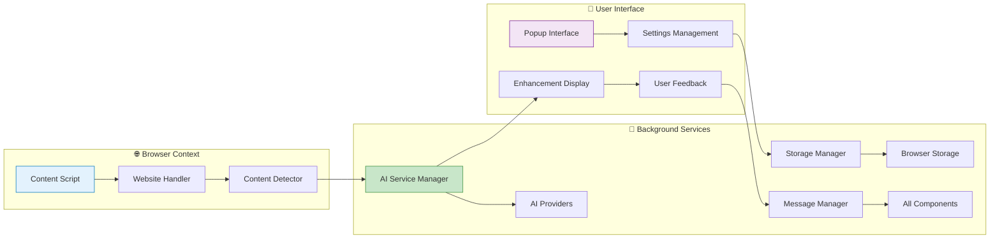

# NovelSynth Architecture Documentation

**Comprehensive System Architecture Overview**

This document provides a detailed technical overview of NovelSynth's sophisticated architecture, demonstrating how our modular, security-first design enables powerful AI-enhanced content processing while maintaining user privacy and system reliability.

## 📋 Architecture Overview

NovelSynth is built on a modern, extensible architecture that prioritizes security, performance, and user privacy. The system consists of four main architectural layers:

1. **🧩 Component Architecture** - Modular service-oriented design
2. **🚀 Processing Pipeline** - Intelligent content enhancement workflow
3. **🛡️ Security Model** - Zero-trust, privacy-first protection
4. **🏗️ Build System** - Professional development and deployment pipeline

Each layer is designed to be independent yet cohesive, allowing for easy maintenance, testing, and feature enhancement while ensuring robust security and excellent user experience.

## 🧩 Component Architecture

Our component architecture follows a modular, service-oriented design pattern that promotes code reusability, testability, and maintainability.

### 📖 [Detailed Component Architecture](./wiki/Component-Architecture-Diagram.md)

**Key Features:**
- **Service-Oriented Design**: Independent services with well-defined interfaces
- **Dependency Injection**: Loose coupling between components
- **Plugin Architecture**: Easy extension with new AI providers and website handlers
- **Event-Driven Communication**: Asynchronous messaging between components

**Core Components:**
- 🤖 **AI Service Manager**: Orchestrates all AI provider interactions
- 🌐 **Site Handler Manager**: Manages website-specific content extraction
- 💾 **Storage Manager**: Secure encrypted storage of user preferences
- 📡 **Message Manager**: Cross-component communication hub

**Benefits:**
- Easy to test individual components in isolation
- Simple to add new AI providers or website support
- Clear separation of concerns and responsibilities
- Excellent code reusability across different contexts

## 🚀 Processing Pipeline

The processing pipeline implements a sophisticated workflow for content enhancement, featuring intelligent decision-making, error recovery, and performance optimization.

### 📖 [Detailed Processing Pipeline](./wiki/Processing-Pipeline-Diagram.md)

**Pipeline Stages:**
1. **🔍 Content Detection**: Intelligent content identification and quality assessment
2. **📝 Content Extraction**: Clean text extraction with formatting preservation
3. **🏷️ Type Classification**: Content categorization for optimal processing
4. **✂️ Smart Segmentation**: Large content handling with context preservation
5. **🤖 Provider Selection**: Optimal AI provider choice based on multiple factors
6. **⚡ Enhancement Processing**: Actual AI-powered content improvement
7. **🔧 Result Assembly**: Intelligent result combination and display

**Advanced Features:**
- **Exponential Backoff**: Intelligent retry logic for rate limits
- **Provider Failover**: Automatic switching between AI providers
- **Context Preservation**: Maintains content coherence across segments
- **Quality Validation**: Ensures enhancement quality before display

## 🛡️ Security Model

NovelSynth implements a comprehensive zero-trust security model that prioritizes user privacy while enabling powerful AI functionality.

### 📖 [Detailed Security Model](./wiki/Security-Model-Diagram.md)

**Security Principles:**
- **Zero Data Collection**: No user content ever stored on NovelSynth servers
- **End-to-End Encryption**: All sensitive data encrypted with AES-256-GCM
- **Direct AI Communication**: No proxy servers or intermediaries
- **Minimal Permissions**: Principle of least privilege throughout

**Security Layers:**
1. **👤 User Data Protection**: Comprehensive data classification and protection
2. **🔐 Encryption & Storage**: Multi-layer encryption for sensitive data
3. **🌐 Network Security**: HTTPS-only with certificate validation
4. **🤖 External Service Security**: Secure AI provider integration

**Privacy Controls:**
- Complete data deletion capabilities
- Data export for user control
- Anonymous analytics with opt-out
- Full transparency through privacy auditing

## 🏗️ Build System

Our build system provides a professional development experience with beautiful CLI interfaces, comprehensive testing, and automated release management.

### 📖 [Detailed Build System](./wiki/Build-System-Diagram.md)

**Build Pipeline:**
1. **📋 Metadata Sync**: Automatic synchronization of package and manifest files
2. **⚙️ TypeScript Compilation**: Type-safe code compilation
3. **📦 Webpack Bundling**: Optimized module bundling for both browsers
4. **🎨 Asset Processing**: Icon, style, and resource optimization
5. **✅ Quality Assurance**: Automated testing and validation
6. **🚀 Release Management**: Version management and package creation

**CLI Features:**
- **🎨 Beautiful Banners**: Comprehensive system information display
- **⏳ Progress Tracking**: Visual progress bars and status updates
- **📝 Enhanced Logging**: Colored, timed logging with context
- **📊 Build Analytics**: Performance metrics and optimization suggestions

**Quality Assurance:**
- Comprehensive unit and integration testing
- Automated security vulnerability scanning
- Cross-browser compatibility validation
- Performance analysis and optimization

## 🔗 System Integration

### 📡 Inter-Component Communication

Components communicate through a well-defined event system that ensures loose coupling and high flexibility:

```typescript
// Event-driven architecture example
eventBus.emit('content.detected', {
  content: extractedContent,
  type: contentType,
  source: 'fanfiction.net'
});

// Components subscribe to relevant events
aiServiceManager.on('content.detected', async (data) => {
  const enhanced = await this.enhanceContent(data);
  eventBus.emit('content.enhanced', enhanced);
});
```

### 🔄 Data Flow Architecture



## 🎯 Design Patterns & Principles

### 🏗️ Architectural Patterns

**Service Locator Pattern**: Central registry for service discovery
```typescript
const aiService = ServiceLocator.get<AIServiceManager>('aiServiceManager');
```

**Observer Pattern**: Event-driven component communication
```typescript
class Component extends EventEmitter {
  // Components can emit and listen to events
}
```

**Strategy Pattern**: Pluggable AI providers and website handlers
```typescript
interface AIProvider {
  enhance(content: string): Promise<EnhancedContent>;
}
```

**Factory Pattern**: Dynamic creation of handlers and providers
```typescript
class HandlerFactory {
  createHandler(url: string): WebsiteHandler {
    // Return appropriate handler based on URL
  }
}
```

### 🎨 Design Principles

**SOLID Principles**:
- **Single Responsibility**: Each component has one clear purpose
- **Open/Closed**: Open for extension, closed for modification
- **Liskov Substitution**: Providers and handlers are interchangeable
- **Interface Segregation**: Small, focused interfaces
- **Dependency Inversion**: Depend on abstractions, not concretions

**Clean Architecture**:
- Business logic independent of external frameworks
- UI independent of business logic
- Database/storage independent of business logic
- External services independent of business logic

## 📈 Performance Optimization

### ⚡ Optimization Strategies

**Lazy Loading**: Components load only when needed
```typescript
const aiProvider = await import('./providers/OpenAIProvider');
```

**Caching**: Intelligent caching of frequently accessed data
```typescript
class CacheManager {
  async get<T>(key: string): Promise<T | null>;
  async set<T>(key: string, value: T, ttl?: number): Promise<void>;
}
```

**Connection Pooling**: Reuse HTTP connections for API calls
```typescript
class HTTPPool {
  private connections: Map<string, Connection> = new Map();
}
```

**Request Batching**: Combine multiple requests when possible
```typescript
class RequestBatcher {
  batchRequests(requests: APIRequest[]): Promise<APIResponse[]>;
}
```

### 📊 Performance Metrics

**Key Performance Indicators**:
- Content detection time: < 100ms
- Enhancement processing time: < 30s for 5000 words
- Memory usage: < 50MB for typical operation
- Bundle size: < 2MB for browser extension

**Monitoring Implementation**:
```typescript
class PerformanceMonitor {
  measureOperation<T>(name: string, operation: () => Promise<T>): Promise<T> {
    const start = performance.now();
    return operation().finally(() => {
      const duration = performance.now() - start;
      this.recordMetric(name, duration);
    });
  }
}
```

## 🧪 Testing Strategy

### 📋 Testing Pyramid

**Unit Tests (70%)**:
- Individual component functionality
- Business logic validation
- Error handling verification

**Integration Tests (20%)**:
- Component interaction testing
- API integration validation
- Data flow verification

**End-to-End Tests (10%)**:
- Complete user workflows
- Cross-browser compatibility
- Performance validation

### 🎯 Test Implementation

```typescript
// Example unit test
describe('AIServiceManager', () => {
  it('should select optimal provider', async () => {
    const manager = new AIServiceManager();
    const provider = await manager.selectProvider({
      contentType: 'fiction',
      length: 1000
    });
    expect(provider.name).toMatch(/openai|anthropic|gemini/);
  });
});

// Example integration test
describe('Content Enhancement Flow', () => {
  it('should enhance content end-to-end', async () => {
    const content = 'Sample content for testing';
    const enhanced = await enhanceContent(content);
    expect(enhanced.length).toBeGreaterThan(content.length);
    expect(enhanced).toContain(content);
  });
});
```

## 🔮 Future Architecture Considerations

### 🚀 Scalability Enhancements

**Microservices Architecture**: Further decomposition of services
**WebAssembly Integration**: Performance-critical operations in WASM
**Service Worker Optimization**: Advanced background processing
**Progressive Web App**: Enhanced web-based interface

### 🤖 AI/ML Enhancements

**Local AI Models**: On-device processing for privacy
**Model Fine-tuning**: Custom models for specific content types
**Federated Learning**: Collaborative improvement without data sharing
**Multi-modal Processing**: Enhanced support for images and media

### 🌐 Platform Expansion

**Mobile Support**: React Native mobile applications
**Desktop Applications**: Electron-based desktop clients
**Web Platform**: Standalone web application
**API Services**: Public API for third-party integration

## 📚 Documentation & Resources

### 📖 Additional Documentation

- [🏠 Home](./wiki/Home.md) - Project overview and getting started
- [📖 Installation Guide](./wiki/Installation-Guide.md) - Step-by-step installation
- [⚙️ Configuration](./wiki/Configuration.md) - Detailed configuration options
- [🤖 AI Providers](./wiki/AI-Providers.md) - AI provider setup and comparison
- [🌐 Supported Sites](./wiki/Supported-Sites.md) - Website compatibility information
- [🛠️ Development Setup](./wiki/Development-Setup.md) - Developer environment setup
- [📚 API Documentation](./wiki/API-Documentation.md) - Internal API reference

### 🔗 External Resources

- **Repository**: [GitHub](https://github.com/LifeExperimentalist/novelsynth)
- **Website**: [Project Homepage](https://life-experimentalist.github.io/novelsynth)
- **Issues**: [Bug Reports](https://github.com/LifeExperimentalist/novelsynth/issues)
- **Discussions**: [Community Forum](https://github.com/LifeExperimentalist/novelsynth/discussions)

---

This architecture documentation provides a comprehensive understanding of NovelSynth's technical design, enabling developers to contribute effectively while maintaining our high standards for security, performance, and user experience.