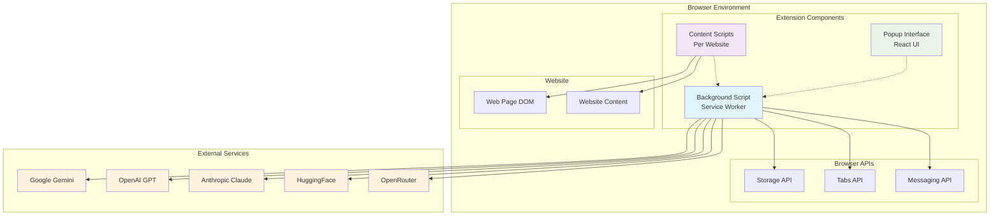
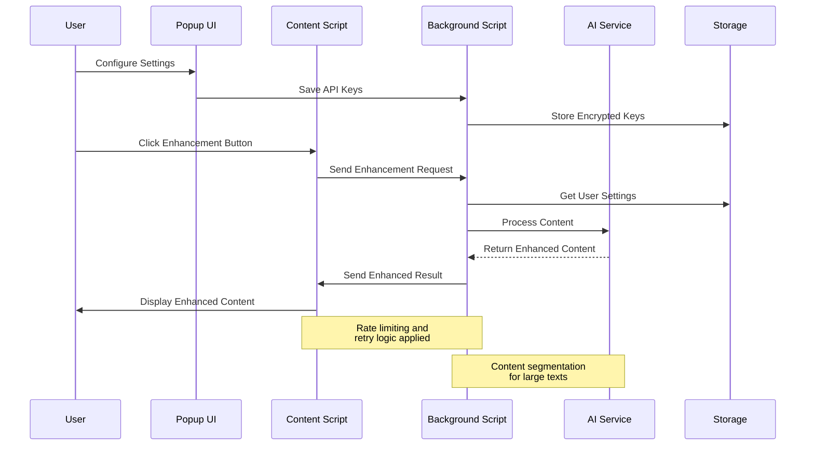
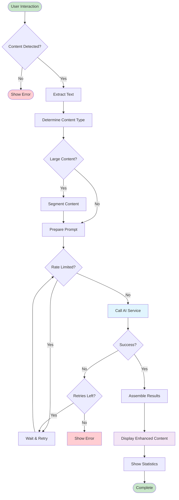
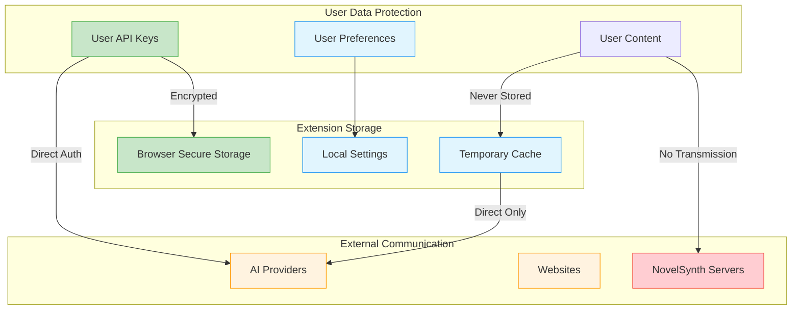
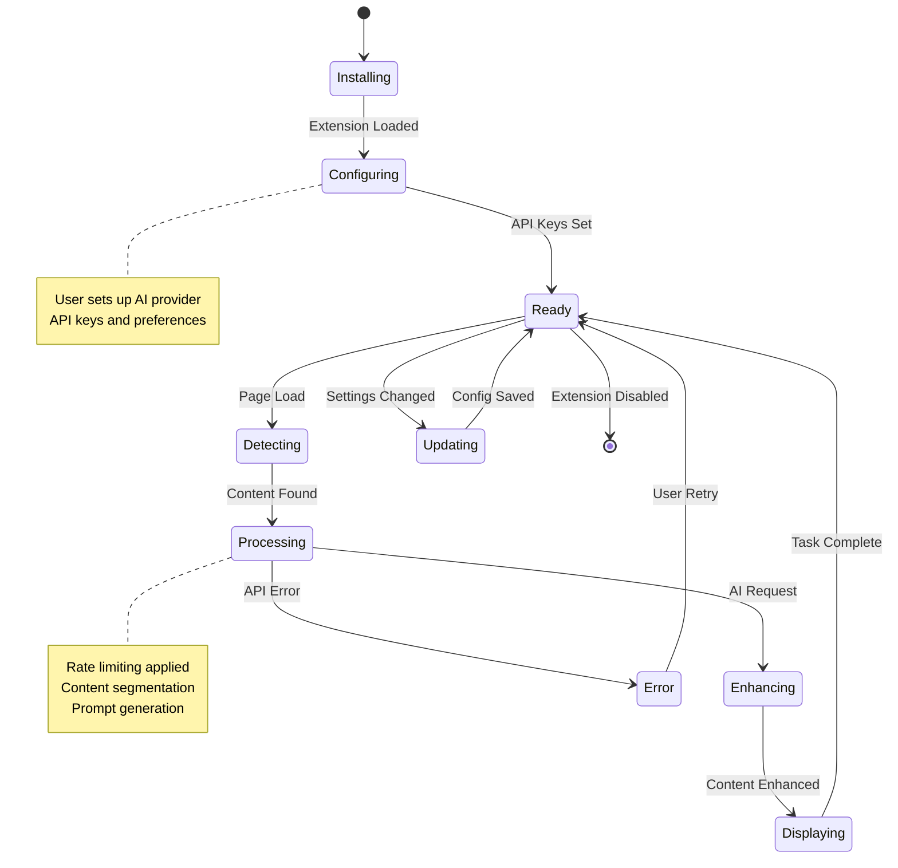
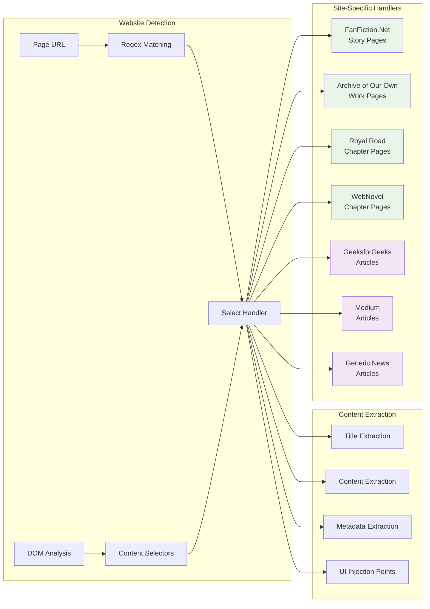
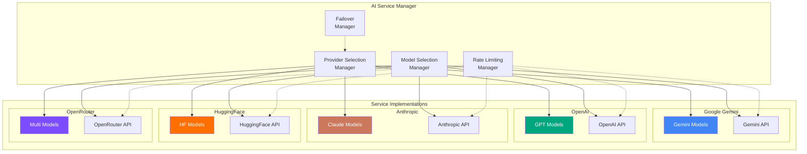
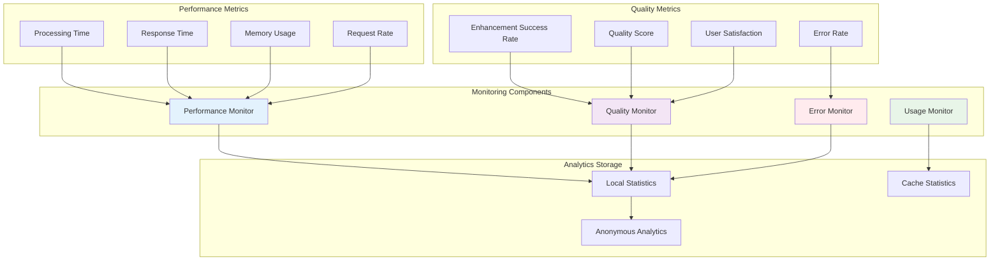
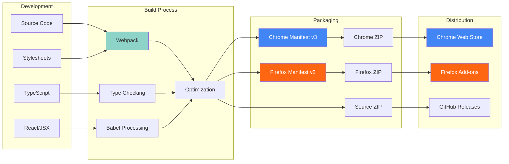

```mermaid
graph TD
    subgraph "Background Services"
        ASM[AI Service Manager]
        SHM[Site Handler Manager]
        SM[Storage Manager]
        RL[Rate Limiter]
        PM[Prompt Manager]
    end

    subgraph "AI Services"
        GS[Gemini Service]
        OS[OpenAI Service]
        AS[Anthropic Service]
        HS[HuggingFace Service]
        RS[OpenRouter Service]
        BASE[Base AI Service]
    end

    subgraph "Content Processing"
        CD[Content Detector]
        CS[Content Segmenter]
        PB[Prompt Builder]
        WC[Word Counter]
        PBN[Processing Banner]
    end

    subgraph "Site Handlers"
        FFH[FanFiction.Net Handler]
        AOH[Archive of Our Own Handler]
        RRH[Royal Road Handler]
        WNH[WebNovel Handler]
        GGH[GeeksforGeeks Handler]
        MH[Medium Handler]
        GNH[Generic News Handler]
    end

    ASM --> GS
    ASM --> OS
    ASM --> AS
    ASM --> HS
    ASM --> RS
    GS --> BASE
    OS --> BASE
    AS --> BASE
    HS --> BASE
    RS --> BASE

    SHM --> FFH
    SHM --> AOH
    SHM --> RRH
    SHM --> WNH
    SHM --> GGH
    SHM --> MH
    SHM --> GNH

    ASM --> RL
    ASM --> PM
    PM --> PB

    style ASM fill:#e3f2fd
    style BASE fill:#f1f8e9
    style SHM fill:#fce4ec
```

# NovelSynth System Architecture Diagrams

This document contains comprehensive Mermaid diagrams that visualize the NovelSynth extension architecture, data flows, and component interactions.

## 🏗️ System Overview

## 🔄 Data Flow Architecture

## 🧩 Component Architecture

## 🚀 Processing Pipeline

## 🔐 Security & Privacy Model

## 📱 Browser Extension Lifecycle

## 🌐 Website Handler System

## 🤖 AI Service Integration

## 📊 Performance & Monitoring

## 🔧 Build & Development Pipeline

---

These diagrams provide a comprehensive visual representation of the NovelSynth extension architecture, making it easier for developers to understand the system structure and for users to understand the data flow and security model.