# NovelSynth Extension Architecture

## 📚 Documentation Index

This document provides a comprehensive overview of the NovelSynth browser extension architecture with integrated visual diagrams and detailed explanations. For individual wiki diagram pages, see:

- **[System Overview Diagram](../wiki/System-Overview-Diagram.md)** - High-level system architecture
- **[Data Flow Diagram](../wiki/Data-Flow-Diagram.md)** - Complete data flow visualization
- **[Component Architecture Diagram](../wiki/Component-Architecture-Diagram.md)** - Detailed component structure
- **[Processing Pipeline Diagram](../wiki/Processing-Pipeline-Diagram.md)** - Content processing flow
- **[Security Model Diagram](../wiki/Security-Model-Diagram.md)** - Security and privacy architecture
- **[Build System Diagram](../wiki/Build-System-Diagram.md)** - Build pipeline visualization

## 🎯 System Overview

### Architecture Philosophy

NovelSynth follows a **modular, privacy-first architecture** designed for:
- **Extensibility**: Easy addition of new AI providers and website handlers
- **Security**: Zero data collection, encrypted API key storage
- **Performance**: Intelligent content segmentation and rate limiting
- **Cross-browser compatibility**: Chrome Manifest v3 and Firefox v2 support

### High-Level System Architecture

The following diagram shows the complete system architecture with all major components and their interactions:

```mermaid
graph TB
    subgraph "🌐 Browser Environment"
        subgraph "🔧 Extension Core"
            BG[🎯 Background Script<br/>Service Worker]
            CS[📄 Content Scripts<br/>Website Integration]
            PP[⚙️ Popup Interface<br/>React-based UI]
        end

        subgraph "🔌 Browser APIs"
            SA[💾 Storage API<br/>Settings & Keys]
            TA[📑 Tabs API<br/>Page Management]
            MA[📡 Messaging API<br/>Communication]
        end

        subgraph "🖥️ Website Layer"
            WP[🌍 Web Page DOM<br/>Content Area]
            WC[📝 Website Content<br/>Text & Images]
        end
    end

    subgraph "🤖 AI Services"
        AI1[🟦 Google Gemini<br/>Text Generation]
        AI2[🟢 OpenAI GPT<br/>Language Models]
        AI3[🟤 Anthropic Claude<br/>Constitutional AI]
        AI4[🟡 HuggingFace<br/>Open Source Models]
        AI5[🟣 OpenRouter<br/>Multi-Provider Access]
    end

    PP -.->|Settings & Config| BG
    CS -.->|Content Processing| BG
    BG -->|Data Persistence| SA
    BG -->|Page Control| TA
    BG -->|Cross-Component| MA
    CS -->|DOM Manipulation| WP
    CS -->|Text Extraction| WC
    BG -->|API Requests| AI1
    BG -->|API Requests| AI2
    BG -->|API Requests| AI3
    BG -->|API Requests| AI4
    BG -->|API Requests| AI5

    style BG fill:#e1f5fe,stroke:#01579b
    style CS fill:#f3e5f5,stroke:#4a148c
    style PP fill:#e8f5e8,stroke:#1b5e20
    style AI1 fill:#4285f4,color:#fff
    style AI2 fill:#00a67e,color:#fff
    style AI3 fill:#ff6b35,color:#fff
    style AI4 fill:#ff9800,color:#fff
    style AI5 fill:#9c27b0,color:#fff
```



**Key Components Explained:**

- **🎯 Background Script**: The brain of the extension, handling AI communication, storage management, and cross-component messaging. Runs as a service worker in Chrome or background script in Firefox.
- **📄 Content Scripts**: Injected into web pages to detect content types, extract text, and display enhanced results. Each supported website has optimized extraction logic.
- **⚙️ Popup Interface**: React-based configuration UI for settings, API keys, and preferences. Provides real-time status and configuration options.
- **🔌 Browser APIs**: Native browser capabilities for secure storage, tab management, and inter-component communication.
- **🤖 External AI Services**: Multiple AI providers for content enhancement with automatic failover and rate limiting.

## 🔄 Complete Data Flow Architecture

### User Interaction to AI Processing Flow

This sequence diagram shows the complete flow from user configuration to content enhancement:


**Data Flow Explanation:**

1. **🔧 Configuration Phase**: User sets up API keys and preferences through the popup interface
2. **🔍 Content Detection**: Content scripts analyze page structure using site-specific handlers
3. **📤 Processing Request**: User triggers enhancement, content is extracted and validated
4. **🤖 AI Processing**: Background script handles API communication with intelligent retry logic
5. **📥 Result Display**: Enhanced content is returned and displayed with formatting preservation

## 🧩 Detailed Component Architecture

### Core Service Layer

This diagram shows the modular service architecture that makes NovelSynth extensible:

```mermaid
graph TD
    subgraph "🎯 Background Services"
        ASM[🤖 AI Service Manager<br/>Provider Coordination]
        SHM[🌐 Site Handler Manager<br/>Website Detection]
        SM[💾 Storage Manager<br/>Settings Persistence]
        RL[⏱️ Rate Limiter<br/>API Throttling]
        PM[📝 Prompt Manager<br/>Template System]
    end

    subgraph "🤖 AI Provider Layer"
        GS[Google Gemini<br/>Service Implementation]
        OS[OpenAI<br/>Service Implementation]
        AS[Anthropic<br/>Service Implementation]
        HS[HuggingFace<br/>Service Implementation]
        RS[OpenRouter<br/>Service Implementation]
        BASE[🔧 Base AI Service<br/>Common Interface]
    end

    subgraph "📄 Content Processing"
        CD[🔍 Content Detector<br/>Type Recognition]
        CS[✂️ Content Segmenter<br/>Large Text Handling]
        PB[🏗️ Prompt Builder<br/>Dynamic Templates]
        WC[📊 Word Counter<br/>Statistics Tracking]
        PBN[⏳ Processing Banner<br/>User Feedback]
    end

    subgraph "🌐 Website Handlers"
        FFH[📚 FanFiction.Net<br/>Story Parser]
        AOH[📖 Archive of Our Own<br/>Work Parser]
        RRH[👑 Royal Road<br/>Chapter Parser]
        WNH[📱 WebNovel<br/>Chapter Parser]
        GGH[💻 GeeksforGeeks<br/>Article Parser]
        MH[📰 Medium<br/>Article Parser]
        GNH[📃 Generic News<br/>Article Parser]
    end

    ASM --> GS
    ASM --> OS
    ASM --> AS
    ASM --> HS
    ASM --> RS
    GS --> BASE
    OS --> BASE
    AS --> BASE
    HS --> BASE
    RS --> BASE

    SHM --> FFH
    SHM --> AOH
    SHM --> RRH
    SHM --> WNH
    SHM --> GGH
    SHM --> MH
    SHM --> GNH

    ASM --> RL
    ASM --> PM
    PM --> PB

    style ASM fill:#e3f2fd,stroke:#0277bd
    style BASE fill:#f1f8e9,stroke:#388e3c
    style SHM fill:#fce4ec,stroke:#c2185b
    style CD fill:#fff3e0,stroke:#f57c00
    style FFH fill:#e8f5e8,stroke:#2e7d32
    style GGH fill:#f3e5f5,stroke:#7b1fa2
```



**Component Responsibilities:**

- **🤖 AI Service Manager**: Orchestrates multiple AI providers, handles failover, manages rate limiting across all providers
- **🌐 Site Handler Manager**: Detects website types using URL patterns and DOM analysis, manages content extraction strategies
- **💾 Storage Manager**: Handles secure storage of API keys using browser encryption, user preferences, and temporary processing data
- **🔧 Base AI Service**: Common interface ensuring consistent behavior across all AI providers, standardizes error handling and response formatting
- **📄 Content Processing Pipeline**: Manages text extraction, intelligent segmentation for large content, and result assembly with formatting preservation

## 🚀 Content Processing Pipeline

### Enhancement Workflow

This flowchart details the complete content enhancement process from detection to display:

```mermaid
flowchart TD
    START([👤 User Clicks Enhance]) --> CD{🔍 Content Detected?}
    CD -->|❌ No| FAIL[⚠️ Show Detection Error]
    CD -->|✅ Yes| ET[📝 Extract Text Content]
    ET --> CT[🏷️ Determine Content Type]
    CT --> SC{📏 Large Content?}
    SC -->|❌ No| PP[🏗️ Prepare Prompt]
    SC -->|✅ Yes| SEG[✂️ Segment Content]
    SEG --> PP
    PP --> API{🔧 API Key Available?}
    API -->|❌ No| CONFIG[⚙️ Show Config Prompt]
    API -->|✅ Yes| RL{⏱️ Rate Limited?}
    RL -->|✅ Yes| WAIT[⏳ Wait & Retry]
    WAIT --> RL
    RL -->|❌ No| AI[🤖 Call AI Service]
    AI --> SUCCESS{✅ Success?}
    SUCCESS -->|❌ No| RETRY{🔄 Retries Left?}
    RETRY -->|✅ Yes| WAIT
    RETRY -->|❌ No| ERROR[❌ Show Error Message]
    SUCCESS -->|✅ Yes| ASSEMBLE[🔧 Assemble Results]
    ASSEMBLE --> DISPLAY[🎉 Display Enhanced Content]
    DISPLAY --> STATS[📊 Show Statistics]
    STATS --> COMPLETE([✅ Enhancement Complete])

    CONFIG --> COMPLETE
    FAIL --> COMPLETE
    ERROR --> COMPLETE

    style START fill:#c8e6c9,stroke:#388e3c
    style COMPLETE fill:#c8e6c9,stroke:#388e3c
    style FAIL fill:#ffcdd2,stroke:#d32f2f
    style ERROR fill:#ffcdd2,stroke:#d32f2f
    style AI fill:#e1f5fe,stroke:#0277bd
    style DISPLAY fill:#f3e5f5,stroke:#7b1fa2
    style CONFIG fill:#fff3e0,stroke:#f57c00
```



**Pipeline Stages Explained:**

1. **🔍 Content Detection**: Uses site-specific handlers to identify content type (fiction, technical article, news, etc.)
2. **📝 Text Extraction**: Pulls relevant text while preserving formatting, images, and structural elements
3. **✂️ Content Segmentation**: Intelligently splits large content (>8000 tokens) into manageable chunks that maintain context
4. **🏗️ Prompt Preparation**: Builds context-aware prompts based on content type, user preferences, and site-specific requirements
5. **🤖 AI Processing**: Sends requests with exponential backoff retry logic and provider-specific rate limiting
6. **🔧 Result Assembly**: Combines processed segments while maintaining original formatting and adding enhancement markers
7. **📊 Statistics & Display**: Shows processing metrics (time, tokens, provider) and enhanced content with diff highlighting

## 🔐 Security & Privacy Model

### Data Protection Architecture

NovelSynth implements a zero-trust, privacy-first security model:

```mermaid
graph TB
    subgraph "👤 User Data"
        UK[🔑 API Keys<br/>Encrypted Storage]
        UP[⚙️ User Preferences<br/>Local Storage]
        UC[📝 User Content<br/>Never Stored]
    end

    subgraph "🛡️ Security Layer"
        BS[🔒 Browser Secure Storage<br/>Native Encryption]
        LS[💾 Local Settings<br/>Non-sensitive Data]
        TS[⚡ Temporary Processing<br/>Memory Only]
    end

    subgraph "🌐 External Communication"
        AI[🤖 AI Providers<br/>Direct API Calls]
        WS[🌍 Websites<br/>Content Extraction]
        NS[🚫 NovelSynth Servers<br/>No Communication]
    end

    UK -->|🔐 Encrypted| BS
    UP --> LS
    UC -->|⚡ Never Stored| TS
    TS -->|🔗 Direct Only| AI
    UC -->|🚫 No Transmission| NS
    UK -->|🔑 Direct Auth| AI

    classDef secure fill:#c8e6c9,stroke:#4caf50,stroke-width:3px
    classDef private fill:#e1f5fe,stroke:#2196f3,stroke-width:2px
    classDef external fill:#fff3e0,stroke:#ff9800,stroke-width:2px
    classDef nosend fill:#ffcdd2,stroke:#f44336,stroke-width:3px

    class UK,BS secure
    class UP,LS,TS private
    class AI,WS external
    class NS nosend
```



**Security Principles:**

- **🔒 Zero Data Collection**: NovelSynth never collects, stores, or transmits user content to our servers
- **🔐 Encrypted Storage**: API keys are stored using browser's native secure storage with AES encryption
- **🔗 Direct Communication**: All AI requests go directly from browser to AI provider - no proxy servers
- **🚫 No Telemetry**: No usage data, analytics, or telemetry sent to NovelSynth servers
- **⚡ Local Processing**: Content analysis, segmentation, and result assembly happens entirely client-side

## 📁 Project Structure & Implementation

```
src/
├── background/                 # Background script (service worker)
│   └── index.ts               # Main background script entry
├── content/                   # Content scripts
│   ├── index.ts              # Main content script
│   └── content.css           # Content script styles
├── popup/                     # Extension popup UI
│   ├── index.tsx             # Popup entry point
│   ├── Popup.tsx             # Main popup component
│   ├── popup.html            # Popup HTML template
│   └── popup.css             # Popup styles
├── services/                  # Modular service providers
│   ├── ai/                   # AI service providers
│   │   ├── BaseAIService.ts  # Common interface
│   │   ├── GeminiService.ts  # Google Gemini
│   │   ├── OpenAIService.ts  # OpenAI GPT
│   │   ├── AnthropicService.ts # Anthropic Claude
│   │   ├── HuggingFaceService.ts # HuggingFace
│   │   ├── OpenRouterService.ts # OpenRouter
│   │   └── AIServiceManager.ts # Service orchestration
│   └── handlers/             # Website-specific handlers
│       ├── fanfiction.ts     # FanFiction.Net
│       ├── archiveOfOurOwn.ts # Archive of Our Own
│       ├── geeksForGeeks.ts  # GeeksforGeeks
│       ├── medium.ts         # Medium articles
│       ├── royalRoad.ts      # Royal Road
│       ├── webnovel.ts       # WebNovel.com
│       ├── genericNews.ts    # Generic news sites
│       └── SiteHandlerManager.ts # Handler coordination
├── utils/                     # Utility functions and classes
│   ├── ContentDetector.ts    # Content type detection
│   ├── ContentSegmenter.ts   # Large content handling
│   ├── ProcessingBanner.ts   # User feedback UI
│   ├── PromptBuilder.ts      # Dynamic prompt construction
│   ├── PromptManager.ts      # Prompt management
│   ├── RateLimiter.ts        # API rate limiting
│   ├── StorageManager.ts     # Settings persistence
│   └── WordCounter.ts        # Text analysis
├── types/                     # TypeScript type definitions
│   └── index.ts              # Shared type definitions
└── icons/                     # Extension icons
    ├── icon16.png            # Toolbar icon
    ├── icon32.png            # Menu icon
    ├── icon48.png            # Extension management
    └── icon128.png           # Chrome Web Store
```

## 🔧 Core Implementation Details

### 1. AI Service Manager Implementation

The `AIServiceManager` provides a unified interface for multiple AI providers:

```typescript
interface AIService {
  enhance(content: string, prompt: string, options?: any): Promise<AIResponse>;
  summarize(content: string, options?: any): Promise<AIResponse>;
  analyze(content: string, options?: any): Promise<AIResponse>;
  getAvailableModels(): AIModel[];
  checkRateLimit(): Promise<boolean>;
}

class AIServiceManager {
  private services: Map<string, AIService> = new Map();
  private rateLimiter: RateLimiter;
  private currentProvider: string;

  async processContent(request: ContentRequest): Promise<ContentResponse> {
    // Rate limiting, provider selection, retry logic
  }
}
```

### 2. Site Handler Architecture

Each website handler extends a base class:

```typescript
abstract class BaseWebsiteHandler {
  abstract detectContent(): ContentInfo | null;
  abstract extractText(): string;
  abstract getTitle(): string;
  abstract getMetadata(): ContentMetadata;
  abstract injectUI(element: HTMLElement): void;
}

class FanFictionHandler extends BaseWebsiteHandler {
  // Site-specific implementation
}
```

### 3. Communication Protocol

Background ↔ Content Script messaging:

```typescript
// Content Script → Background
chrome.runtime.sendMessage({
  action: 'enhance',
  data: {
    content: extractedText,
    contentType: 'fiction',
    options: userPreferences
  }
});

// Background → Content Script
chrome.tabs.sendMessage(tabId, {
  action: 'enhancementComplete',
  data: {
    enhanced: processedContent,
    stats: processingStats,
    processingTime: elapsed
  }
});
```

## 🚀 Extension Lifecycle & States

### State Management


## 📈 Performance Optimization Strategies

### Content Segmentation Strategy

For large content (>8000 tokens):
1. **Semantic Chunking**: Split at paragraph or section boundaries
2. **Context Preservation**: Include overlap between chunks
3. **Parallel Processing**: Process multiple chunks simultaneously when rate limits allow
4. **Result Merging**: Intelligently combine results maintaining formatting

### Rate Limiting Implementation

```typescript
class RateLimiter {
  private limits: Map<string, ProviderLimits> = new Map();
  private usage: Map<string, UsageTracker> = new Map();

  async checkLimit(provider: string): Promise<boolean> {
    // Check current usage against provider limits
    // Implement exponential backoff for rate-limited requests
  }
}
```

### Caching Strategy

- **Prompt Templates**: Cache frequently used prompts
- **Model Metadata**: Cache provider capabilities and limits
- **User Preferences**: Local storage for fast access
- **Content Signatures**: Avoid re-processing identical content

## 🔮 Extensibility & Future Development

### Adding New AI Providers

1. **Extend Base Service**: Implement `BaseAIService` interface
2. **Register Provider**: Add to `AIServiceManager` registry
3. **Update UI**: Add provider option in popup interface
4. **Configure Limits**: Set provider-specific rate limits

### Adding New Website Handlers

1. **Extend Base Handler**: Implement `BaseWebsiteHandler` abstract class
2. **Define Selectors**: Specify CSS selectors for content extraction
3. **Register Handler**: Add to `SiteHandlerManager` registry
4. **Add Prompts**: Create site-specific prompt templates

### Adding New Features

1. **Define Message Types**: Update message interface specifications
2. **Implement Background Logic**: Add processing logic to background script
3. **Update Content Scripts**: Add UI elements and interaction handlers
4. **Add Configuration**: Include feature toggles in popup interface

---

This comprehensive architecture documentation provides the foundation for understanding, maintaining, and extending the NovelSynth extension. Each component is designed for modularity and testability, enabling rapid development and reliable operation across multiple browsers and AI providers.