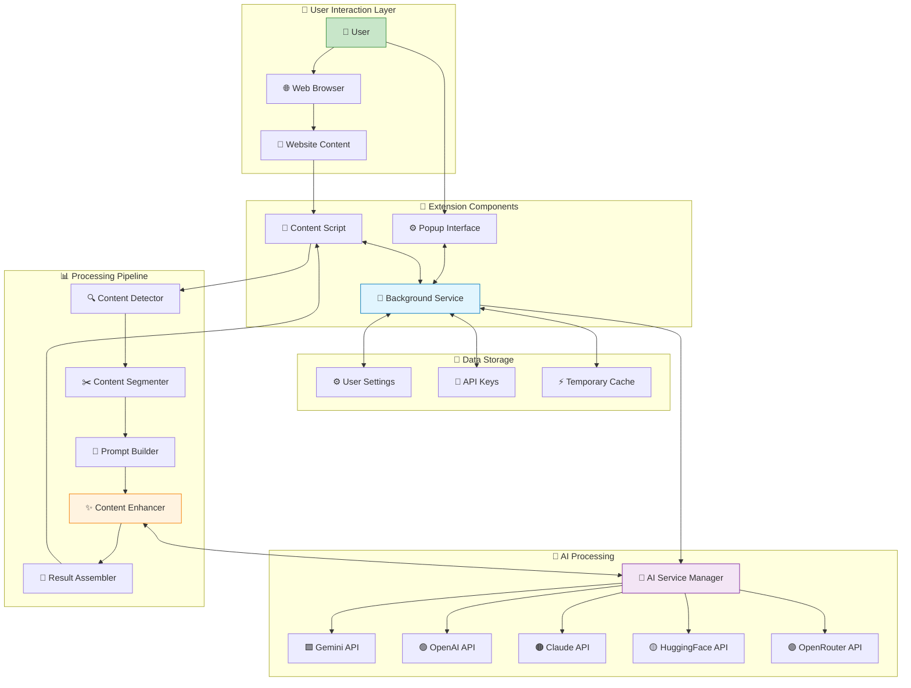
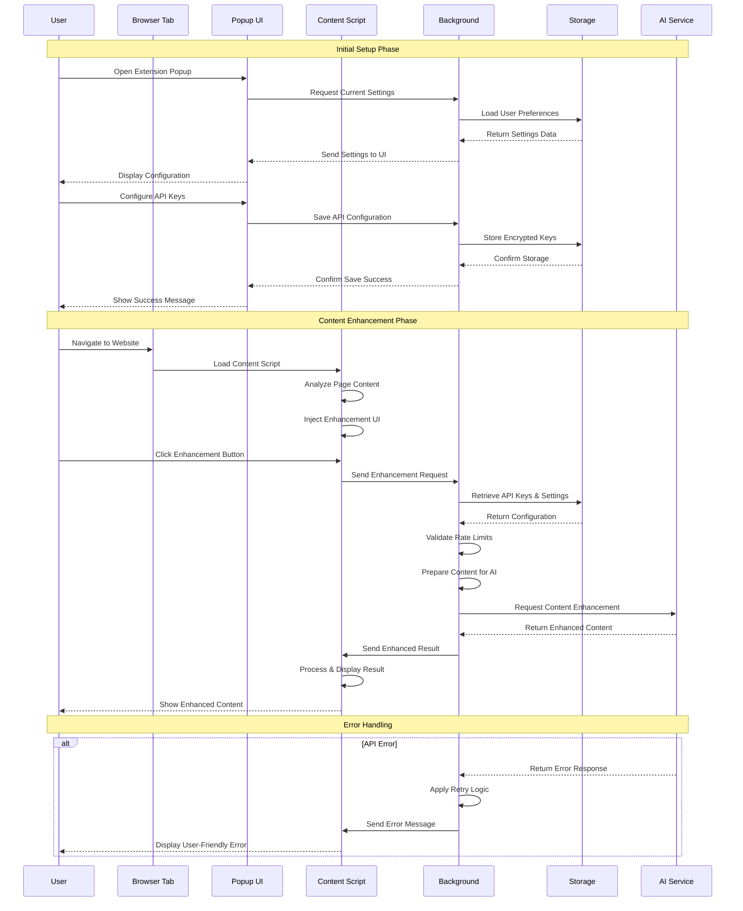
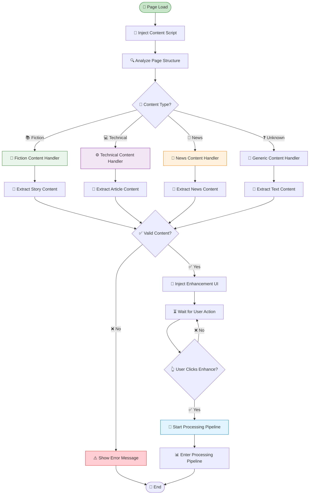
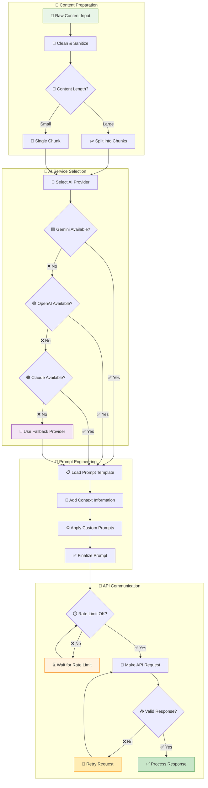
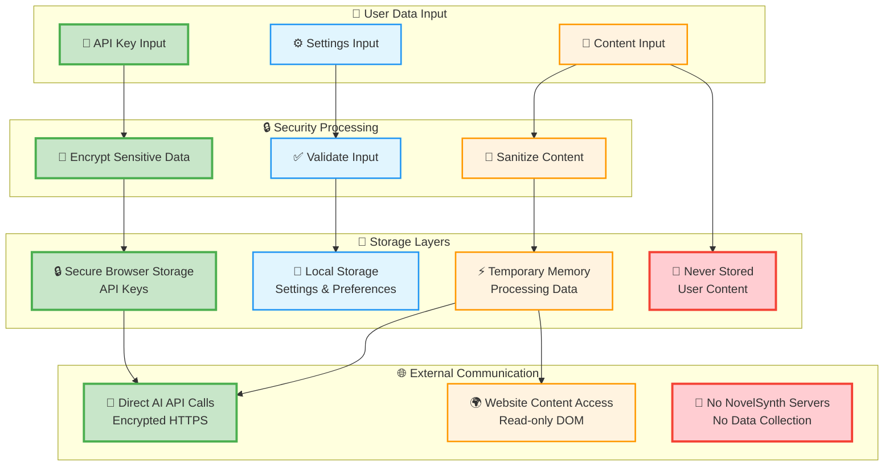
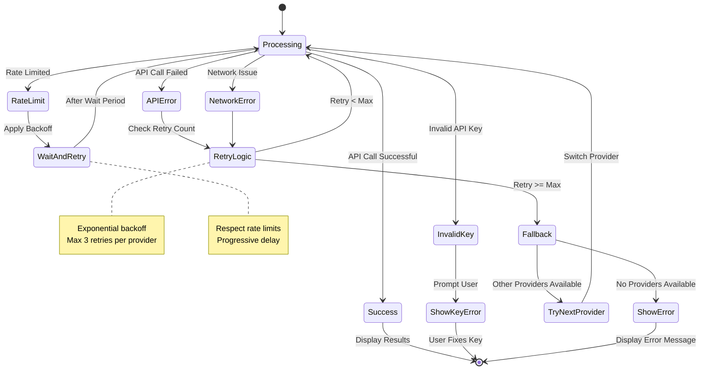
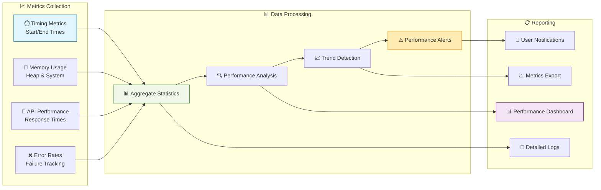

# NovelSynth Data Flow Documentation

This document provides comprehensive diagrams showing how data flows through the NovelSynth extension system.

## 🔄 Complete Data Flow Overview

## 📱 User Interaction Flow

## 🔍 Content Detection & Processing Flow

## 🤖 AI Service Processing Flow

## 💾 Data Storage & Security Flow

## 🔄 Error Handling & Recovery Flow

## 📊 Performance Monitoring Flow

---

These data flow diagrams provide a comprehensive view of how information moves through the NovelSynth extension, from user interaction to AI processing and result delivery. Each diagram focuses on different aspects of the system to help developers and users understand the complete data journey.