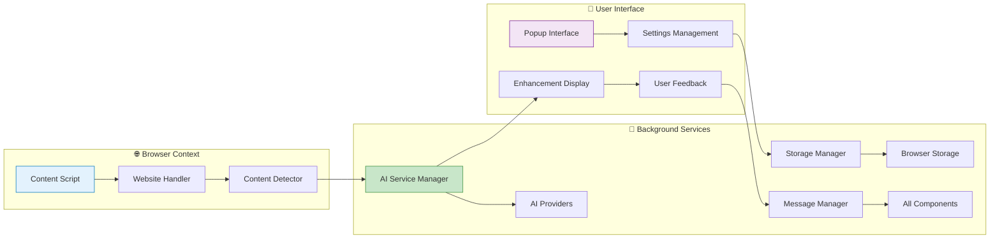

# NovelSynth Architecture Documentation

**Comprehensive System Architecture & Technical Overview**

This document provides the complete technical architecture of NovelSynth, including detailed visual diagrams, component interactions, and system design principles.

## 📋 Table of Contents

1. [System Overview](#️-system-overview)
2. [High-Level Architecture](#️-high-level-architecture)
3. [Component Architecture](#️-component-architecture)
4. [Data Flow & Processing Pipeline](#️-data-flow--processing-pipeline)
5. [AI Service Integration](#️-ai-service-integration)
6. [Security Architecture](#️-security-architecture)
7. [Browser Extension Structure](#️-browser-extension-structure)
8. [Website Integration Layer](#️-website-integration-layer)
9. [Build System & Deployment](#️-build-system--deployment)

---

## 🏗️ System Overview

NovelSynth is a modular, cross-browser extension that provides AI-powered content enhancement capabilities. The architecture follows modern software engineering principles with emphasis on security, extensibility, and user privacy.

### Core Design Principles

- **🔒 Security First**: Zero-trust architecture with encrypted storage
- **🧩 Modular Design**: Loosely coupled components for easy maintenance
- **⚡ Performance**: Efficient content processing with intelligent caching
- **🌐 Cross-Platform**: Unified codebase supporting Chrome, Firefox, and Edge
- **🔌 Extensible**: Plugin architecture for new AI providers and features

---

## 🏗️ High-Level Architecture

```mermaid
graph TB
    subgraph "🌐 Browser Environment"
        subgraph "🔧 Extension Core"
            direction LR
            BG[🎯 Background Script<br/>📦 Service Worker<br/>• Message routing<br/>• API coordination<br/>• State management]
            CS[📄 Content Scripts<br/>🔗 Website Integration<br/>• DOM manipulation<br/>• Text extraction<br/>• UI injection]
            PP[⚙️ Popup Interface<br/>⚛️ React Application<br/>• Settings management<br/>• Feature controls<br/>• API key setup]
            FP[🎈 Floating Panel<br/>🎮 Quick Access<br/>• Feature shortcuts<br/>• Text selection UI<br/>• Real-time processing]
        end

        subgraph "🔌 Browser APIs"
            SA[💾 Storage API<br/>• Encrypted settings<br/>• API keys<br/>• User preferences]
            TA[📑 Tabs API<br/>• Page detection<br/>• Cross-tab messaging<br/>• Permission management]
            MA[📡 Messaging API<br/>• Component communication<br/>• Event coordination<br/>• Error propagation]
            WR[🌍 WebRequest API<br/>• Request monitoring<br/>• Header injection<br/>• CORS handling]
        end
    end

    subgraph "🤖 AI Service Layer"
        direction TB
        subgraph "Primary Providers"
            GEM[🟦 Google Gemini<br/>• Gemini 1.5 Pro/Flash<br/>• 2M+ token context<br/>• Free tier available]
            OAI[🟢 OpenAI<br/>• GPT-4/3.5-turbo<br/>• Function calling<br/>• High quality outputs]
        end
        subgraph "Extended Providers"
            ANT[🟤 Anthropic Claude<br/>• Claude 3 Sonnet/Opus<br/>• Constitutional AI<br/>• Safety focused]
            HF[🟡 HuggingFace<br/>• Open source models<br/>• Local deployment<br/>• Custom fine-tuning]
        end
    end

    subgraph "🌍 Website Integration"
        WEB[📝 Target Websites<br/>• Fiction platforms<br/>• News sites<br/>• Blogs & articles<br/>• Technical docs]
        SEL[🎯 Content Selectors<br/>• Smart text detection<br/>• Context extraction<br/>• Formatting preservation]
    end

    subgraph "☁️ External Services"
        API[🔗 REST APIs<br/>• Rate limiting<br/>• Authentication<br/>• Error handling]
        CDN[📦 CDN Resources<br/>• Static assets<br/>• Model downloads<br/>• Update delivery]
    end

    %% Core Connections
    PP -.->|⚙️ Configuration| BG
    CS -.->|📤 Content Processing| BG
    FP -.->|🎮 Quick Actions| BG

    %% Browser API Integration
    BG -->|💾 Data Persistence| SA
    BG -->|📑 Page Management| TA
    BG <-->|📡 Communication Hub| MA
    BG -->|🌍 Network Control| WR

    %% Website Integration
    CS -->|🔍 DOM Analysis| SEL
    CS -->|📝 Content Extraction| WEB
    FP -->|🎯 Text Selection| WEB

    %% AI Service Integration
    BG -->|🤖 API Requests| GEM
    BG -->|🤖 API Requests| OAI
    BG -->|🤖 API Requests| ANT
    BG -->|🤖 API Requests| HF

    %% External Services
    BG -->|🔗 HTTP Requests| API
    BG -->|📦 Resource Loading| CDN

    %% Styling
    style BG fill:#e1f5fe,stroke:#01579b,stroke-width:3px
    style CS fill:#f3e5f5,stroke:#4a148c,stroke-width:3px
    style PP fill:#e8f5e8,stroke:#1b5e20,stroke-width:3px
    style FP fill:#fff3e0,stroke:#e65100,stroke-width:3px
    style GEM fill:#4285f4,color:#fff,stroke:#1565c0,stroke-width:2px
    style OAI fill:#00a67e,color:#fff,stroke:#00695c,stroke-width:2px
    style ANT fill:#ff6b35,color:#fff,stroke:#d84315,stroke-width:2px
    style HF fill:#ff9800,color:#fff,stroke:#f57c00,stroke-width:2px
```



**Architecture Explanation:**
- **Extension Core**: Four main components handle different aspects of functionality
- **Browser APIs**: Native browser services provide secure storage, messaging, and network access
- **AI Service Layer**: Multiple AI providers offer redundancy and choice
- **Website Integration**: Smart content detection and extraction across various site types
- **External Services**: RESTful APIs and CDN resources for scalability

The processing pipeline implements a sophisticated workflow for content enhancement, featuring intelligent decision-making, error recovery, and performance optimization.

### 📖 [Detailed Processing Pipeline](../wiki/Processing-Pipeline-Diagram.md)

**Pipeline Stages:**
1. **🔍 Content Detection**: Intelligent content identification and quality assessment
2. **📝 Content Extraction**: Clean text extraction with formatting preservation
3. **🏷️ Type Classification**: Content categorization for optimal processing
4. **✂️ Smart Segmentation**: Large content handling with context preservation
5. **🤖 Provider Selection**: Optimal AI provider choice based on multiple factors
6. **⚡ Enhancement Processing**: Actual AI-powered content improvement
7. **🔧 Result Assembly**: Intelligent result combination and display

**Advanced Features:**
- **Exponential Backoff**: Intelligent retry logic for rate limits
- **Provider Failover**: Automatic switching between AI providers
- **Context Preservation**: Maintains content coherence across segments
- **Quality Validation**: Ensures enhancement quality before display

## 🛡️ Security Model

NovelSynth implements a comprehensive zero-trust security model that prioritizes user privacy while enabling powerful AI functionality.

### 📖 [Detailed Security Model](../wiki/Security-Model-Diagram.md)

**Security Principles:**
- **Zero Data Collection**: No user content ever stored on NovelSynth servers
- **End-to-End Encryption**: All sensitive data encrypted with AES-256-GCM
- **Direct AI Communication**: No proxy servers or intermediaries
- **Minimal Permissions**: Principle of least privilege throughout

**Security Layers:**
1. **👤 User Data Protection**: Comprehensive data classification and protection
2. **🔐 Encryption & Storage**: Multi-layer encryption for sensitive data
3. **🌐 Network Security**: HTTPS-only with certificate validation
4. **🤖 External Service Security**: Secure AI provider integration

**Privacy Controls:**
- Complete data deletion capabilities
- Data export for user control
- Anonymous analytics with opt-out
- Full transparency through privacy auditing

## 🏗️ Build System

Our build system provides a professional development experience with beautiful CLI interfaces, comprehensive testing, and automated release management.

### 📖 [Detailed Build System](../wiki/Build-System-Diagram.md)

**Build Pipeline:**
1. **📋 Metadata Sync**: Automatic synchronization of package and manifest files
2. **⚙️ TypeScript Compilation**: Type-safe code compilation
3. **📦 Webpack Bundling**: Optimized module bundling for both browsers
4. **🎨 Asset Processing**: Icon, style, and resource optimization
5. **✅ Quality Assurance**: Automated testing and validation
6. **🚀 Release Management**: Version management and package creation

**CLI Features:**
- **🎨 Beautiful Banners**: Comprehensive system information display
- **⏳ Progress Tracking**: Visual progress bars and status updates
- **📝 Enhanced Logging**: Colored, timed logging with context
- **📊 Build Analytics**: Performance metrics and optimization suggestions

**Quality Assurance:**
- Comprehensive unit and integration testing
- Automated security vulnerability scanning
- Cross-browser compatibility validation
- Performance analysis and optimization

## 🔗 System Integration

### 📡 Inter-Component Communication

Components communicate through a well-defined event system that ensures loose coupling and high flexibility:

```typescript
// Event-driven architecture example
eventBus.emit('content.detected', {
  content: extractedContent,
  type: contentType,
  source: 'fanfiction.net'
});

// Components subscribe to relevant events
aiServiceManager.on('content.detected', async (data) => {
  const enhanced = await this.enhanceContent(data);
  eventBus.emit('content.enhanced', enhanced);
});
```

### 🔄 Data Flow Architecture



## 📁 Project Structure

```
src/
├── background/              # Background script (service worker)
│   └── index.ts            # Main background script entry
├── content/                # Content scripts
│   ├── index.ts           # Main content script
│   └── content.css        # Content script styles
├── popup/                  # Extension popup UI
│   ├── index.tsx          # Popup entry point
│   ├── Popup.tsx          # Main popup component
│   ├── popup.html         # Popup HTML template
│   └── popup.css          # Popup styles
├── services/              # Modular service providers
│   ├── ai/               # AI service providers
│   │   ├── BaseAIService.ts
│   │   ├── GeminiService.ts
│   │   ├── OpenAIService.ts
│   │   ├── AnthropicService.ts
│   │   ├── HuggingFaceService.ts
│   │   ├── OpenRouterService.ts
│   │   └── AIServiceManager.ts
│   └── handlers/         # Website-specific handlers
│       ├── fanfiction.ts
│       ├── archiveOfOurOwn.ts
│       ├── geeksForGeeks.ts
│       ├── medium.ts
│       ├── royalRoad.ts
│       ├── webnovel.ts
│       ├── genericNews.ts
│       └── SiteHandlerManager.ts
├── utils/                 # Utility functions and classes
│   ├── ContentDetector.ts  # Content type detection
│   ├── ContentSegmenter.ts # Large content handling
│   ├── ProcessingBanner.ts # User feedback
│   ├── PromptBuilder.ts    # Modular prompt construction
│   ├── PromptManager.ts    # Prompt management
│   ├── RateLimiter.ts      # API rate limiting
│   ├── StorageManager.ts   # Settings persistence
│   └── WordCounter.ts      # Text analysis
├── types/                 # TypeScript type definitions
│   └── index.ts          # Shared type definitions
└── icons/                # Extension icons
    ├── icon16.png
    ├── icon32.png
    ├── icon48.png
    └── icon128.png
```

## 🔧 Core Components

### 1. AI Service Manager (`AIServiceManager`)

**Purpose**: Centralized management of multiple AI providers with automatic failover and rate limiting.

**Key Features**:
- Provider abstraction layer
- Dynamic model selection per feature type
- Rate limiting and retry logic
- Content segmentation for large texts
- Error handling and fallbacks

**Supported Providers**:
- Google Gemini
- OpenAI GPT
- Anthropic Claude
- HuggingFace Models
- OpenRouter

### 2. Site Handler Manager (`SiteHandlerManager`)

**Purpose**: Website-specific content detection and extraction logic.

**Key Features**:
- Modular handler registration
- Automatic site detection
- Content area identification
- Title and metadata extraction
- Navigation context awareness

**Supported Sites**:
- Fiction: FanFiction.Net, Archive of Our Own, Royal Road, WebNovel.com
- Technical: GeeksforGeeks, Medium, Substack
- News: Generic news detection
- Universal: Fallback for any long-form content

### 3. Prompt Management System

**Purpose**: Modular prompt construction for different content types and operations.

**Components**:
- `PromptManager`: Central prompt registry
- `PromptBuilder`: Dynamic prompt construction
- User-customizable prompts per operation type

**Prompt Types**:
- Enhancement: Content improvement prompts
- Summary: Summarization prompts
- Analysis: Content analysis prompts
- Suggestions: Improvement suggestions
- Permanent: Always-included context
- Website: Site-specific prompts
- Novel: Story-specific prompts

### 4. Content Processing Pipeline

```
Content Detection → Segmentation → AI Processing → Result Assembly → Display
```

1. **Detection**: Identify content type and extract relevant text
2. **Segmentation**: Break large content into manageable chunks
3. **Processing**: Send to AI provider with appropriate prompts
4. **Assembly**: Combine processed segments maintaining formatting
5. **Display**: Show enhanced content with statistics

### 5. Storage Management (`StorageManager`)

**Purpose**: Persistent storage of user settings, API keys, and custom prompts.

**Storage Types**:
- User preferences (providers, models, features)
- API keys (encrypted browser storage)
- Custom prompts (user modifications)
- Rate limiting state
- Processing statistics

## 🔄 Communication Flow

### Background ↔ Content Script Communication

```typescript
// Content Script → Background
chrome.runtime.sendMessage({
  action: 'enhance',
  data: { content, contentType, options }
});

// Background → Content Script
chrome.tabs.sendMessage(tabId, {
  action: 'enhancementComplete',
  data: { enhanced, stats, processingTime }
});
```

### AI Service Integration

```typescript
interface AIService {
  enhance(content: string, prompt: string, options?: any): Promise<AIResponse>;
  summarize(content: string, options?: any): Promise<AIResponse>;
  analyze(content: string, options?: any): Promise<AIResponse>;
  getAvailableModels(): AIModel[];
}
```

## 🚀 Extension Lifecycle

### 1. Installation/Startup
- Initialize storage with default settings
- Register content scripts
- Set up background service worker

### 2. Page Load
- Content script injection
- Site handler detection
- Content analysis and UI injection

### 3. User Interaction
- UI activation through extension button
- Content enhancement request
- Real-time processing feedback

### 4. Processing Flow
- Content segmentation (if needed)
- Rate limit checking
- AI service calls with retry logic
- Result assembly and display

## 🔒 Security Considerations

### API Key Management
- Keys stored in browser's secure storage
- Never transmitted to NovelSynth servers
- Direct communication with AI providers only

### Content Privacy
- No content logging or storage
- Processing happens client-side
- User data remains with chosen AI provider

### Permissions
- `activeTab`: Access current page content
- `storage`: Store user preferences
- `scripting`: Inject content scripts
- `<all_urls>`: Universal content detection

## 🧪 Testing Strategy

### 📋 Testing Pyramid

**Unit Tests (70%)**:
- Individual component functionality
- Business logic validation
- Error handling verification

**Integration Tests (20%)**:
- Component interaction testing
- API integration validation
- Data flow verification

**End-to-End Tests (10%)**:
- Complete user workflows
- Cross-browser compatibility
- Performance validation

### 🎯 Test Implementation

```typescript
// Example unit test
describe('AIServiceManager', () => {
  it('should select optimal provider', async () => {
    const manager = new AIServiceManager();
    const provider = await manager.selectProvider({
      contentType: 'fiction',
      length: 1000
    });
    expect(provider.name).toMatch(/openai|anthropic|gemini/);
  });
});

// Example integration test
describe('Content Enhancement Flow', () => {
  it('should enhance content end-to-end', async () => {
    const content = 'Sample content for testing';
    const enhanced = await enhanceContent(content);
    expect(enhanced.length).toBeGreaterThan(content.length);
    expect(enhanced).toContain(content);
  });
});
```

### Manual Testing
- Real-world website testing
- User workflow validation
- Error scenario handling

## 📈 Performance Optimization

### Content Segmentation
- Intelligent chunking based on content structure
- Preserve formatting and images
- Parallel processing where possible

### Rate Limiting
- Provider-specific limits
- Exponential backoff
- User-configurable thresholds

### Caching
- Model metadata caching
- Prompt template caching
- User preference caching

## 🔮 Future Extensibility

### Adding New AI Providers
1. Extend `BaseAIService` class
2. Implement required methods
3. Add to `AIServiceManager` registry
4. Update UI for provider selection

### Adding New Website Handlers
1. Extend `BaseWebsiteHandler` class
2. Implement site-specific selectors
3. Register in `SiteHandlerManager`
4. Add site-specific prompts

### Adding New Features
1. Define new action types
2. Update message interfaces
3. Implement in background service
4. Add UI controls in popup

## 🔮 Future Architecture Considerations

### 🚀 Scalability Enhancements

**Microservices Architecture**: Further decomposition of services
**WebAssembly Integration**: Performance-critical operations in WASM
**Service Worker Optimization**: Advanced background processing
**Progressive Web App**: Enhanced web-based interface

### 🤖 AI/ML Enhancements

**Local AI Models**: On-device processing for privacy
**Model Fine-tuning**: Custom models for specific content types
**Federated Learning**: Collaborative improvement without data sharing
**Multi-modal Processing**: Enhanced support for images and media

### 🌐 Platform Expansion

**Mobile Support**: React Native mobile applications
**Desktop Applications**: Electron-based desktop clients
**Web Platform**: Standalone web application
**API Services**: Public API for third-party integration

## 📚 Dependencies

### Runtime Dependencies
- React 19.1.0 (popup UI)
- Chrome/Firefox Extension APIs

### Build Dependencies
- TypeScript 5.8.3
- Webpack 5.99.9
- Babel (React/TypeScript compilation)

### Development Dependencies
- @types/chrome (Chrome API types)
- @types/react (React type definitions)
- Various webpack loaders and plugins

## 📚 Documentation & Resources

### 📖 Additional Documentation

- [🏠 Home](../wiki/Home.md) - Project overview and getting started
- [📖 Installation Guide](../wiki/Installation-Guide.md) - Step-by-step installation
- [🛠️ Development Setup](../README.md) - Developer environment setup

### 🔗 External Resources

- **Repository**: [GitHub](https://github.com/LifeExperimentalist/novelsynth)
- **Website**: [Project Homepage](https://life-experimentalist.github.io/novelsynth)
- **Issues**: [Bug Reports](https://github.com/LifeExperimentalist/novelsynth/issues)
- **Discussions**: [Community Forum](https://github.com/LifeExperimentalist/novelsynth/discussions)

---

This architecture documentation provides a comprehensive understanding of NovelSynth's technical design, enabling developers to contribute effectively while maintaining our high standards for security, performance, and user experience.