# NovelSynth Architecture Documentation

**Comprehensive System Architecture & Technical Overview**

This document provides the complete technical architecture of NovelSynth, including detailed visual diagrams, component interactions, and system design principles.

## 📋 Table of Contents

- [NovelSynth Architecture Documentation](#novelsynth-architecture-documentation)
  - [📋 Table of Contents](#-table-of-contents)
  - [System Overview](#system-overview)
    - [Core Design Principles](#core-design-principles)
  - [High-Level Architecture](#high-level-architecture)
  - [Component Architecture](#component-architecture)
  - [Data Flow \& Processing Pipeline](#data-flow--processing-pipeline)
  - [AI Service Integration](#ai-service-integration)
  - [Security Architecture](#security-architecture)
  - [Browser Extension Structure](#browser-extension-structure)
  - [Website Integration Layer](#website-integration-layer)
  - [Build System \& Deployment](#build-system--deployment)

---

## System Overview

NovelSynth is a modular, cross-browser extension that provides AI-powered content enhancement capabilities. The architecture follows modern software engineering principles with emphasis on security, extensibility, and user privacy.

### Core Design Principles

- **🔒 Security First**: Zero-trust architecture with encrypted storage
- **🧩 Modular Design**: Loosely coupled components for easy maintenance
- **⚡ Performance**: Efficient content processing with intelligent caching
- **🌐 Cross-Platform**: Unified codebase supporting Chrome, Firefox, and Edge
- **🔌 Extensible**: Plugin architecture for new AI providers and features

---

## High-Level Architecture

```mermaid
graph TB
    subgraph "🌐 Browser Environment"
        subgraph "🔧 Extension Core"
            direction LR
            BG[🎯 Background Script<br/>📦 Service Worker<br/>• Message routing<br/>• API coordination<br/>• State management]
            CS[📄 Content Scripts<br/>🔗 Website Integration<br/>• DOM manipulation<br/>• Text extraction<br/>• UI injection]
            PP[⚙️ Popup Interface<br/>⚛️ React Application<br/>• Settings management<br/>• Feature controls<br/>• API key setup]
            FP[🎈 Floating Panel<br/>🎮 Quick Access<br/>• Feature shortcuts<br/>• Text selection UI<br/>• Real-time processing]
        end

        subgraph "🔌 Browser APIs"
            SA[💾 Storage API<br/>• Encrypted settings<br/>• API keys<br/>• User preferences]
            TA[📑 Tabs API<br/>• Page detection<br/>• Cross-tab messaging<br/>• Permission management]
            MA[📡 Messaging API<br/>• Component communication<br/>• Event coordination<br/>• Error propagation]
            WR[🌍 WebRequest API<br/>• Request monitoring<br/>• Header injection<br/>• CORS handling]
        end
    end

    subgraph "🤖 AI Service Layer"
        direction TB
        subgraph "Primary Providers"
            GEM[🟦 Google Gemini<br/>• Gemini 1.5 Pro/Flash<br/>• 2M+ token context<br/>• Free tier available]
            OAI[🟢 OpenAI<br/>• GPT-4/3.5-turbo<br/>• Function calling<br/>• High quality outputs]
        end
        subgraph "Extended Providers"
            ANT[🟤 Anthropic Claude<br/>• Claude 3 Sonnet/Opus<br/>• Constitutional AI<br/>• Safety focused]
            HF[🟡 HuggingFace<br/>• Open source models<br/>• Local deployment<br/>• Custom fine-tuning]
        end
    end

    subgraph "🌍 Website Integration"
        WEB[📝 Target Websites<br/>• Fiction platforms<br/>• News sites<br/>• Blogs & articles<br/>• Technical docs]
        SEL[🎯 Content Selectors<br/>• Smart text detection<br/>• Context extraction<br/>• Formatting preservation]
    end

    subgraph "☁️ External Services"
        API[🔗 REST APIs<br/>• Rate limiting<br/>• Authentication<br/>• Error handling]
        CDN[📦 CDN Resources<br/>• Static assets<br/>• Model downloads<br/>• Update delivery]
    end

    %% Core Connections
    PP -.->|⚙️ Configuration| BG
    CS -.->|📤 Content Processing| BG
    FP -.->|🎮 Quick Actions| BG

    %% Browser API Integration
    BG -->|💾 Data Persistence| SA
    BG -->|📑 Page Management| TA
    BG <-->|📡 Communication Hub| MA
    BG -->|🌍 Network Control| WR

    %% Website Integration
    CS -->|🔍 DOM Analysis| SEL
    CS -->|📝 Content Extraction| WEB
    FP -->|🎯 Text Selection| WEB

    %% AI Service Integration
    BG -->|🤖 API Requests| GEM
    BG -->|🤖 API Requests| OAI
    BG -->|🤖 API Requests| ANT
    BG -->|🤖 API Requests| HF

    %% External Services
    BG -->|🔗 HTTP Requests| API
    BG -->|📦 Resource Loading| CDN

    %% Styling
    style BG fill:#e1f5fe,stroke:#01579b,stroke-width:3px
    style CS fill:#f3e5f5,stroke:#4a148c,stroke-width:3px
    style PP fill:#e8f5e8,stroke:#1b5e20,stroke-width:3px
    style FP fill:#fff3e0,stroke:#e65100,stroke-width:3px
    style GEM fill:#4285f4,color:#fff,stroke:#1565c0,stroke-width:2px
    style OAI fill:#00a67e,color:#fff,stroke:#00695c,stroke-width:2px
    style ANT fill:#ff6b35,color:#fff,stroke:#d84315,stroke-width:2px
    style HF fill:#ff9800,color:#fff,stroke:#f57c00,stroke-width:2px
```

**Architecture Explanation:**
- **Extension Core**: Four main components handle different aspects of functionality
- **Browser APIs**: Native browser services provide secure storage, messaging, and network access
- **AI Service Layer**: Multiple AI providers offer redundancy and choice
- **Website Integration**: Smart content detection and extraction across various site types
- **External Services**: RESTful APIs and CDN resources for scalability

---

## Component Architecture

```mermaid
graph TB
    subgraph "🏗️ Core Services"
        direction TB
        AM[🤖 AI Manager<br/>📋 Service Coordination<br/>• Provider selection<br/>• Request routing<br/>• Response aggregation<br/>• Error recovery]

        subgraph "AI Service Implementations"
            GS[🟦 Gemini Service<br/>• Google AI SDK<br/>• Streaming responses<br/>• Large context windows]
            OS[🟢 OpenAI Service<br/>• Official API client<br/>• Function calling<br/>• Embeddings support]
            AS[🟤 Anthropic Service<br/>• Claude integration<br/>• Constitutional AI<br/>• Safety guardrails]
        end

        FR[📚 Feature Registry<br/>🔧 Plugin Management<br/>• Feature discovery<br/>• Dynamic loading<br/>• Configuration storage<br/>• Capability matching]

        SM[💾 Storage Manager<br/>🔐 Secure Persistence<br/>• Encrypted storage<br/>• Settings sync<br/>• Cache management<br/>• Backup/restore]

        MM[📡 Message Manager<br/>🚀 Communication Hub<br/>• Cross-component events<br/>• Error propagation<br/>• State synchronization<br/>• Performance monitoring]
    end

    subgraph "🖼️ UI Components"
        direction LR
        MP[⚙️ Main Popup<br/>🎛️ Control Center<br/>• Feature selection<br/>• Settings panel<br/>• API configuration<br/>• Status monitoring]

        FP[🎈 Floating Panel<br/>⚡ Quick Access<br/>• Text selection UI<br/>• Feature shortcuts<br/>• Real-time feedback<br/>• Minimal footprint]

        CS[📄 Content Scripts<br/>🌐 Page Integration<br/>• DOM injection<br/>• Event handling<br/>• Result display<br/>• Context extraction]
    end

    subgraph "🌍 Website Handlers"
        direction TB
        WH[🎯 Website Handler Base<br/>🏗️ Abstract Foundation<br/>• Common interfaces<br/>• Shared utilities<br/>• Error handling<br/>• Performance metrics]

        FH[📖 Fiction Handler<br/>• Chapter detection<br/>• Character tracking<br/>• Plot analysis<br/>• Style consistency]

        NH[📰 News Handler<br/>• Article extraction<br/>• Summary generation<br/>• Fact checking<br/>• Bias detection]

        TH[⚙️ Technical Handler<br/>• Code block detection<br/>• Documentation parsing<br/>• API reference<br/>• Tutorial enhancement]
    end

    subgraph "🔧 Utilities"
        direction LR
        TU[📝 Text Utils<br/>• Content parsing<br/>• Language detection<br/>• Formatting preservation<br/>• Chunk management]

        RL[⏱️ Rate Limiter<br/>• Request throttling<br/>• Quota management<br/>• Backoff strategies<br/>• Usage tracking]

        ER[🚨 Error Handler<br/>• Exception catching<br/>• User notifications<br/>• Retry logic<br/>• Logging system]
    end

    %% Service Connections
    AM --> GS
    AM --> OS
    AM --> AS
    AM --> FR
    AM --> SM
    AM --> MM

    %% UI to Service Connections
    MP --> AM
    MP --> FR
    MP --> SM
    FP --> AM
    FP --> MM
    CS --> AM
    CS --> WH

    %% Website Handler Connections
    WH --> FH
    WH --> NH
    WH --> TH
    CS --> FH
    CS --> NH
    CS --> TH

    %% Utility Connections
    AM --> TU
    AM --> RL
    AM --> ER
    CS --> TU
    WH --> TU
    MM --> ER

    %% Styling
    style AM fill:#e3f2fd,stroke:#1976d2,stroke-width:3px
    style FR fill:#f3e5f5,stroke:#7b1fa2,stroke-width:3px
    style SM fill:#e8f5e8,stroke:#388e3c,stroke-width:3px
    style MM fill:#fff3e0,stroke:#f57c00,stroke-width:3px
    style GS fill:#4285f4,color:#fff
    style OS fill:#00a67e,color:#fff
    style AS fill:#ff6b35,color:#fff
```

**Component Explanation:**
- **AI Manager**: Central orchestrator that routes requests to appropriate AI services
- **Feature Registry**: Plugin system that manages available features and their capabilities
- **Storage Manager**: Secure, encrypted storage for user data and settings
- **Message Manager**: Event-driven communication system between all components
- **Website Handlers**: Specialized processors for different types of content
- **UI Components**: React-based interfaces for user interaction
- **Utilities**: Shared services for common functionality

---

## Data Flow & Processing Pipeline

**Data Flow Explanation:**
1. **Initialization**: Content scripts detect page type and inject appropriate UI
2. **User Action**: Text selection triggers feature activation through floating panel
3. **Validation**: System checks credentials, rate limits, and content validity
4. **Processing**: AI Manager routes request to optimal provider with context-aware prompts
5. **Enhancement**: AI service processes content with streaming response handling
6. **Delivery**: Results are post-processed and delivered through intuitive UI
7. **Error Handling**: Comprehensive fallback mechanisms ensure reliable operation

---

## AI Service Integration

```mermaid
graph TB
    subgraph "🎯 AI Manager Core"
        direction TB
        RE[🎭 Request Engine<br/>• Provider selection<br/>• Load balancing<br/>• Fallback logic]
        PT[📝 Prompt Templates<br/>• Context injection<br/>• Variable substitution<br/>• Style adaptation]
        RL[⏱️ Rate Limiter<br/>• Request throttling<br/>• Quota tracking<br/>• Backoff strategies]
        CH[📦 Response Cache<br/>• Result storage<br/>• Duplicate detection<br/>• Performance optimization]
    end

    subgraph "🟦 Google Gemini Integration"
        direction LR
        GC[🔗 Gemini Client<br/>@google/generative-ai]
        GM[🧠 Model Selection<br/>• gemini-1.5-pro<br/>• gemini-1.5-flash<br/>• Context optimization]
        GS[📡 Streaming Handler<br/>• Real-time responses<br/>• Progressive display<br/>• Error recovery]
    end

    subgraph "🟢 OpenAI Integration"
        direction LR
        OC[🔗 OpenAI Client<br/>Official SDK]
        OM[🧠 Model Selection<br/>• gpt-4-turbo<br/>• gpt-3.5-turbo<br/>• Function calling]
        OS[📡 Streaming Handler<br/>• Token streaming<br/>• Cost optimization<br/>• Response filtering]
    end

    subgraph "🟤 Anthropic Integration"
        direction LR
        AC[🔗 Anthropic Client<br/>REST API]
        AM[🧠 Model Selection<br/>• claude-3-opus<br/>• claude-3-sonnet<br/>• Constitutional AI]
        AS[📡 Message Handler<br/>• Conversation context<br/>• Safety filtering<br/>• Multi-turn support]
    end

    subgraph "🔧 Service Configuration"
        direction TB
        SC[⚙️ Service Config<br/>• API endpoints<br/>• Authentication<br/>• Model parameters]
        MC[🎛️ Model Capabilities<br/>• Feature mapping<br/>• Context limits<br/>• Cost estimation]
        EH[🚨 Error Handling<br/>• Retry logic<br/>• Fallback chains<br/>• User notifications]
    end

    %% Core AI Manager Connections
    RE --> PT
    RE --> RL
    RE --> CH

    %% Service Integrations
    RE --> GC
    RE --> OC
    RE --> AC

    %% Gemini Flow
    GC --> GM
    GM --> GS
    GS --> CH

    %% OpenAI Flow
    OC --> OM
    OM --> OS
    OS --> CH

    %% Anthropic Flow
    AC --> AM
    AM --> AS
    AS --> CH

    %% Configuration
    SC --> GC
    SC --> OC
    SC --> AC
    MC --> GM
    MC --> OM
    MC --> AM
    EH --> GS
    EH --> OS
    EH --> AS

    %% Styling
    style RE fill:#e3f2fd,stroke:#1976d2,stroke-width:3px
    style PT fill:#f3e5f5,stroke:#7b1fa2,stroke-width:3px
    style RL fill:#e8f5e8,stroke:#388e3c,stroke-width:3px
    style CH fill:#fff3e0,stroke:#f57c00,stroke-width:3px
    style GC fill:#4285f4,color:#fff
    style OC fill:#00a67e,color:#fff
    style AC fill:#ff6b35,color:#fff
```

**AI Integration Explanation:**
- **Request Engine**: Intelligently routes requests based on feature requirements and provider availability
- **Prompt Templates**: Context-aware prompt generation with variable substitution for personalized results
- **Rate Limiter**: Prevents API quota exhaustion with intelligent throttling and backoff strategies
- **Response Cache**: Optimizes performance by caching results for identical requests
- **Provider Integration**: Native SDK integration for reliable, type-safe API communication
- **Error Handling**: Comprehensive fallback mechanisms ensure high availability

---

## Security Architecture

```mermaid
graph TB
    subgraph "🔒 Security Layers"
        direction TB

        subgraph "🌐 Network Security"
            TLS[🔐 TLS/HTTPS<br/>• End-to-end encryption<br/>• Certificate validation<br/>• Secure transport]
            CORS[🚫 CORS Protection<br/>• Origin validation<br/>• Request filtering<br/>• CSP enforcement]
            RL[⏱️ Rate Limiting<br/>• DDoS prevention<br/>• Quota enforcement<br/>• Abuse detection]
        end

        subgraph "💾 Data Protection"
            ENC[🔑 Encryption at Rest<br/>• AES-256 encryption<br/>• Key derivation<br/>• Secure storage]
            MEM[🧠 Memory Protection<br/>• Sensitive data clearing<br/>• Secure key handling<br/>• Buffer protection]
            VAL[✅ Input Validation<br/>• XSS prevention<br/>• Injection protection<br/>• Sanitization]
        end

        subgraph "🔐 Authentication"
            API[🔑 API Key Management<br/>• Secure storage<br/>• Rotation support<br/>• Scope limitation]
            PERM[🛡️ Permissions Model<br/>• Least privilege<br/>• Granular controls<br/>• User consent]
            AUDIT[📋 Audit Logging<br/>• Access tracking<br/>• Security events<br/>• Compliance monitoring]
        end
    end

    subgraph "🌍 Browser Security Model"
        direction LR
        CSP[📋 Content Security Policy<br/>• Script restrictions<br/>• Resource whitelisting<br/>• Inline code blocking]
        SW[🔧 Secure Worker Context<br/>• Isolated execution<br/>• Limited API access<br/>• Sandboxed processing]
        ORIGIN[🎯 Origin Isolation<br/>• Cross-origin restrictions<br/>• Message validation<br/>• Domain verification]
    end

    subgraph "🔍 Privacy Protection"
        direction TB
        ANON[🎭 Data Anonymization<br/>• No personal storage<br/>• Temporary processing<br/>• Content segregation]
        LOCAL[🏠 Local Processing<br/>• Client-side operations<br/>• Minimal data transfer<br/>• User control]
        GDPR[📖 Privacy Compliance<br/>• GDPR adherence<br/>• Data minimization<br/>• User rights]
    end

    %% Security Flow Connections
    TLS --> API
    CORS --> VAL
    RL --> AUDIT

    ENC --> MEM
    MEM --> VAL
    VAL --> PERM

    API --> PERM
    PERM --> AUDIT

    CSP --> SW
    SW --> ORIGIN

    ANON --> LOCAL
    LOCAL --> GDPR

    %% Cross-layer Security
    TLS -.-> ENC
    CSP -.-> VAL
    PERM -.-> ANON
    AUDIT -.-> GDPR

    %% Styling
    style TLS fill:#e8f5e8,stroke:#2e7d32,stroke-width:3px
    style ENC fill:#e3f2fd,stroke:#1565c0,stroke-width:3px
    style API fill:#fff3e0,stroke:#ef6c00,stroke-width:3px
    style CSP fill:#fce4ec,stroke:#c2185b,stroke-width:3px
    style ANON fill:#f3e5f5,stroke:#7b1fa2,stroke-width:3px
```

**Security Architecture Explanation:**
- **Network Security**: Multi-layered protection against network-based attacks
- **Data Protection**: Comprehensive encryption and validation mechanisms
- **Authentication**: Secure API key management with granular permissions
- **Browser Security**: Leverages native browser security features and sandboxing
- **Privacy Protection**: Ensures user data privacy with minimal data retention

---

## Browser Extension Structure

```mermaid
graph TB
    subgraph "📦 Extension Package"
        direction TB
        MAN[📋 Manifest.json<br/>📝 Extension Configuration<br/>• Permissions declaration<br/>• Content script matching<br/>• Background service worker<br/>• Cross-browser compatibility]

        subgraph "🎯 Background Script"
            SW[⚙️ Service Worker<br/>🔧 Background Processing<br/>• Message routing<br/>• API coordination<br/>• State management<br/>• Storage operations]
            AM[🤖 AI Manager Instance<br/>• Provider coordination<br/>• Request processing<br/>• Response handling]
            SM[💾 Storage Manager<br/>• Settings persistence<br/>• Cache management<br/>• Sync operations]
        end

        subgraph "📄 Content Scripts"
            CS[🌐 Website Integration<br/>📝 DOM Manipulation<br/>• Content detection<br/>• UI injection<br/>• Event handling<br/>• Result display]
            WH[🎯 Website Handlers<br/>• Site-specific logic<br/>• Content extraction<br/>• Format adaptation]
            FP[🎈 Floating Panel<br/>• Quick access UI<br/>• Text selection<br/>• Real-time feedback]
        end

        subgraph "⚙️ Popup Interface"
            POP[🎛️ React Application<br/>⚛️ Settings & Control<br/>• Feature management<br/>• API configuration<br/>• User preferences<br/>• Status monitoring]
            COMP[🧩 UI Components<br/>• Reusable widgets<br/>• Form controls<br/>• Display elements]
        end

        subgraph "📁 Static Assets"
            ICON[🎨 Icons & Images<br/>• Extension branding<br/>• Feature icons<br/>• Status indicators]
            CSS[🎨 Stylesheets<br/>• UI styling<br/>• Theme support<br/>• Responsive design]
            HTML[📄 HTML Templates<br/>• Popup structure<br/>• Content overlays]
        end
    end

    subgraph "🔌 Browser APIs"
        direction LR
        STOR[💾 Storage API<br/>• Local storage<br/>• Sync storage<br/>• Session storage]
        TABS[📑 Tabs API<br/>• Tab management<br/>• Page detection<br/>• Navigation events]
        MSG[📡 Runtime Messaging<br/>• Cross-component communication<br/>• Event coordination]
        PERM[🛡️ Permissions API<br/>• Dynamic permissions<br/>• Access control]
    end

    %% Extension Structure Connections
    MAN --> SW
    MAN --> CS
    MAN --> POP

    SW --> AM
    SW --> SM

    CS --> WH
    CS --> FP

    POP --> COMP

    %% Browser API Connections
    SW --> STOR
    SW --> TABS
    SW --> MSG
    SW --> PERM

    CS --> MSG
    POP --> MSG

    SM --> STOR

    %% Static Asset Connections
    POP --> CSS
    POP --> HTML
    FP --> CSS
    CS --> ICON

    %% Styling
    style MAN fill:#e8f5e8,stroke:#2e7d32,stroke-width:3px
    style SW fill:#e3f2fd,stroke:#1565c0,stroke-width:3px
    style CS fill:#f3e5f5,stroke:#7b1fa2,stroke-width:3px
    style POP fill:#fff3e0,stroke:#ef6c00,stroke-width:3px
    style AM fill:#4285f4,color:#fff
    style SM fill:#00a67e,color:#fff
    style WH fill:#ff6b35,color:#fff
    style FP fill:#ff9800,color:#fff
```

**Extension Structure Explanation:**
- **Manifest**: Central configuration defining permissions, content scripts, and browser compatibility
- **Background Script**: Persistent service worker managing core functionality and API interactions
- **Content Scripts**: Injected into web pages for DOM manipulation and user interface
- **Popup Interface**: React-based settings and control panel accessible from browser toolbar
- **Static Assets**: Icons, stylesheets, and templates for consistent user experience
- **Browser APIs**: Native browser services for storage, messaging, and permission management

---

## Website Integration Layer

```mermaid
graph TB
    subgraph "🌍 Website Detection & Analysis"
        direction TB

        subgraph "🔍 Content Detection"
            URL[🌐 URL Analysis<br/>• Domain matching<br/>• Path patterns<br/>• Site identification]
            DOM[📄 DOM Analysis<br/>• Content structure<br/>• Text density<br/>• Element types]
            META[📋 Metadata Extraction<br/>• Page title<br/>• Meta tags<br/>• Schema markup]
        end

        subgraph "📝 Content Extraction"
            TXT[📝 Text Extraction<br/>• Main content areas<br/>• Reading flow<br/>• Paragraph structure]
            CTX[🎯 Context Detection<br/>• Content type<br/>• Language<br/>• Topic analysis]
            FMT[🎨 Format Preservation<br/>• HTML structure<br/>• Styling<br/>• Layout integrity]
        end
    end

    subgraph "🎯 Site-Specific Handlers"
        direction LR

        subgraph "📚 Fiction Platforms"
            AO3[📖 Archive of Our Own<br/>• Chapter navigation<br/>• Series detection<br/>• Work metadata]
            FFN[📚 FanFiction.Net<br/>• Story structure<br/>• Author info<br/>• Category tags]
            WTP[✍️ Wattpad<br/>• Part detection<br/>• Social features<br/>• Reading lists]
        end

        subgraph "📰 News & Articles"
            NEWS[📰 News Sites<br/>• Article extraction<br/>• Byline detection<br/>• Publication date]
            BLOG[📝 Blogs<br/>• Post content<br/>• Comment sections<br/>• Author bios]
            MED[📱 Medium<br/>• Story format<br/>• Clap system<br/>• Member content]
        end

        subgraph "💻 Technical Content"
            GH[🐙 GitHub<br/>• README files<br/>• Code documentation<br/>• Issue content]
            SO[❓ Stack Overflow<br/>• Question/answer pairs<br/>• Code snippets<br/>• Vote scores]
            DOCS[📚 Documentation<br/>• API references<br/>• Tutorials<br/>• Code examples]
        end
    end

    subgraph "🔧 Enhancement Injection"
        direction TB

        subgraph "🎮 User Interface"
            FP[🎈 Floating Panel<br/>• Quick access<br/>• Feature selection<br/>• Progress display]
            BTN[🔘 Enhancement Buttons<br/>• Context-sensitive<br/>• Feature shortcuts<br/>• Visual feedback]
            OVER[📋 Result Overlay<br/>• Enhanced content<br/>• Comparison view<br/>• Action buttons]
        end

        subgraph "⚡ Real-time Processing"
            SEL[🎯 Text Selection<br/>• Smart boundaries<br/>• Content validation<br/>• Context extraction]
            PROC[🔄 Live Processing<br/>• Streaming updates<br/>• Progress tracking<br/>• Error handling]
            DISP[📺 Result Display<br/>• Formatted output<br/>• Copy/paste support<br/>• Save options]
        end
    end

    %% Detection Flow
    URL --> DOM
    DOM --> META
    META --> TXT
    TXT --> CTX
    CTX --> FMT

    %% Handler Routing
    URL --> AO3
    URL --> FFN
    URL --> WTP
    URL --> NEWS
    URL --> BLOG
    URL --> MED
    URL --> GH
    URL --> SO
    URL --> DOCS

    %% Enhancement Integration
    FMT --> FP
    CTX --> BTN
    TXT --> OVER

    SEL --> PROC
    PROC --> DISP

    %% Handler to Enhancement
    AO3 --> SEL
    FFN --> SEL
    NEWS --> SEL
    GH --> SEL
    SO --> SEL

    %% Styling
    style URL fill:#e8f5e8,stroke:#2e7d32,stroke-width:3px
    style DOM fill:#e3f2fd,stroke:#1565c0,stroke-width:3px
    style TXT fill:#fff3e0,stroke:#ef6c00,stroke-width:3px
    style AO3 fill:#990000,color:#fff
    style FFN fill:#3366cc,color:#fff
    style WTP fill:#ff6600,color:#fff
    style NEWS fill:#333333,color:#fff
    style GH fill:#24292e,color:#fff
    style SO fill:#f48024,color:#fff
    style FP fill:#9c27b0,color:#fff
```

**Website Integration Explanation:**
- **Content Detection**: Multi-layered analysis to identify and extract relevant content
- **Site-Specific Handlers**: Specialized processors for popular platforms and content types
- **Enhancement Injection**: Seamless UI integration with real-time processing capabilities
- **Context Awareness**: Intelligent adaptation based on content type and site characteristics

---

## Build System & Deployment

```mermaid
graph TB
    subgraph "🛠️ Development Environment"
        direction TB
        SRC[📁 Source Code<br/>🎯 TypeScript/React<br/>• Type safety<br/>• Component architecture<br/>• Modern ES features<br/>• Developer experience]

        VITE[⚡ Vite Build System<br/>🚀 Fast Development<br/>• Hot module replacement<br/>• Optimized bundling<br/>• Plugin ecosystem<br/>• Development server]

        TS[📝 TypeScript<br/>🔧 Type Checking<br/>• Static analysis<br/>• Interface definitions<br/>• Error prevention<br/>• IDE integration]

        LINT[✅ Code Quality<br/>🔍 ESLint + Prettier<br/>• Code standards<br/>• Formatting consistency<br/>• Best practices<br/>• Pre-commit hooks]
    end

    subgraph "🔄 Build Pipeline"
        direction LR

        subgraph "🧪 Testing Phase"
            UNIT[🧩 Unit Tests<br/>• Component testing<br/>• Service testing<br/>• Utility testing]
            INTEG[🔗 Integration Tests<br/>• API testing<br/>• Workflow testing<br/>• Cross-component testing]
            E2E[🌐 E2E Tests<br/>• Browser automation<br/>• User journey testing<br/>• Cross-browser validation]
        end

        subgraph "📦 Build Phase"
            BUNDLE[📦 Bundle Creation<br/>• Code splitting<br/>• Asset optimization<br/>• Tree shaking<br/>• Minification]
            MANIFEST[📋 Manifest Generation<br/>• Browser-specific configs<br/>• Permission optimization<br/>• Version management]
            ASSETS[🎨 Asset Processing<br/>• Image optimization<br/>• Icon generation<br/>• CSS preprocessing]
        end

        subgraph "🚀 Deployment Phase"
            PACK[📮 Extension Packaging<br/>• ZIP archive creation<br/>• Signature generation<br/>• Metadata inclusion]
            STORE[🏪 Store Submission<br/>• Chrome Web Store<br/>• Firefox Add-ons<br/>• Edge Extensions]
            UPDATE[🔄 Auto-Updates<br/>• Version distribution<br/>• Rollback capability<br/>• User notifications]
        end
    end

    subgraph "🌍 Target Browsers"
        direction TB
        CHROME[🟡 Chrome/Chromium<br/>• Manifest V3<br/>• Service workers<br/>• Latest Web APIs]
        FIREFOX[🟠 Firefox<br/>• WebExtensions API<br/>• Privacy focus<br/>• Developer tools]
        EDGE[🔵 Microsoft Edge<br/>• Chromium-based<br/>• Enterprise features<br/>• Security emphasis]
    end

    %% Development Flow
    SRC --> VITE
    SRC --> TS
    SRC --> LINT

    VITE --> UNIT
    TS --> UNIT
    LINT --> UNIT

    %% Testing Flow
    UNIT --> INTEG
    INTEG --> E2E

    %% Build Flow
    E2E --> BUNDLE
    BUNDLE --> MANIFEST
    MANIFEST --> ASSETS

    %% Deployment Flow
    ASSETS --> PACK
    PACK --> STORE
    STORE --> UPDATE

    %% Browser Targets
    PACK --> CHROME
    PACK --> FIREFOX
    PACK --> EDGE

    %% Styling
    style SRC fill:#e8f5e8,stroke:#2e7d32,stroke-width:3px
    style VITE fill:#646cff,color:#fff,stroke-width:2px
    style TS fill:#3178c6,color:#fff,stroke-width:2px
    style LINT fill:#4b32c3,color:#fff,stroke-width:2px
    style UNIT fill:#e3f2fd,stroke:#1565c0,stroke-width:2px
    style INTEG fill:#f3e5f5,stroke:#7b1fa2,stroke-width:2px
    style E2E fill:#fff3e0,stroke:#ef6c00,stroke-width:2px
    style CHROME fill:#4285f4,color:#fff
    style FIREFOX fill:#ff9500,color:#fff
    style EDGE fill:#0078d4,color:#fff
```

**Build System Explanation:**
- **Development Environment**: Modern toolchain with TypeScript, React, and Vite for optimal developer experience
- **Testing Pipeline**: Comprehensive testing strategy from unit tests to end-to-end browser automation
- **Build Pipeline**: Optimized bundling with code splitting, asset optimization, and browser-specific configurations
- **Deployment**: Automated packaging and distribution to multiple browser extension stores
- **Cross-Browser Support**: Single codebase targeting Chrome, Firefox, and Edge with appropriate adaptations

---

This comprehensive architecture documentation provides a complete technical overview of NovelSynth's design, implementation, and operational characteristics. Each diagram illustrates specific aspects of the system with detailed explanations of component interactions and design decisions.

For implementation details, see the individual component documentation and API references in the related wiki pages.
