# Build System Diagram

**NovelSynth Build Pipeline & Development Workflow**

This diagram illustrates the comprehensive build system that powers NovelSynth's development, testing, and release process, featuring beautiful CLI interfaces and cross-platform compatibility.

## 🏗️ Complete Build System Architecture

```mermaid
graph TD
    subgraph "🔄 Development Workflow"
        DEV[👨‍💻 Developer Workspace<br/>TypeScript + React Development]
        GIT[📚 Git Repository<br/>Version Control & Branching]
        IDE[🛠️ VS Code Integration<br/>IntelliSense + Debugging]
        LINT[✨ Code Quality<br/>ESLint + Prettier + TypeScript]
    end

    subgraph "🔧 Build Pipeline Core"
        META[📋 Metadata Sync<br/>package.json ↔ manifest.json]
        CLEAN[🧹 Clean Build<br/>Remove Previous Artifacts]
        COMPILE[⚙️ TypeScript Compilation<br/>Source → JavaScript]
        BUNDLE[📦 Webpack Bundling<br/>Modules → Optimized Bundles]
        ASSETS[🎨 Asset Processing<br/>Images + Icons + Styles]
    end

    subgraph "🎯 Target Generation"
        CHROME[🟢 Chrome Extension<br/>Manifest v3 + Service Worker]
        FIREFOX[🟠 Firefox Extension<br/>Manifest v2 + Background Script]
        SOURCE[📂 Source Package<br/>Development Archive]
        DOCS[📚 Documentation<br/>Auto-generated API Docs]
    end

    subgraph "✅ Quality Assurance"
        TEST[🧪 Automated Testing<br/>Unit + Integration Tests]
        VALIDATE[✔️ Manifest Validation<br/>Browser Compatibility Check]
        SECURITY[🔒 Security Scan<br/>Dependency Vulnerability Check]
        PERFORMANCE[⚡ Performance Analysis<br/>Bundle Size + Load Time]
    end

    subgraph "🚀 Release Management"
        VERSION[🏷️ Version Management<br/>Semantic Versioning]
        PACKAGE[📦 Package Creation<br/>Signed & Compressed Archives]
        RELEASE[🎉 Release Notes<br/>Auto-generated Changelog]
        DEPLOY[🌐 Deployment<br/>Store Submission Ready]
    end

    subgraph "📊 CLI Interface Layer"
        BANNER[🎨 Beautiful Banners<br/>System Info + Progress]
        PROGRESS[⏳ Progress Tracking<br/>Visual Progress Bars]
        LOGGING[📝 Enhanced Logging<br/>Colored Output + Timing]
        STATS[📈 Build Statistics<br/>Performance Metrics]
    end

    %% Development Flow
    DEV --> GIT
    GIT --> IDE
    IDE --> LINT
    LINT --> META

    %% Build Pipeline Flow
    META --> CLEAN
    CLEAN --> COMPILE
    COMPILE --> BUNDLE
    BUNDLE --> ASSETS

    %% Target Generation Flow
    ASSETS --> CHROME
    ASSETS --> FIREFOX
    ASSETS --> SOURCE
    ASSETS --> DOCS

    %% Quality Assurance Flow
    CHROME --> TEST
    FIREFOX --> TEST
    TEST --> VALIDATE
    VALIDATE --> SECURITY
    SECURITY --> PERFORMANCE

    %% Release Flow
    PERFORMANCE --> VERSION
    VERSION --> PACKAGE
    PACKAGE --> RELEASE
    RELEASE --> DEPLOY

    %% CLI Integration
    BANNER -.-> META
    PROGRESS -.-> COMPILE
    LOGGING -.-> BUNDLE
    STATS -.-> PACKAGE

    %% Styling
    style DEV fill:#e3f2fd,stroke:#0277bd,stroke-width:3px
    style META fill:#c8e6c9,stroke:#388e3c,stroke-width:3px
    style CHROME fill:#4caf50,color:#fff,stroke-width:2px
    style FIREFOX fill:#ff9800,color:#fff,stroke-width:2px
    style BANNER fill:#f3e5f5,stroke:#7b1fa2,stroke-width:3px
    style DEPLOY fill:#ffcdd2,stroke:#d32f2f,stroke-width:3px
```



## 🎨 CLI Interface Design

### 🌟 Beautiful System Banner

The build system features a comprehensive system information banner that displays before each major operation:

```mermaid
graph LR
    subgraph "🎨 CLI Banner Components"
        HEADER[📋 Project Header<br/>NovelSynth Build System]
        PROJ[📊 Project Info<br/>Name, Version, Author, License]
        SYS[💻 System Info<br/>Platform, Node.js, Memory, CPU]
        BUILD[🎯 Build Config<br/>Target, Working Dir, Timestamp]
        DECOR[✨ Visual Decoration<br/>ASCII Art + Unicode Borders]
    end

    HEADER --> PROJ
    PROJ --> SYS
    SYS --> BUILD
    BUILD --> DECOR

    style HEADER fill:#e1f5fe,stroke:#01579b
    style PROJ fill:#e8f5e8,stroke:#2e7d32
    style SYS fill:#fff3e0,stroke:#ef6c00
    style BUILD fill:#f3e5f5,stroke:#4a148c
    style DECOR fill:#ffebee,stroke:#c62828
```



**Example Banner Output**:
```
╔═══════════════════════════════════════════════════════════════╗
║                     NovelSynth Build System                  ║
║                  Browser Extension Builder                   ║
╠═══════════════════════════════════════════════════════════════╣
║ Project:     NovelSynth                                      ║
║ Version:     1.0.0                                           ║
║ Author:      VKrishna04                                      ║
║ License:     Apache-2.0                                      ║
║ Homepage:    https://life-experimentalist.github.io/...      ║
║ Platform:    win32 x64                                       ║
║ Node.js:     v18.17.0                                        ║
║ Memory:      16GB total, 8GB free                            ║
║ CPU:         Intel(R) Core(TM) i7-9750H CPU @ 2.60GHz       ║
║ Working Dir: v:\Code\ProjectCode\NovelSynth                  ║
║ Target:      Chrome v3 + Firefox v2 Extensions              ║
║ Build Time:  12/20/2024, 2:30:45 PM                         ║
╚═══════════════════════════════════════════════════════════════╝
```

### ⏳ Progress Tracking System


**Progress Bar Implementation**:
```typescript
class ProgressTracker {
  private currentStep = 0;
  private totalSteps = 6;
  private stepNames = [
    'Synchronizing metadata',
    'Cleaning build directories',
    'Compiling TypeScript',
    'Bundling with Webpack',
    'Processing assets',
    'Creating packages'
  ];

  showProgress(step: number, message: string): void {
    const percentage = Math.round((step / this.totalSteps) * 100);
    const filled = Math.round(percentage / 5);
    const empty = 20 - filled;

    const progressBar = '█'.repeat(filled) + '░'.repeat(empty);
    const stepInfo = `${step}/${this.totalSteps}`;

    console.log(`🔄 [${progressBar}] ${percentage}% - Step ${stepInfo}: ${message}`);
  }
}
```

### 🎨 Colored Logging System

```mermaid
graph TD
    subgraph "📝 Log Level System"
        SUCCESS[✅ Success Logs<br/>Green + Checkmark]
        ERROR[❌ Error Logs<br/>Red + X Mark]
        WARNING[⚠️ Warning Logs<br/>Yellow + Warning]
        INFO[ℹ️ Info Logs<br/>Blue + Info Icon]
        PROGRESS[🔨 Progress Logs<br/>Purple + Tool Icon]
        DEBUG[🐛 Debug Logs<br/>Gray + Bug Icon]
    end

    subgraph "⏱️ Timing Integration"
        START[⏱️ Start Timer<br/>Record Operation Start]
        MEASURE[📏 Measure Duration<br/>Calculate Elapsed Time]
        DISPLAY[📊 Display Results<br/>Format with Units]
    end

    SUCCESS --> START
    ERROR --> START
    WARNING --> START
    INFO --> START
    PROGRESS --> START
    DEBUG --> START

    START --> MEASURE
    MEASURE --> DISPLAY

    style SUCCESS fill:#c8e6c9,stroke:#4caf50
    style ERROR fill:#ffcdd2,stroke:#f44336
    style WARNING fill:#fff3e0,stroke:#ff9800
    style INFO fill:#e3f2fd,stroke:#2196f3
    style PROGRESS fill:#f3e5f5,stroke:#9c27b0
    style DEBUG fill:#f5f5f5,stroke:#757575
```



**Enhanced Logger Implementation**:
```typescript
class EnhancedLogger {
  private colors = {
    success: '\x1b[32m',    // Green
    error: '\x1b[31m',      // Red
    warning: '\x1b[33m',    // Yellow
    info: '\x1b[34m',       // Blue
    progress: '\x1b[35m',   // Magenta
    debug: '\x1b[90m',      // Gray
    reset: '\x1b[0m'        // Reset
  };

  success(message: string, duration?: number): void {
    const timing = duration ? ` [${duration.toFixed(1)}s]` : '';
    console.log(`${this.colors.success}✅${timing} ${message}${this.colors.reset}`);
  }

  error(message: string, error?: Error): void {
    console.log(`${this.colors.error}❌ ${message}${this.colors.reset}`);
    if (error) {
      console.log(`${this.colors.error}   ${error.message}${this.colors.reset}`);
    }
  }

  progress(message: string): void {
    console.log(`${this.colors.progress}🔨 ${message}${this.colors.reset}`);
  }
}
```

## 🔧 Build Pipeline Implementation

### 📋 Metadata Synchronization

**Purpose**: Keep package.json and manifest.json files synchronized automatically

```typescript
class MetadataSync {
  async synchronizeMetadata(): Promise<void> {
    const packageJson = await this.loadPackageJson();
    const manifestTemplate = await this.loadManifestTemplate();

    // Sync common fields
    const syncedManifest = {
      ...manifestTemplate,
      name: packageJson.name,
      version: packageJson.version,
      description: packageJson.description,
      author: packageJson.author,
      homepage_url: packageJson.homepage
    };

    // Generate browser-specific manifests
    await this.generateChromeManifest(syncedManifest);
    await this.generateFirefoxManifest(syncedManifest);

    console.log('✅ Metadata synchronized across all files');
  }

  private async generateChromeManifest(base: any): Promise<void> {
    const chromeManifest = {
      ...base,
      manifest_version: 3,
      background: {
        service_worker: 'background/index.js'
      },
      action: {
        default_popup: 'popup/popup.html'
      }
    };

    await this.writeFile('dist/chrome/manifest.json', chromeManifest);
  }

  private async generateFirefoxManifest(base: any): Promise<void> {
    const firefoxManifest = {
      ...base,
      manifest_version: 2,
      background: {
        scripts: ['background/index.js'],
        persistent: false
      },
      browser_action: {
        default_popup: 'popup/popup.html'
      }
    };

    await this.writeFile('dist/firefox/manifest.json', firefoxManifest);
  }
}
```

### ⚙️ TypeScript Compilation & Bundling

**Multi-Target Build Configuration**:
```typescript
class BuildManager {
  async buildForTarget(target: 'chrome' | 'firefox'): Promise<void> {
    const webpackConfig = this.getWebpackConfig(target);

    // Compile TypeScript
    await this.compileTypeScript(target);

    // Bundle with Webpack
    await this.bundleWithWebpack(webpackConfig);

    // Process assets
    await this.processAssets(target);

    // Validate manifest
    await this.validateManifest(target);
  }

  private getWebpackConfig(target: string): webpack.Configuration {
    return {
      mode: 'production',
      entry: {
        background: './src/background/index.ts',
        content: './src/content/index.ts',
        popup: './src/popup/index.tsx'
      },
      output: {
        path: path.resolve(__dirname, `dist/${target}`),
        filename: '[name]/index.js'
      },
      resolve: {
        extensions: ['.ts', '.tsx', '.js', '.jsx']
      },
      module: {
        rules: [
          {
            test: /\.tsx?$/,
            use: 'ts-loader',
            exclude: /node_modules/
          },
          {
            test: /\.css$/,
            use: ['style-loader', 'css-loader']
          }
        ]
      },
      plugins: [
        new webpack.DefinePlugin({
          'process.env.TARGET_BROWSER': JSON.stringify(target)
        })
      ]
    };
  }
}
```

### 🎨 Asset Processing Pipeline


**Asset Processing Implementation**:
```typescript
class AssetProcessor {
  async processIcons(): Promise<void> {
    const iconSizes = [16, 32, 48, 128];
    const sourceIcon = 'src/icons/icon.svg';

    for (const size of iconSizes) {
      await this.resizeIcon(sourceIcon, size, `dist/chrome/icons/icon${size}.png`);
      await this.resizeIcon(sourceIcon, size, `dist/firefox/icons/icon${size}.png`);
    }

    // Optimize all generated PNG files
    await this.optimizePNGs('dist/*/icons/*.png');
  }

  async processStyles(): Promise<void> {
    // Compile SCSS to CSS
    const result = sass.renderSync({
      file: 'src/styles/main.scss',
      outputStyle: 'compressed'
    });

    // Add vendor prefixes
    const prefixed = autoprefixer.process(result.css);

    // Write to both targets
    await fs.writeFile('dist/chrome/styles/main.css', prefixed.css);
    await fs.writeFile('dist/firefox/styles/main.css', prefixed.css);
  }
}
```

## ✅ Quality Assurance Pipeline

### 🧪 Automated Testing Framework

```mermaid
graph TD
    subgraph "🧪 Test Suite Architecture"
        UNIT[🔬 Unit Tests<br/>Individual Component Testing]
        INTEGRATION[🔗 Integration Tests<br/>Component Interaction Testing]
        E2E[🌐 End-to-End Tests<br/>Full Workflow Testing]
        PERFORMANCE[⚡ Performance Tests<br/>Bundle Size + Load Time]
    end

    subgraph "🔍 Test Categories"
        AI_TESTS[🤖 AI Service Tests<br/>Provider Integration]
        UI_TESTS[🖥️ UI Component Tests<br/>React Component Testing]
        STORAGE_TESTS[💾 Storage Tests<br/>Data Persistence]
        SECURITY_TESTS[🔒 Security Tests<br/>Vulnerability Scanning]
    end

    subgraph "📊 Test Reporting"
        COVERAGE[📈 Coverage Reports<br/>Code Coverage Analysis]
        RESULTS[📋 Test Results<br/>Pass/Fail Statistics]
        METRICS[📊 Performance Metrics<br/>Bundle Analysis]
        REPORT[📄 HTML Reports<br/>Detailed Test Documentation]
    end

    UNIT --> AI_TESTS
    UNIT --> UI_TESTS
    INTEGRATION --> STORAGE_TESTS
    INTEGRATION --> SECURITY_TESTS
    E2E --> PERFORMANCE

    AI_TESTS --> COVERAGE
    UI_TESTS --> RESULTS
    STORAGE_TESTS --> METRICS
    SECURITY_TESTS --> REPORT

    style UNIT fill:#e8f5e8,stroke:#4caf50
    style INTEGRATION fill:#e3f2fd,stroke:#2196f3
    style E2E fill:#f3e5f5,stroke:#9c27b0
    style PERFORMANCE fill:#fff3e0,stroke:#ff9800
```



**Test Implementation**:
```typescript
// Jest configuration for comprehensive testing
module.exports = {
  preset: 'ts-jest',
  testEnvironment: 'jsdom',
  setupFilesAfterEnv: ['<rootDir>/tests/setup.ts'],
  collectCoverageFrom: [
    'src/**/*.{ts,tsx}',
    '!src/**/*.d.ts',
    '!src/**/*.test.{ts,tsx}'
  ],
  coverageThreshold: {
    global: {
      branches: 80,
      functions: 80,
      lines: 80,
      statements: 80
    }
  },
  testMatch: [
    '<rootDir>/tests/**/*.test.{ts,tsx}',
    '<rootDir>/src/**/*.test.{ts,tsx}'
  ]
};

// Example test suite
describe('AIServiceManager', () => {
  let manager: AIServiceManager;

  beforeEach(() => {
    manager = new AIServiceManager();
  });

  it('should select optimal provider based on content type', async () => {
    const request = { contentType: 'fiction', content: 'test content' };
    const provider = await manager.selectProvider(request);
    expect(provider).toBeDefined();
    expect(['openai', 'anthropic', 'gemini']).toContain(provider.name);
  });
});
```

### ✔️ Manifest Validation & Compatibility

```typescript
class ManifestValidator {
  async validateChromeManifest(manifestPath: string): Promise<ValidationResult> {
    const manifest = await this.loadManifest(manifestPath);
    const errors = [];

    // Validate manifest version
    if (manifest.manifest_version !== 3) {
      errors.push('Chrome extensions must use manifest version 3');
    }

    // Validate service worker
    if (!manifest.background?.service_worker) {
      errors.push('Chrome manifest must specify a service worker');
    }

    // Validate permissions
    const invalidPermissions = this.checkChromePermissions(manifest.permissions);
    errors.push(...invalidPermissions);

    return { valid: errors.length === 0, errors };
  }

  async validateFirefoxManifest(manifestPath: string): Promise<ValidationResult> {
    const manifest = await this.loadManifest(manifestPath);
    const errors = [];

    // Validate manifest version
    if (manifest.manifest_version !== 2) {
      errors.push('Firefox extensions should use manifest version 2');
    }

    // Validate background scripts
    if (!manifest.background?.scripts) {
      errors.push('Firefox manifest must specify background scripts');
    }

    return { valid: errors.length === 0, errors };
  }
}
```

## 🚀 Release Management System

### 🏷️ Semantic Versioning Automation

```typescript
class VersionManager {
  async bumpVersion(type: 'patch' | 'minor' | 'major'): Promise<string> {
    const packageJson = await this.loadPackageJson();
    const currentVersion = packageJson.version;
    const newVersion = this.calculateNewVersion(currentVersion, type);

    // Update package.json
    packageJson.version = newVersion;
    await this.savePackageJson(packageJson);

    // Update manifests
    await this.updateManifestVersions(newVersion);

    // Create git tag
    await this.createGitTag(newVersion);

    console.log(`✅ Version bumped from ${currentVersion} to ${newVersion}`);
    return newVersion;
  }

  private calculateNewVersion(current: string, type: string): string {
    const [major, minor, patch] = current.split('.').map(Number);

    switch (type) {
      case 'major': return `${major + 1}.0.0`;
      case 'minor': return `${major}.${minor + 1}.0`;
      case 'patch': return `${major}.${minor}.${patch + 1}`;
      default: throw new Error(`Invalid version type: ${type}`);
    }
  }
}
```

### 📦 Package Creation & Signing

```mermaid
flowchart TD
    BUILD[🏗️ Built Extensions] --> VALIDATE[✅ Validation Check]
    VALIDATE --> CHROME_PKG[📦 Chrome Package Creation]
    VALIDATE --> FIREFOX_PKG[📦 Firefox Package Creation]
    VALIDATE --> SOURCE_PKG[📂 Source Package Creation]

    CHROME_PKG --> CHROME_ZIP[🗜️ Chrome ZIP Archive]
    FIREFOX_PKG --> FIREFOX_ZIP[🗜️ Firefox ZIP Archive]
    SOURCE_PKG --> SOURCE_ZIP[🗜️ Source ZIP Archive]

    CHROME_ZIP --> SIGN[🔏 Digital Signing]
    FIREFOX_ZIP --> SIGN
    SOURCE_ZIP --> SIGN

    SIGN --> VERIFY[✔️ Signature Verification]
    VERIFY --> UPLOAD[📤 Upload Ready Packages]

    style BUILD fill:#e3f2fd,stroke:#0277bd
    style CHROME_ZIP fill:#4caf50,color:#fff
    style FIREFOX_ZIP fill:#ff9800,color:#fff
    style SOURCE_ZIP fill:#9c27b0,color:#fff
    style UPLOAD fill:#f44336,color:#fff
```



**Package Creation Implementation**:
```typescript
class PackageCreator {
  async createChromePackage(): Promise<string> {
    const timestamp = new Date().toISOString().split('T')[0];
    const version = await this.getVersion();
    const filename = `novelsynth-chrome-v${version}-${timestamp}.zip`;

    const zip = new JSZip();

    // Add all Chrome extension files
    await this.addDirectoryToZip(zip, 'dist/chrome', '');

    // Generate and save the package
    const content = await zip.generateAsync({ type: 'nodebuffer' });
    await fs.writeFile(`packages/${filename}`, content);

    console.log(`✅ Chrome package created: ${filename}`);
    return filename;
  }

  async createFirefoxPackage(): Promise<string> {
    const timestamp = new Date().toISOString().split('T')[0];
    const version = await this.getVersion();
    const filename = `novelsynth-firefox-v${version}-${timestamp}.zip`;

    // Similar implementation for Firefox
    // ...

    return filename;
  }

  async createSourcePackage(): Promise<string> {
    const timestamp = new Date().toISOString().split('T')[0];
    const version = await this.getVersion();
    const filename = `novelsynth-source-v${version}-${timestamp}.zip`;

    const zip = new JSZip();

    // Add source files (excluding node_modules, dist, packages)
    const filesToInclude = await this.getSourceFiles();
    for (const file of filesToInclude) {
      const content = await fs.readFile(file);
      zip.file(file, content);
    }

    const content = await zip.generateAsync({ type: 'nodebuffer' });
    await fs.writeFile(`packages/${filename}`, content);

    console.log(`✅ Source package created: ${filename}`);
    return filename;
  }
}
```

### 🎉 Automated Release Notes

```typescript
class ReleaseNotesGenerator {
  async generateReleaseNotes(version: string): Promise<string> {
    const commits = await this.getCommitsSinceLastRelease();
    const features = this.extractFeatures(commits);
    const bugfixes = this.extractBugfixes(commits);
    const improvements = this.extractImprovements(commits);

    const releaseNotes = `
# NovelSynth v${version} Release Notes

## 🎉 New Features
${features.map(f => `- ${f.description}`).join('\n')}

## 🐛 Bug Fixes
${bugfixes.map(b => `- ${b.description}`).join('\n')}

## ⚡ Improvements
${improvements.map(i => `- ${i.description}`).join('\n')}

## 📊 Statistics
- Total commits: ${commits.length}
- Features added: ${features.length}
- Bugs fixed: ${bugfixes.length}
- Performance improvements: ${improvements.length}

## 🔗 Downloads
- [Chrome Extension](./packages/novelsynth-chrome-v${version}-${this.getTimestamp()}.zip)
- [Firefox Extension](./packages/novelsynth-firefox-v${version}-${this.getTimestamp()}.zip)
- [Source Code](./packages/novelsynth-source-v${version}-${this.getTimestamp()}.zip)
`;

    await fs.writeFile(`release-notes-v${version}.md`, releaseNotes);
    return releaseNotes;
  }
}
```

## 📊 Build Analytics & Monitoring

### 📈 Performance Metrics

```typescript
class BuildAnalytics {
  async analyzeBuildPerformance(): Promise<BuildMetrics> {
    const metrics = {
      bundleSizes: await this.analyzeBundleSizes(),
      buildTimes: await this.measureBuildTimes(),
      dependencyAnalysis: await this.analyzeDependencies(),
      codeQuality: await this.measureCodeQuality()
    };

    console.log('📊 Build Performance Analysis:');
    console.log(`   Bundle Size (Chrome): ${metrics.bundleSizes.chrome}KB`);
    console.log(`   Bundle Size (Firefox): ${metrics.bundleSizes.firefox}KB`);
    console.log(`   Total Build Time: ${metrics.buildTimes.total}s`);
    console.log(`   Code Coverage: ${metrics.codeQuality.coverage}%`);

    return metrics;
  }

  private async analyzeBundleSizes(): Promise<BundleSizeMetrics> {
    const chromeSize = await this.calculateDirectorySize('dist/chrome');
    const firefoxSize = await this.calculateDirectorySize('dist/firefox');

    return {
      chrome: Math.round(chromeSize / 1024),
      firefox: Math.round(firefoxSize / 1024),
      difference: Math.round(Math.abs(chromeSize - firefoxSize) / 1024)
    };
  }
}
```

### 🎯 Success/Failure Banners

**Success Banner**:
```
╔═══════════════════════════════════════════════════════════════╗
║                        BUILD SUCCESSFUL                      ║
╠═══════════════════════════════════════════════════════════════╣
║ Total Build Time: 45.23s                                     ║
║ Packages Created: 3                                          ║
╠═══════════════════════════════════════════════════════════════╣
║ Generated Packages:                                          ║
║   📦 novelsynth-chrome-v1.0.0-2024-12-20.zip                ║
║   📦 novelsynth-firefox-v1.0.0-2024-12-20.zip               ║
║   📦 novelsynth-source-v1.0.0-2024-12-20.zip                ║
╠═══════════════════════════════════════════════════════════════╣
║ Release Notes: release-notes-v1.0.0.md                      ║
║ Website: https://life-experimentalist.github.io/novelsynth  ║
║ Repository: github.com/LifeExperimentalist/novelsynth       ║
╚═══════════════════════════════════════════════════════════════╝
```

**Failure Banner**:
```
╔═══════════════════════════════════════════════════════════════╗
║                         BUILD FAILED                         ║
╠═══════════════════════════════════════════════════════════════╣
║ Error: TypeScript compilation failed                         ║
║ Stage: Compilation (Step 3/6)                               ║
║ Time: 12.34s                                                ║
╠═══════════════════════════════════════════════════════════════╣
║ Error Details:                                              ║
║   src/services/ai/BaseAIService.ts(42,15):                  ║
║   error TS2345: Argument of type 'string' is not           ║
║   assignable to parameter of type 'number'.                 ║
╠═══════════════════════════════════════════════════════════════╣
║ Suggested Fix: Check type definitions in BaseAIService      ║
║ Documentation: https://docs.novelsynth.com/troubleshooting  ║
╚═══════════════════════════════════════════════════════════════╝
```

---

This comprehensive build system provides a professional development experience with beautiful CLI feedback, robust quality assurance, and automated release management, ensuring NovelSynth maintains high standards throughout its development lifecycle.