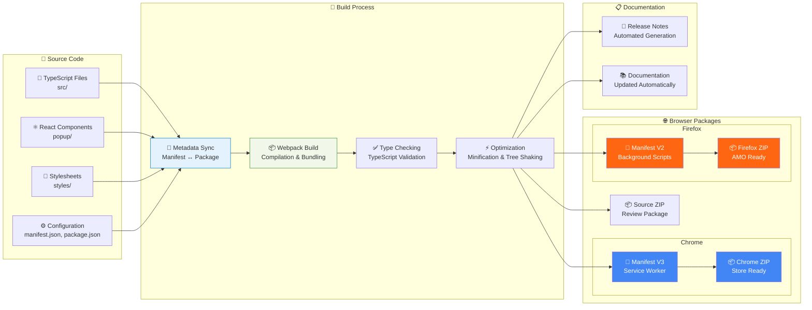
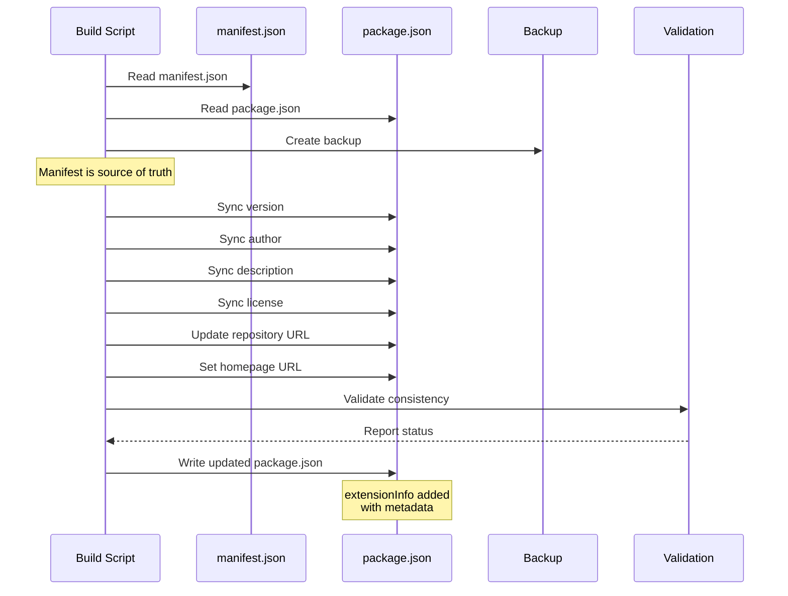
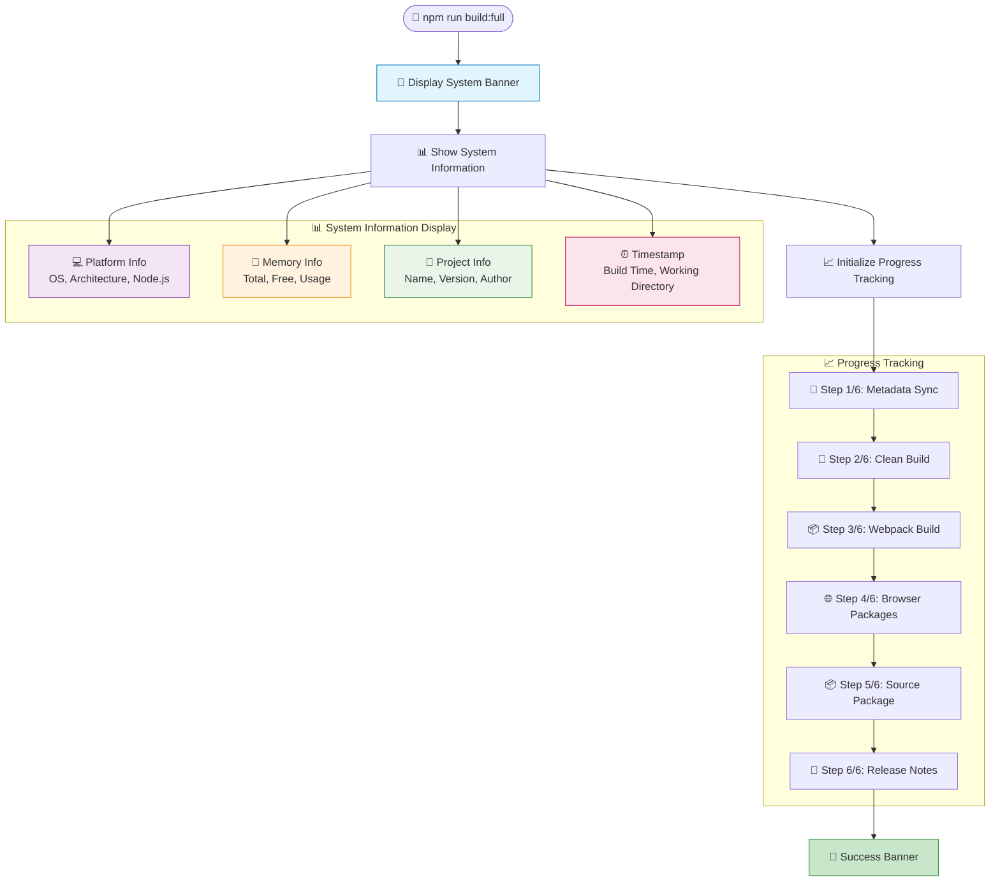
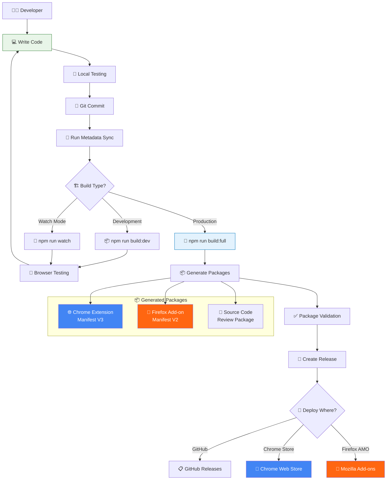
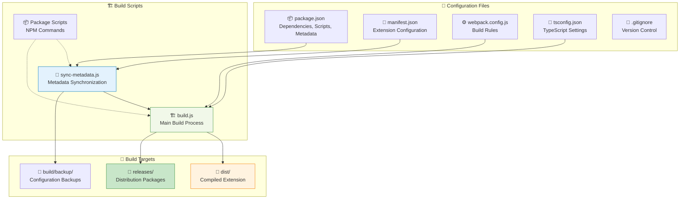
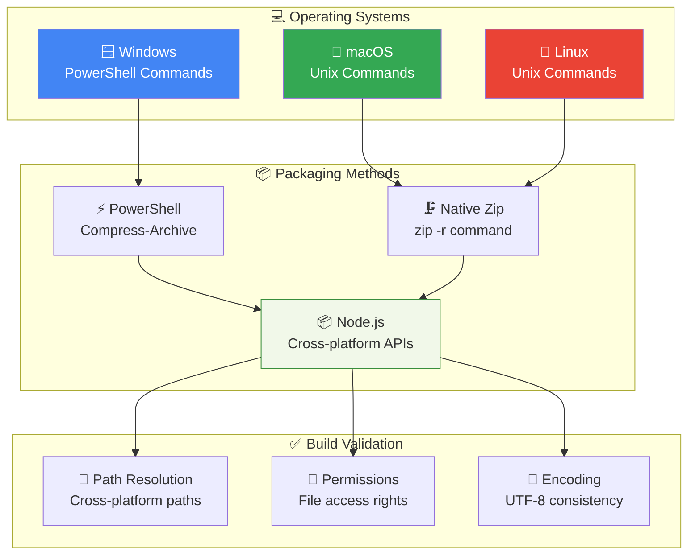
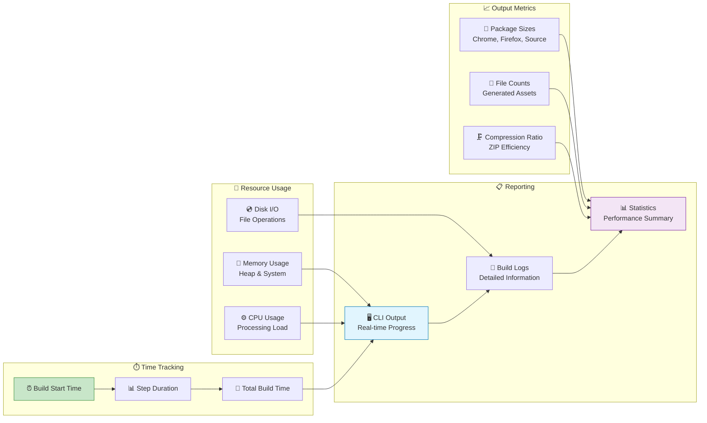

# Build System

This page explains the NovelSynth build system architecture and processes.

## 🏗️ Build Pipeline Overview

The NovelSynth build system is designed for cross-browser compatibility and professional distribution:



## 🔄 Metadata Synchronization

The build system automatically synchronizes metadata between manifest.json and package.json:



## 🎯 CLI Interface Design

The build system features a beautiful command-line interface:



## 🛠️ Development Workflow

The complete development and build workflow:



## ⚙️ Build Configuration

The build system uses multiple configuration files that work together:



## 🔧 Cross-Platform Compatibility

The build system works across different operating systems:



## 📊 Build Performance Monitoring

The build system tracks performance metrics:



## 🎨 CLI Banner Design

The build system features a beautiful ASCII banner:

```
╔═══════════════════════════════════════════════════════════════╗
║                     NovelSynth Build System                  ║
║                  Browser Extension Builder                   ║
╠═══════════════════════════════════════════════════════════════╣
║ Project:     NovelSynth                                      ║
║ Version:     1.0.0                                           ║
║ Author:      VKrishna04                                      ║
║ License:     Apache-2.0                                      ║
║ Homepage:    https://life-experimentalist.github.io/...      ║
║ Platform:    win32 x64                                       ║
║ Node.js:     v18.17.0                                        ║
║ Memory:      16GB total, 8GB free                            ║
║ CPU:         Intel(R) Core(TM) i7-9750H CPU @ 2.60GHz       ║
║ Working Dir: v:\Code\ProjectCode\NovelSynth                  ║
║ Target:      Chrome v3 + Firefox v2 Extensions              ║
║ Build Time:  12/20/2024, 2:30:45 PM                         ║
╚═══════════════════════════════════════════════════════════════╝
```

## 🚀 Build Commands Reference

| Command                 | Description                                 | Output                    |
| ----------------------- | ------------------------------------------- | ------------------------- |
| `npm run sync-metadata` | Synchronize manifest.json with package.json | Updated package.json      |
| `npm run build:dev`     | Development build with source maps          | dist/ directory           |
| `npm run build`         | Production build optimized                  | dist/ directory           |
| `npm run build:release` | Create browser packages                     | releases/ directory       |
| `npm run build:full`    | Complete build pipeline                     | All packages + docs       |
| `npm run watch`         | Development with file watching              | Continuous building       |
| `npm run clean`         | Clean build artifacts                       | Empty dist/ and releases/ |

---

The NovelSynth build system is designed for professional development with comprehensive tooling, cross-platform support, and beautiful CLI feedback.