# Component Architecture Diagram

**NovelSynth Modular Service Architecture**

This diagram illustrates NovelSynth's sophisticated component architecture, showcasing our modular, service-oriented design that promotes maintainability, testability, and extensibility.

## 🧩 Complete Component Architecture

```mermaid
graph TB
    subgraph "🌐 Browser Extension Context"
        subgraph "📱 User Interface Layer"
            POPUP[🎛️ Popup Interface<br/>Settings & Control Panel]
            CONTENT_UI[🖥️ Content Enhancement UI<br/>In-page Enhancement Display]
            OVERLAY[📱 Enhancement Overlay<br/>Progress & Status Display]
        end

        subgraph "📜 Content Scripts Layer"
            CS[📄 Content Script<br/>DOM Access & Injection]
            INJ[💉 Script Injector<br/>Safe UI Injection]
            DETECTOR[🔍 Content Detector<br/>Page Content Analysis]
        end

        subgraph "🔧 Background Services Core"
            BG[⚙️ Background Service Worker<br/>Main Extension Orchestrator]
            MSG[📡 Message Manager<br/>Cross-Context Communication]
            EVENTS[🔔 Event Bus<br/>Component Event System]
        end
    end

    subgraph "🏗️ Core Service Architecture"
        subgraph "🤖 AI Service Layer"
            AI_MGR[🧠 AI Service Manager<br/>Provider Orchestration]
            PROVIDERS[🔌 AI Providers<br/>OpenAI, Anthropic, Gemini, etc.]
            PROMPT[📝 Prompt Builder<br/>Dynamic Prompt Generation]
            RATE[⏱️ Rate Limiter<br/>Request Throttling]
        end

        subgraph "🌍 Website Handler Layer"
            SITE_MGR[🌐 Site Handler Manager<br/>Website-Specific Logic]
            HANDLERS[📋 Site Handlers<br/>AO3, FFN, Wattpad, etc.]
            EXTRACTOR[🎯 Content Extractor<br/>Text Extraction & Cleaning]
            CLASSIFIER[🏷️ Content Classifier<br/>Type & Quality Detection]
        end

        subgraph "💾 Storage & Cache Layer"
            STORAGE[🗄️ Storage Manager<br/>Encrypted User Data]
            CACHE[💾 Cache Manager<br/>Temporary Data Storage]
            CONFIG[⚙️ Config Manager<br/>User Preferences]
            CRYPTO[🔐 Crypto Service<br/>Encryption & Decryption]
        end

        subgraph "🔄 Processing Layer"
            PROCESSOR[🔄 Content Processor<br/>Enhancement Orchestration]
            SEGMENT[✂️ Content Segmenter<br/>Large Content Handling]
            ASSEMBLER[🔧 Result Assembler<br/>Enhanced Content Compilation]
            VALIDATOR[✅ Quality Validator<br/>Enhancement Quality Check]
        end
    end

    subgraph "🛡️ Security & Privacy Layer"
        SECURITY[🛡️ Security Manager<br/>Privacy & Security Enforcement]
        SANITIZER[🧹 Content Sanitizer<br/>XSS & Injection Prevention]
        AUDIT[🔍 Privacy Auditor<br/>Data Flow Monitoring]
        PERMISSIONS[🔒 Permission Manager<br/>Access Control]
    end

    subgraph "📊 Monitoring & Analytics Layer"
        MONITOR[📊 Performance Monitor<br/>System Metrics Collection]
        LOGGER[📝 Enhanced Logger<br/>Structured Logging System]
        ANALYTICS[📈 Analytics Manager<br/>Anonymous Usage Tracking]
        ERROR[🚨 Error Handler<br/>Exception Management]
    end

    %% User Interface Connections
    POPUP --> MSG
    CONTENT_UI --> CS
    OVERLAY --> CS

    %% Content Script Connections
    CS --> MSG
    INJ --> CS
    DETECTOR --> CS

    %% Background Service Connections
    BG --> MSG
    MSG --> EVENTS
    EVENTS --> AI_MGR
    EVENTS --> SITE_MGR
    EVENTS --> STORAGE
    EVENTS --> PROCESSOR

    %% AI Service Connections
    AI_MGR --> PROVIDERS
    AI_MGR --> PROMPT
    AI_MGR --> RATE
    PROMPT --> PROVIDERS
    RATE --> PROVIDERS

    %% Website Handler Connections
    SITE_MGR --> HANDLERS
    HANDLERS --> EXTRACTOR
    HANDLERS --> CLASSIFIER
    EXTRACTOR --> DETECTOR
    CLASSIFIER --> PROCESSOR

    %% Storage Connections
    STORAGE --> CACHE
    STORAGE --> CONFIG
    STORAGE --> CRYPTO
    CONFIG --> AI_MGR
    CONFIG --> SITE_MGR

    %% Processing Connections
    PROCESSOR --> SEGMENT
    PROCESSOR --> ASSEMBLER
    PROCESSOR --> VALIDATOR
    SEGMENT --> AI_MGR
    ASSEMBLER --> CONTENT_UI
    VALIDATOR --> ASSEMBLER

    %% Security Connections
    SECURITY --> SANITIZER
    SECURITY --> AUDIT
    SECURITY --> PERMISSIONS
    SANITIZER --> EXTRACTOR
    AUDIT --> STORAGE
    PERMISSIONS --> HANDLERS

    %% Monitoring Connections
    MONITOR --> LOGGER
    MONITOR --> ANALYTICS
    MONITOR --> ERROR
    LOGGER --> ALL_COMPONENTS[All Components]
    ERROR --> ALL_COMPONENTS

    %% Cross-Layer Connections
    AI_MGR --> SECURITY
    STORAGE --> SECURITY
    PROCESSOR --> MONITOR
    MSG --> ERROR

    %% Styling
    classDef ui fill:#e3f2fd,stroke:#0277bd,stroke-width:3px
    classDef content fill:#e8f5e8,stroke:#388e3c,stroke-width:2px
    classDef background fill:#fff3e0,stroke:#f57c00,stroke-width:2px
    classDef ai fill:#f3e5f5,stroke:#7b1fa2,stroke-width:2px
    classDef website fill:#e0f2f1,stroke:#00695c,stroke-width:2px
    classDef storage fill:#fce4ec,stroke:#c2185b,stroke-width:2px
    classDef processing fill:#f9fbe7,stroke:#689f38,stroke-width:2px
    classDef security fill:#ffcdd2,stroke:#d32f2f,stroke-width:3px
    classDef monitoring fill:#e8eaf6,stroke:#3f51b5,stroke-width:2px

    class POPUP,CONTENT_UI,OVERLAY ui
    class CS,INJ,DETECTOR content
    class BG,MSG,EVENTS background
    class AI_MGR,PROVIDERS,PROMPT,RATE ai
    class SITE_MGR,HANDLERS,EXTRACTOR,CLASSIFIER website
    class STORAGE,CACHE,CONFIG,CRYPTO storage
    class PROCESSOR,SEGMENT,ASSEMBLER,VALIDATOR processing
    class SECURITY,SANITIZER,AUDIT,PERMISSIONS security
    class MONITOR,LOGGER,ANALYTICS,ERROR monitoring
```



## 🏗️ Architecture Layer Analysis

### 📱 User Interface Layer

The UI layer provides intuitive interfaces for user interaction and content display.

#### 🎛️ Popup Interface
**Purpose**: Primary user control panel for extension settings and status

**Features**:
- API key management with secure input
- Provider selection and configuration
- Enhancement history and statistics
- Real-time processing status
- Quick settings toggles

**Implementation**:
```typescript
class PopupInterface extends React.Component {
  constructor(props: PopupProps) {
    super(props);
    this.state = {
      providers: [],
      currentProvider: null,
      processingStatus: 'idle',
      enhancementHistory: []
    };
  }

  async componentDidMount() {
    // Load user configuration
    const config = await ConfigManager.loadConfig();
    this.setState({ providers: config.providers });

    // Listen for processing updates
    MessageManager.onMessage('processing.status', this.updateStatus);
  }

  render() {
    return (
      <EnhancementControlPanel
        providers={this.state.providers}
        onProviderChange={this.handleProviderChange}
        onEnhancementRequest={this.handleEnhancementRequest}
        status={this.state.processingStatus}
      />
    );
  }
}
```

#### 🖥️ Content Enhancement UI
**Purpose**: In-page display of enhanced content with comparison features

**Features**:
- Side-by-side original/enhanced comparison
- Interactive enhancement markers
- Copy/export functionality
- Enhancement quality feedback
- Undo/redo capabilities

#### 📱 Enhancement Overlay
**Purpose**: Non-intrusive progress and status display during processing

**Features**:
- Real-time progress tracking
- Cancellation controls
- Error message display
- Processing statistics
- Beautiful animations

### 📜 Content Scripts Layer

The content scripts layer handles safe interaction with website content.

#### 📄 Content Script
**Purpose**: Bridge between web page and extension functionality

**Core Responsibilities**:
```typescript
class ContentScript {
  private detector: ContentDetector;
  private injector: ScriptInjector;
  private messageHandler: MessageHandler;

  async initialize(): Promise<void> {
    // Initialize secure communication
    this.messageHandler = new MessageHandler();

    // Set up content detection
    this.detector = new ContentDetector();
    await this.detector.initialize();

    // Initialize UI injection
    this.injector = new ScriptInjector();

    // Listen for enhancement requests
    this.messageHandler.onMessage('enhance.content', this.handleEnhanceRequest);
  }

  private async handleEnhanceRequest(): Promise<void> {
    const content = await this.detector.extractContent();
    if (content) {
      const enhancementUI = await this.injector.createEnhancementUI();
      enhancementUI.showProgress();

      // Send content to background for processing
      this.messageHandler.sendMessage('process.content', content);
    }
  }
}
```

#### 🔍 Content Detector
**Purpose**: Intelligent detection and extraction of enhanceable content

**Detection Strategies**:
- **Website-Specific Handlers**: Optimized selectors for known sites
- **Generic Content Detection**: Heuristic-based detection for unknown sites
- **Content Quality Assessment**: Validation of enhancement suitability
- **Format Preservation**: Maintaining important formatting during extraction

#### 💉 Script Injector
**Purpose**: Safe injection of enhancement UI into web pages

**Security Features**:
- CSP-compliant injection methods
- Sandboxed execution environment
- XSS prevention measures
- Minimal DOM manipulation

### 🔧 Background Services Core

The background layer orchestrates all extension functionality.

#### ⚙️ Background Service Worker
**Purpose**: Main extension orchestrator running in service worker context

**Core Functions**:
```typescript
class BackgroundService {
  private messageManager: MessageManager;
  private aiServiceManager: AIServiceManager;
  private storageManager: StorageManager;

  async initialize(): Promise<void> {
    // Initialize core services
    this.messageManager = new MessageManager();
    this.aiServiceManager = new AIServiceManager();
    this.storageManager = new StorageManager();

    // Set up message routing
    this.setupMessageRouting();

    // Initialize AI providers
    await this.aiServiceManager.initializeProviders();
  }

  private setupMessageRouting(): void {
    this.messageManager.route('process.content', this.handleContentProcessing);
    this.messageManager.route('config.update', this.handleConfigUpdate);
    this.messageManager.route('provider.test', this.handleProviderTest);
  }

  private async handleContentProcessing(content: ContentData): Promise<void> {
    try {
      const enhanced = await this.aiServiceManager.enhanceContent(content);
      this.messageManager.broadcast('content.enhanced', enhanced);
    } catch (error) {
      this.messageManager.broadcast('content.error', error);
    }
  }
}
```

#### 📡 Message Manager
**Purpose**: Cross-context communication hub

**Message Types**:
- **Command Messages**: Action requests between components
- **Event Messages**: Status updates and notifications
- **Data Messages**: Content and configuration transfers
- **Error Messages**: Exception and error reporting

#### 🔔 Event Bus
**Purpose**: Component event system for loose coupling

**Event Categories**:
- **Content Events**: Detection, extraction, enhancement
- **Provider Events**: Selection, testing, rate limiting
- **Storage Events**: Configuration updates, cache management
- **UI Events**: User interactions, display updates

### 🤖 AI Service Layer

The AI layer manages all artificial intelligence functionality.

#### 🧠 AI Service Manager
**Purpose**: Orchestrates AI provider interactions and load balancing

**Provider Selection Algorithm**:
```typescript
class AIServiceManager {
  private providers: Map<string, AIProvider> = new Map();
  private rateLimiter: RateLimiter;
  private loadBalancer: LoadBalancer;

  async selectOptimalProvider(request: EnhancementRequest): Promise<AIProvider> {
    const candidates = this.getAvailableProviders();
    const scores = await this.scoreProviders(candidates, request);

    // Sort by score and availability
    const ranked = scores.sort((a, b) => b.score - a.score);

    for (const candidate of ranked) {
      if (await this.rateLimiter.checkAvailability(candidate.provider)) {
        return candidate.provider;
      }
    }

    throw new Error('No available AI providers');
  }

  private async scoreProviders(
    providers: AIProvider[],
    request: EnhancementRequest
  ): Promise<ProviderScore[]> {
    return providers.map(provider => ({
      provider,
      score: this.calculateProviderScore(provider, request)
    }));
  }

  private calculateProviderScore(
    provider: AIProvider,
    request: EnhancementRequest
  ): number {
    let score = 0;

    // Content type compatibility
    score += provider.getContentTypeScore(request.contentType) * 0.4;

    // Rate limit status
    score += this.rateLimiter.getAvailabilityScore(provider) * 0.3;

    // User preference
    score += this.getUserPreferenceScore(provider) * 0.2;

    // Cost efficiency
    score += provider.getCostScore(request.tokenCount) * 0.1;

    return score;
  }
}
```

#### 🔌 AI Providers
**Purpose**: Abstracted interfaces to different AI services

**Provider Implementation Pattern**:
```typescript
abstract class BaseAIProvider implements AIProvider {
  protected apiKey: string;
  protected baseURL: string;
  protected rateLimiter: ProviderRateLimiter;

  abstract async enhance(content: string, options: EnhancementOptions): Promise<EnhancedContent>;
  abstract getContentTypeScore(type: ContentType): number;
  abstract getCostScore(tokenCount: number): number;

  protected async makeRequest(payload: any): Promise<any> {
    await this.rateLimiter.waitForAvailability();

    const response = await fetch(this.baseURL, {
      method: 'POST',
      headers: this.getHeaders(),
      body: JSON.stringify(payload)
    });

    if (!response.ok) {
      throw new AIProviderError(`API request failed: ${response.status}`);
    }

    return response.json();
  }
}

class OpenAIProvider extends BaseAIProvider {
  async enhance(content: string, options: EnhancementOptions): Promise<EnhancedContent> {
    const prompt = this.buildPrompt(content, options);
    const payload = {
      model: 'gpt-4',
      messages: [{ role: 'user', content: prompt }],
      temperature: 0.7
    };

    const response = await this.makeRequest(payload);
    return this.parseResponse(response);
  }
}
```

### 🌍 Website Handler Layer

The website layer provides site-specific content extraction logic.

#### 🌐 Site Handler Manager
**Purpose**: Dynamic website handler selection and management

**Handler Selection Logic**:
```typescript
class SiteHandlerManager {
  private handlers: Map<string, WebsiteHandler> = new Map();
  private genericHandler: GenericWebsiteHandler;

  getHandler(url: string): WebsiteHandler {
    const domain = this.extractDomain(url);

    // Check for specific handler
    if (this.handlers.has(domain)) {
      return this.handlers.get(domain);
    }

    // Check for pattern-based handlers
    const patternHandler = this.findPatternHandler(url);
    if (patternHandler) {
      return patternHandler;
    }

    // Fall back to generic handler
    return this.genericHandler;
  }

  registerHandler(pattern: string, handler: WebsiteHandler): void {
    this.handlers.set(pattern, handler);
  }
}
```

#### 📋 Site Handlers
**Purpose**: Website-specific content extraction implementations

**Handler Implementation Example**:
```typescript
class ArchiveOfOurOwnHandler implements WebsiteHandler {
  readonly name = 'Archive of Our Own';
  readonly patterns = ['archiveofourown.org'];

  async detectContent(): Promise<ContentDetectionResult> {
    const workElement = document.querySelector('#workskin');
    if (!workElement) {
      return { found: false, reason: 'No work content found' };
    }

    const title = document.querySelector('h2.title')?.textContent?.trim();
    const author = document.querySelector('a[rel="author"]')?.textContent?.trim();

    return {
      found: true,
      element: workElement,
      metadata: {
        title,
        author,
        type: 'fanfiction',
        wordCount: this.estimateWordCount(workElement)
      }
    };
  }

  async extractContent(element: HTMLElement): Promise<ExtractedContent> {
    // Remove navigation and metadata elements
    const cleaned = this.removeUnwantedElements(element);

    // Extract and preserve chapter structure
    const chapters = this.extractChapters(cleaned);

    return {
      text: this.elementsToText(chapters),
      formatting: this.preserveFormatting(chapters),
      metadata: await this.extractMetadata(element)
    };
  }
}
```

### 💾 Storage & Cache Layer

The storage layer manages secure data persistence and caching.

#### 🗄️ Storage Manager
**Purpose**: Encrypted storage of sensitive user data

**Security Implementation**:
```typescript
class StorageManager {
  private cryptoService: CryptoService;

  async storeSecure(key: string, value: any): Promise<void> {
    const encrypted = await this.cryptoService.encrypt(JSON.stringify(value));
    await browser.storage.local.set({ [key]: encrypted });
  }

  async retrieveSecure<T>(key: string): Promise<T | null> {
    const stored = await browser.storage.local.get(key);
    if (!stored[key]) return null;

    const decrypted = await this.cryptoService.decrypt(stored[key]);
    return JSON.parse(decrypted);
  }

  async storeAPIKey(provider: string, key: string): Promise<void> {
    const hashedKey = await this.cryptoService.hash(key);
    await this.storeSecure(`api_key_${provider}`, {
      key: key,
      hash: hashedKey,
      timestamp: Date.now()
    });
  }
}
```

#### 💾 Cache Manager
**Purpose**: Temporary data storage with automatic expiration

**Cache Implementation**:
```typescript
class CacheManager {
  private cache: Map<string, CacheEntry> = new Map();

  async set(key: string, value: any, ttl: number = 3600): Promise<void> {
    const entry: CacheEntry = {
      value,
      timestamp: Date.now(),
      ttl: ttl * 1000
    };

    this.cache.set(key, entry);

    // Set expiration timer
    setTimeout(() => {
      this.cache.delete(key);
    }, entry.ttl);
  }

  async get<T>(key: string): Promise<T | null> {
    const entry = this.cache.get(key);
    if (!entry) return null;

    // Check if expired
    if (Date.now() - entry.timestamp > entry.ttl) {
      this.cache.delete(key);
      return null;
    }

    return entry.value;
  }
}
```

## 🔄 Component Interaction Patterns

### 📡 Message-Based Communication

Components communicate through structured messages to maintain loose coupling:

```typescript
// Message interface definition
interface Message {
  type: string;
  payload: any;
  sender: string;
  timestamp: number;
  id: string;
}

// Example message flow
class ComponentA {
  async processContent(content: string): Promise<void> {
    // Send processing request
    await MessageManager.send({
      type: 'content.process',
      payload: { content, options: this.getOptions() },
      sender: 'ComponentA'
    });

    // Listen for result
    MessageManager.onMessage('content.processed', (message) => {
      this.handleProcessedContent(message.payload);
    });
  }
}
```

### 🔔 Event-Driven Architecture

Components can emit and listen to events for reactive programming:

```typescript
class EventDrivenComponent extends EventEmitter {
  async processData(data: any): Promise<void> {
    this.emit('processing.started', { data });

    try {
      const result = await this.performProcessing(data);
      this.emit('processing.completed', { result });
    } catch (error) {
      this.emit('processing.failed', { error });
    }
  }
}

// Other components can listen to events
aiService.on('processing.completed', (event) => {
  ui.displayResult(event.result);
});
```

### 🏭 Dependency Injection

Components receive dependencies through injection for better testability:

```typescript
class ServiceContainer {
  private services: Map<string, any> = new Map();

  register<T>(name: string, service: T): void {
    this.services.set(name, service);
  }

  get<T>(name: string): T {
    if (!this.services.has(name)) {
      throw new Error(`Service ${name} not found`);
    }
    return this.services.get(name);
  }
}

// Component using dependency injection
class AIServiceManager {
  constructor(
    private storageManager: StorageManager,
    private rateLimiter: RateLimiter,
    private logger: Logger
  ) {}

  // Component implementation
}

// Registration and initialization
const container = new ServiceContainer();
container.register('storage', new StorageManager());
container.register('rateLimiter', new RateLimiter());
container.register('logger', new Logger());

const aiService = new AIServiceManager(
  container.get('storage'),
  container.get('rateLimiter'),
  container.get('logger')
);
```

## 🧪 Testing Architecture

### 🔬 Component Testing Strategy

Each component is designed for comprehensive testing:

```typescript
// Mock dependencies for testing
class MockStorageManager implements StorageManager {
  private data: Map<string, any> = new Map();

  async store(key: string, value: any): Promise<void> {
    this.data.set(key, value);
  }

  async retrieve<T>(key: string): Promise<T | null> {
    return this.data.get(key) || null;
  }
}

// Component test
describe('AIServiceManager', () => {
  let aiService: AIServiceManager;
  let mockStorage: MockStorageManager;
  let mockRateLimiter: MockRateLimiter;

  beforeEach(() => {
    mockStorage = new MockStorageManager();
    mockRateLimiter = new MockRateLimiter();
    aiService = new AIServiceManager(mockStorage, mockRateLimiter);
  });

  it('should select provider based on content type', async () => {
    await mockStorage.store('preferred_provider', 'openai');

    const provider = await aiService.selectProvider({
      contentType: 'fiction',
      content: 'test content'
    });

    expect(provider.name).toBe('openai');
  });
});
```

### 🔗 Integration Testing

Integration tests verify component interactions:

```typescript
describe('Content Enhancement Flow', () => {
  it('should enhance content from detection to display', async () => {
    // Set up components
    const contentDetector = new ContentDetector();
    const aiService = new AIServiceManager();
    const uiManager = new UIManager();

    // Mock webpage content
    document.body.innerHTML = '<article>Original content</article>';

    // Trigger enhancement flow
    const content = await contentDetector.detectContent();
    expect(content.found).toBe(true);

    const enhanced = await aiService.enhanceContent(content);
    expect(enhanced.text).toContain('Original content');
    expect(enhanced.text.length).toBeGreaterThan(content.text.length);

    await uiManager.displayEnhancement(enhanced);
    expect(document.querySelector('.enhancement-ui')).toBeTruthy();
  });
});
```

## 📈 Performance & Scalability

### ⚡ Component Performance

Each component is optimized for performance:

```typescript
class PerformantComponent {
  private cache: LRUCache<string, any>;
  private taskQueue: TaskQueue;

  constructor() {
    this.cache = new LRUCache({ max: 1000 });
    this.taskQueue = new TaskQueue({ concurrency: 3 });
  }

  async processWithCaching(key: string, processor: () => Promise<any>): Promise<any> {
    // Check cache first
    const cached = this.cache.get(key);
    if (cached) return cached;

    // Queue processing task
    const result = await this.taskQueue.add(() => processor());

    // Cache result
    this.cache.set(key, result);
    return result;
  }
}
```

### 🔄 Scalability Patterns

Components support horizontal scaling:

```typescript
class ScalableAIService {
  private providers: AIProvider[];
  private loadBalancer: LoadBalancer;

  async enhanceContent(content: string): Promise<EnhancedContent> {
    // Distribute load across providers
    const provider = await this.loadBalancer.selectProvider();

    // Process with retry and failover
    return this.processWithRetry(content, provider);
  }

  private async processWithRetry(
    content: string,
    provider: AIProvider,
    retries: number = 3
  ): Promise<EnhancedContent> {
    try {
      return await provider.enhance(content);
    } catch (error) {
      if (retries > 0) {
        const fallbackProvider = await this.loadBalancer.selectFallback();
        return this.processWithRetry(content, fallbackProvider, retries - 1);
      }
      throw error;
    }
  }
}
```

---

This component architecture ensures NovelSynth remains maintainable, testable, and scalable while providing excellent performance and user experience. The modular design allows for easy extension and modification as the project evolves.