# Data Flow Diagram

**NovelSynth Complete Data Flow Visualization**

This diagram illustrates the complete data flow through the NovelSynth extension, from user interaction to AI processing and result display, showing all intermediate steps and decision points.

## 🔄 Complete Data Flow Sequence


## 📊 Data Flow Analysis by Phase

### 🔧 Extension Initialization Phase

**Purpose**: Configure the extension with user preferences and API credentials

**Data Elements**:
- **API Keys**: Encrypted storage of provider credentials
- **User Preferences**: Provider selection, model choices, feature toggles
- **Configuration Validation**: Real-time testing of API connectivity
- **Setting Synchronization**: Cross-component configuration updates

**Security Measures**:
- API keys encrypted using browser's native secure storage
- No credential transmission to NovelSynth servers
- Validation of configuration before storage
- Automatic cleanup of temporary validation data

**Performance Characteristics**:
- Configuration load: <100ms
- API validation: 1-3s per provider
- Settings persistence: <50ms
- Cross-component sync: <200ms

### 🔍 Content Detection Phase

**Purpose**: Identify suitable content for enhancement and inject user interface

**Detection Algorithm**:
1. **URL Pattern Matching**: Check against known website handlers
2. **DOM Structure Analysis**: Look for content containers and text blocks
3. **Content Quality Assessment**: Evaluate text length and coherence
4. **Content Type Classification**: Fiction, technical, news, or general content

**Data Extraction**:
- **Text Content**: Main article/story text with formatting preservation
- **Metadata**: Title, author, publication date, content type
- **Context Information**: Website type, navigation structure, related content
- **User Interface Integration**: Button placement and styling

**Performance Metrics**:
- Page analysis: <200ms
- Content extraction: <500ms for typical articles
- UI injection: <100ms
- Memory usage: <5MB for large content

### ⚡ Content Processing Phase

**Purpose**: Prepare content for AI processing with optimal segmentation and prompt construction

**Processing Pipeline**:
1. **Content Validation**: Check for minimum length and quality thresholds
2. **Content Cleaning**: Remove ads, navigation, and irrelevant elements
3. **Format Preservation**: Maintain paragraph structure and emphasis
4. **Segmentation Strategy**: Split large content while preserving context

**Segmentation Logic**:
```
if (contentLength > 8000 tokens) {
  segments = intelligentSplit({
    method: 'semantic',        // Split at paragraph boundaries
    overlap: 200,             // Token overlap between segments
    maxSize: 6000,            // Maximum tokens per segment
    preserveContext: true     // Maintain story/article flow
  });
}
```

**Quality Metrics**:
- Text extraction accuracy: >95%
- Format preservation: >90%
- Segmentation coherence: >85%
- Processing speed: <2s for 10,000 words

### 🤖 AI Processing Phase

**Purpose**: Send content to AI providers with intelligent retry logic and rate limiting

**Provider Selection Algorithm**:
1. **User Preference**: Primary provider from configuration
2. **Rate Limit Status**: Check current usage against limits
3. **Content Type Optimization**: Best provider for content type
4. **Cost Optimization**: Balance quality vs. usage costs

**Rate Limiting Strategy**:
```typescript
interface RateLimitConfig {
  provider: string;
  requestsPerMinute: number;
  tokensPerMinute: number;
  currentUsage: UsageTracker;
  backoffStrategy: 'exponential' | 'linear';
}
```

**Retry Logic**:
- **Initial Attempt**: Use preferred provider
- **Rate Limited**: Exponential backoff (2s, 4s, 8s, 16s)
- **Provider Error**: Try alternative provider
- **Final Fallback**: User notification with retry option

**Performance Tracking**:
- Average response time per provider
- Success rate and error frequency
- Token usage and cost estimation
- User satisfaction metrics

### 🎨 Result Assembly Phase

**Purpose**: Combine processed segments and display enhanced content with preserved formatting

**Assembly Process**:
1. **Segment Recombination**: Merge processed chunks maintaining flow
2. **Format Restoration**: Apply original emphasis, links, and structure
3. **Enhancement Highlighting**: Mark improved sections for user visibility
4. **Statistics Generation**: Processing time, tokens used, improvements made

**Display Features**:
- **Side-by-side Comparison**: Original vs. enhanced content
- **Diff Highlighting**: Visual indicators of changes and improvements
- **Processing Metrics**: Time taken, provider used, enhancement quality
- **Export Options**: Copy enhanced text, save as file, share results

**Quality Assurance**:
- **Content Integrity**: Verify no information loss during processing
- **Format Consistency**: Ensure visual coherence with original
- **Performance Validation**: Check processing time and resource usage
- **User Experience**: Smooth transitions and responsive interactions

## 🔄 Alternative Data Flows

### 🚨 Error Handling Flow

```mermaid
flowchart TD
    ERROR[🚨 Processing Error] --> TYPE{Error Type?}

    TYPE -->|Rate Limited| WAIT[⏳ Exponential Backoff]
    TYPE -->|API Error| RETRY[🔄 Retry with Same Provider]
    TYPE -->|Provider Down| FALLBACK[🔀 Switch to Fallback Provider]
    TYPE -->|Invalid Key| CONFIG[⚙️ Prompt for Configuration]
    TYPE -->|Network Error| NETWORK[🌐 Check Connectivity]

    WAIT --> CHECK{Rate Limit Cleared?}
    CHECK -->|Yes| RESUME[▶️ Resume Processing]
    CHECK -->|No| WAIT

    RETRY --> SUCCESS{Retry Successful?}
    SUCCESS -->|Yes| RESUME
    SUCCESS -->|No| FALLBACK

    FALLBACK --> AVAILABLE{Fallback Available?}
    AVAILABLE -->|Yes| RESUME
    AVAILABLE -->|No| NOTIFY[📢 Notify User]

    CONFIG --> USER[👤 User Reconfigures]
    USER --> RESUME

    NETWORK --> RECONNECT{Connection Restored?}
    RECONNECT -->|Yes| RESUME
    RECONNECT -->|No| NOTIFY

    RESUME --> COMPLETE[✅ Processing Complete]
    NOTIFY --> MANUAL[👤 Manual Retry Option]
    MANUAL --> RESUME
```



### ⚡ Fast Path Flow

**Purpose**: Optimized flow for small content and cached configurations

**Optimization Strategies**:
- **Configuration Caching**: Skip settings retrieval for repeat users
- **Provider Warm-up**: Pre-validate API connectivity
- **Content Pre-processing**: Background analysis during page load
- **Result Caching**: Store recent enhancements for identical content

**Performance Targets**:
- Configuration load: <50ms (cached)
- Content detection: <100ms (pre-analyzed)
- AI processing: <5s (warm provider)
- Result display: <100ms (optimized rendering)

## 📈 Performance Monitoring

### 🔍 Data Collection Points

**Processing Metrics**:
- Content detection accuracy and speed
- AI provider response times and success rates
- Memory usage during processing
- Network bandwidth consumption

**User Experience Metrics**:
- Time from click to enhancement display
- User satisfaction with enhancement quality
- Feature usage patterns and preferences
- Error frequency and recovery time

**System Health Metrics**:
- Extension resource consumption
- Cross-browser compatibility metrics
- API rate limit adherence
- Security audit results

### 📊 Analytics Dashboard

**Real-time Monitoring**:
- Active processing requests
- Provider status and performance
- Error rates and types
- User engagement metrics

**Historical Analysis**:
- Performance trends over time
- Popular content types and websites
- Provider reliability statistics
- Enhancement quality improvements

## 🔒 Privacy-Preserving Data Flow

### 🛡️ Data Protection Principles

**Zero Collection Policy**:
- User content never stored on NovelSynth servers
- Processing happens entirely client-side or direct-to-AI
- No analytics or telemetry data transmitted
- API keys encrypted locally, never shared

**Data Flow Validation**:
```typescript
interface DataFlowValidation {
  source: 'browser' | 'user';
  destination: 'ai-provider' | 'local-storage';
  encryption: boolean;
  retention: 'none' | 'session' | 'persistent';
  purpose: 'processing' | 'configuration' | 'cache';
}
```

**Security Checkpoints**:
1. **Input Validation**: Sanitize all user inputs and content
2. **Encryption Verification**: Ensure API keys properly encrypted
3. **Network Security**: Validate HTTPS connections to AI providers
4. **Storage Audit**: Regular cleanup of temporary processing data

---

This comprehensive data flow documentation ensures transparency in how NovelSynth handles user data while maintaining the highest standards of privacy and security throughout the content enhancement process.