# NovelSynth Development & Build System

**Comprehensive Build Pipeline, Development Workflow & Release Management**

This document provides complete documentation for NovelSynth's build system, featuring beautiful CLI interfaces, cross-platform compatibility, and professional release management.

## 📋 Table of Contents

1. [Build System Overview](#️-build-system-overview)
2. [Development Workflow](#️-development-workflow)
3. [Build Pipeline Architecture](#-build-pipeline-architecture)
4. [CLI Interface Design](#-cli-interface-design)
5. [Quality Assurance](#-quality-assurance)
6. [Release Management](#-release-management)
7. [Cross-Platform Compatibility](#-cross-platform-compatibility)
8. [Performance Monitoring](#-performance-monitoring)
9. [Commands Reference](#-commands-reference)

---

## 🏗️ Build System Overview

NovelSynth's build system is designed for professional development with beautiful CLI interfaces, comprehensive testing, and automated release management across multiple browsers.

### Core Design Principles

- **🎨 Beautiful CLI**: Enhanced user experience with visual progress tracking
- **🔄 Automated Workflow**: Minimal manual intervention required
- **🌐 Cross-Platform**: Works seamlessly on Windows, macOS, and Linux
- **📦 Multi-Target**: Generates optimized packages for Chrome, Firefox, and source distribution
- **✅ Quality Assurance**: Comprehensive testing and validation at every step

### Complete Build System Architecture

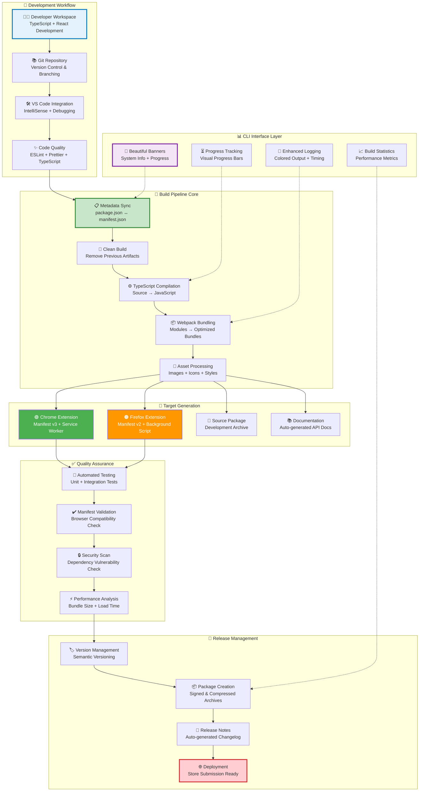

---

## 🛠️ Development Workflow

### Complete Development Process

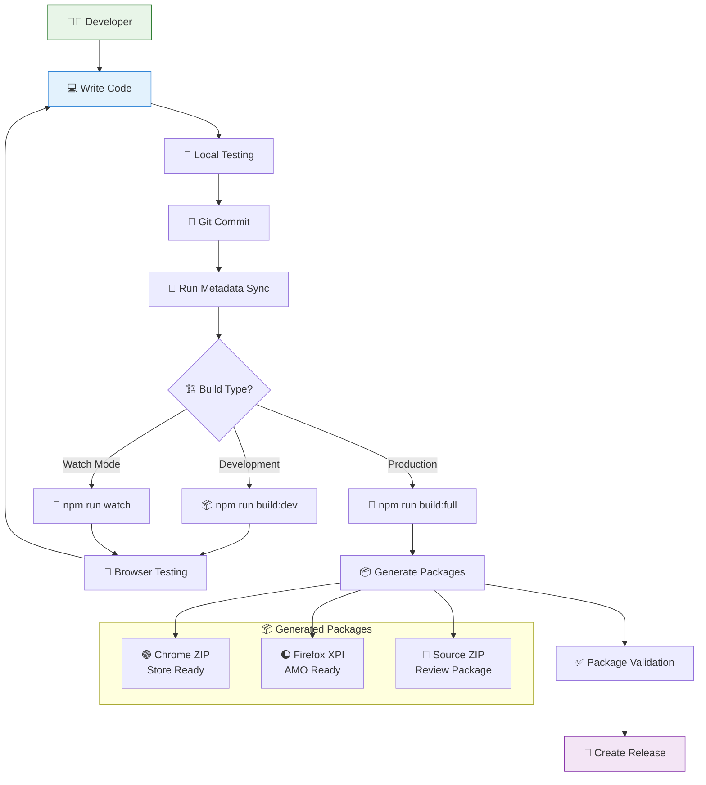

### Development Commands

```bash
# Initial setup
npm install
npm run sync-metadata

# Development workflow
npm run dev              # Watch mode with hot reload
npm run build:dev        # Development build with source maps
npm run build:full       # Production build with optimization

# Testing
npm run test             # Run test suite
npm run test:watch       # Tests in watch mode
npm run type-check       # TypeScript validation

# Quality assurance
npm run lint             # ESLint checking
npm run format           # Prettier formatting
npm run validate         # Full validation pipeline

# Package generation
npm run package          # Generate all packages
npm run package:chrome   # Chrome-specific package
npm run package:firefox  # Firefox-specific package
```

---

## 🔧 Build Pipeline Architecture

### Metadata Synchronization

The build system automatically synchronizes metadata between `package.json` and `manifest.json`:

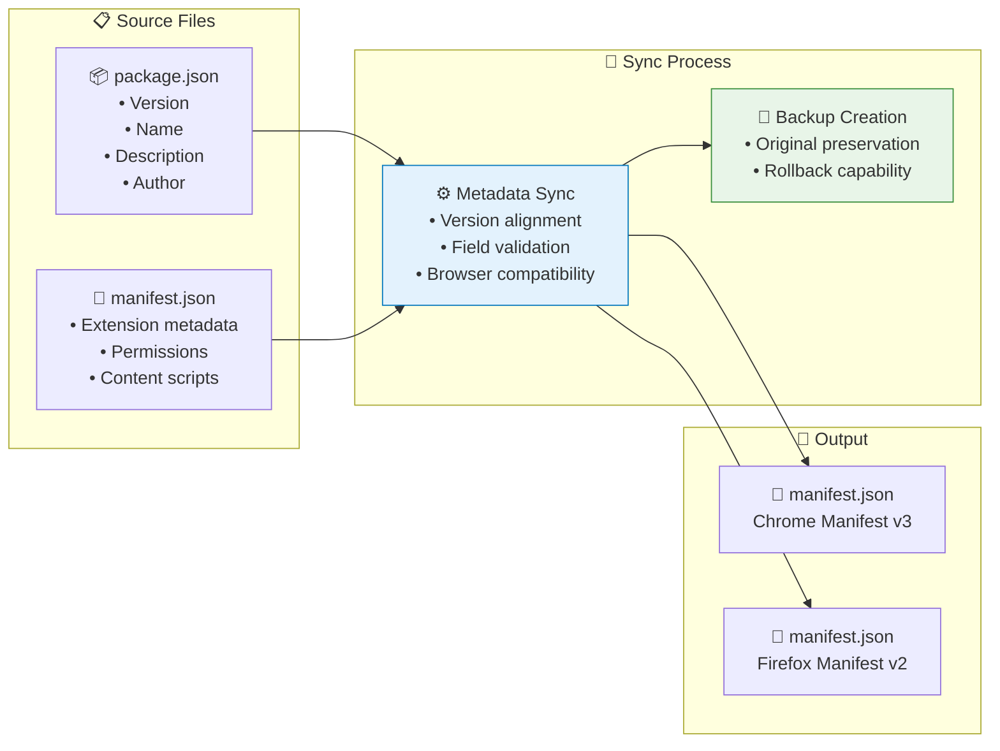

### TypeScript Compilation & Bundling

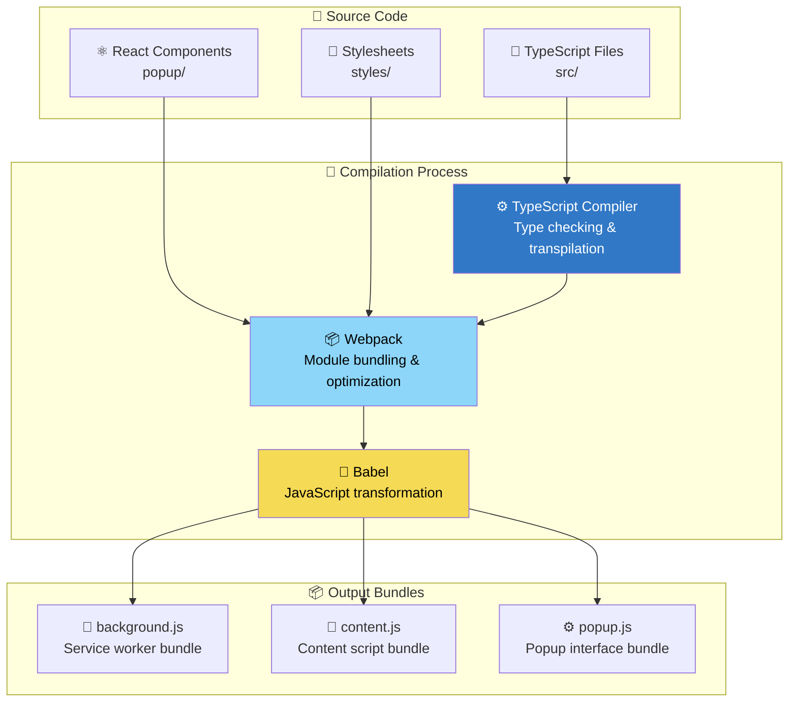

### Asset Processing Pipeline

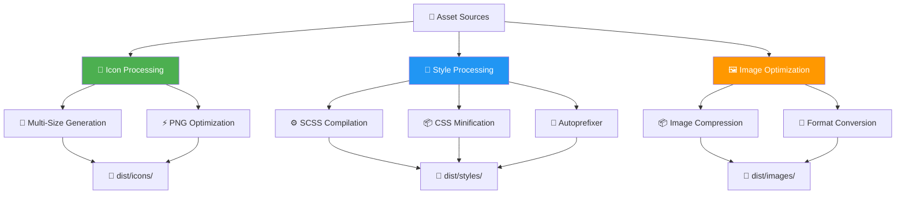

---

## 🎨 CLI Interface Design

### Beautiful System Banner

The build system features a comprehensive information banner:

```
╔══════════════════════════════════════════════════════════════════════════════╗
║                            🚀 NovelSynth Build System                         ║
╠══════════════════════════════════════════════════════════════════════════════╣
║  📋 Project Information                                                        ║
║  ├─ Name: NovelSynth                    │  ├─ Version: 1.0.0                 ║
║  ├─ Description: AI-powered content     │  ├─ License: MIT                   ║
║  │   enhancement extension              │  └─ Author: Your Name              ║
║                                                                                ║
║  💻 System Information                                                         ║
║  ├─ Platform: Windows 11                │  ├─ Memory: 16.0 GB               ║
║  ├─ Node.js: v18.17.0                   │  ├─ CPU: Intel i7-12700K          ║
║  ├─ npm: 9.6.7                          │  └─ Architecture: x64              ║
║                                                                                ║
║  🎯 Build Configuration                                                        ║
║  ├─ Target: Production                  │  ├─ Mode: Release                  ║
║  ├─ Environment: Cross-browser          │  ├─ Optimization: Enabled         ║
║  ├─ Working Directory: NovelSynth/      │  └─ Timestamp: 2024-12-07 15:30   ║
╚══════════════════════════════════════════════════════════════════════════════╝
```

### Progress Tracking System

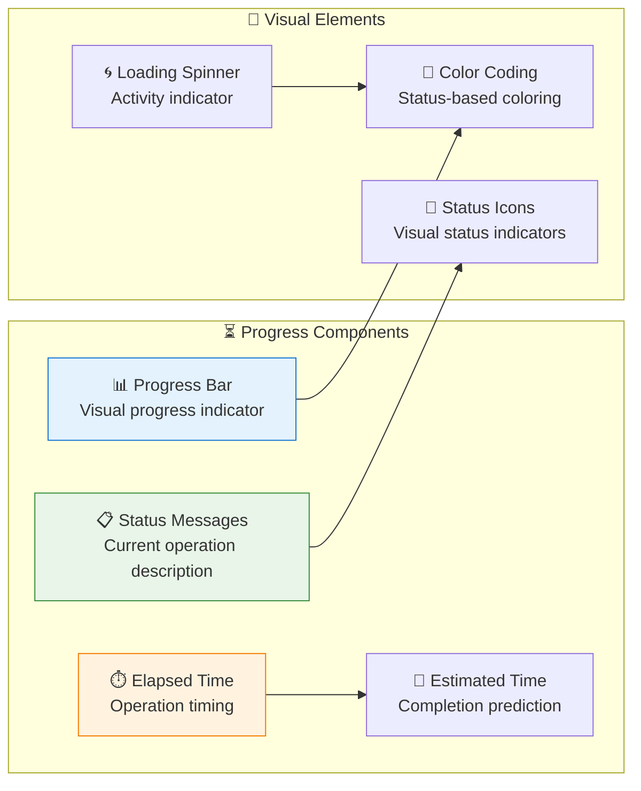

### Enhanced Logging System

```bash
[15:30:42] 🔄 Starting metadata synchronization...
[15:30:42] ✅ package.json → manifest.json sync complete
[15:30:43] 🧹 Cleaning previous build artifacts...
[15:30:43] ⚙️ Compiling TypeScript sources...
[15:30:45] 📦 Bundling with Webpack...
[15:30:47] 🎨 Processing assets and icons...
[15:30:48] ✅ Chrome extension build complete (2.1 MB)
[15:30:48] ✅ Firefox extension build complete (2.0 MB)
[15:30:49] 📊 Build Statistics:
           ├─ Build time: 7.2 seconds
           ├─ Bundle size: 2.1 MB (Chrome), 2.0 MB (Firefox)
           ├─ Type errors: 0
           └─ Lint warnings: 0
```

---

## ✅ Quality Assurance

### Automated Testing Framework

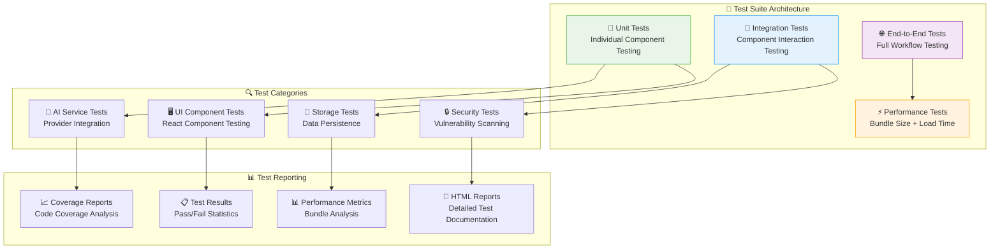

### Manifest Validation & Compatibility

```typescript
class ManifestValidator {
  validateChromeManifest(manifest: any): ValidationResult {
    const errors: string[] = [];

    // Validate manifest version
    if (manifest.manifest_version !== 3) {
      errors.push('Chrome manifest must use version 3');
    }

    // Validate service worker
    if (!manifest.background?.service_worker) {
      errors.push('Chrome manifest must specify service worker');
    }

    // Validate host permissions
    if (!manifest.host_permissions) {
      errors.push('Chrome manifest must specify host permissions');
    }

    return { valid: errors.length === 0, errors };
  }

  validateFirefoxManifest(manifest: any): ValidationResult {
    const errors: string[] = [];

    // Validate manifest version
    if (manifest.manifest_version !== 2) {
      errors.push('Firefox manifest must use version 2');
    }

    // Validate background scripts
    if (!manifest.background?.scripts) {
      errors.push('Firefox manifest must specify background scripts');
    }

    return { valid: errors.length === 0, errors };
  }
}
```

### Security Scanning

```bash
# Dependency vulnerability check
npm audit --audit-level high

# SAST (Static Application Security Testing)
npm run security:scan

# License compliance check
npm run license:check

# Bundle analysis for security
npm run analyze:security
```

---

## 🚀 Release Management

### Semantic Versioning Automation

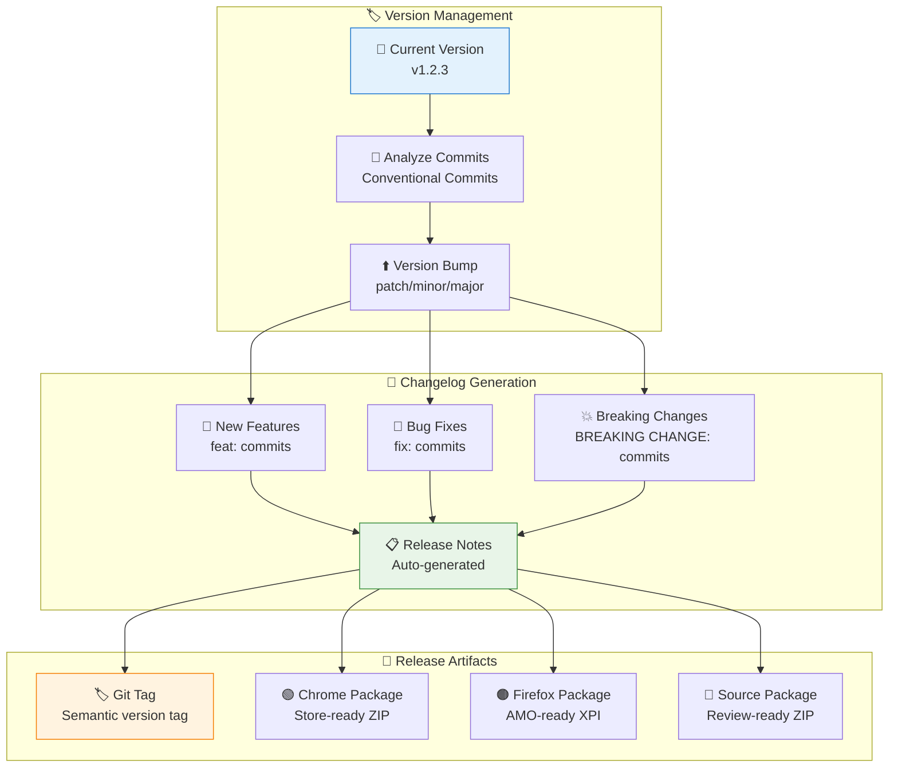

### Package Creation & Signing

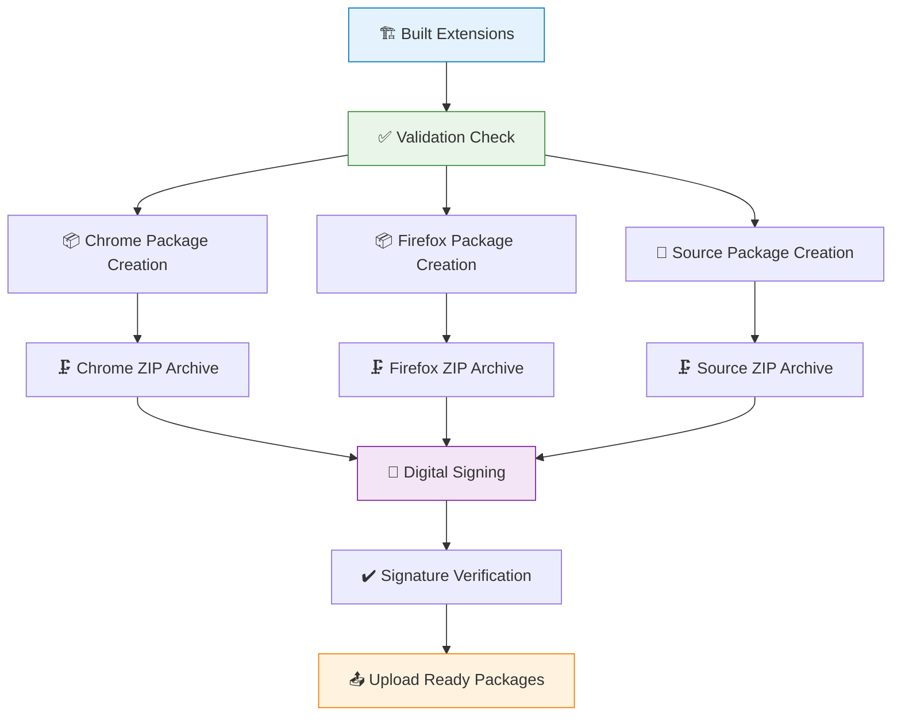

### Automated Release Notes

```typescript
class ReleaseNotesGenerator {
  async generateReleaseNotes(version: string): Promise<string> {
    const commits = await this.getCommitsSinceLastRelease();
    const features = this.extractFeatures(commits);
    const bugfixes = this.extractBugfixes(commits);
    const improvements = this.extractImprovements(commits);

    const releaseNotes = `
# NovelSynth v${version} Release Notes

## 🎉 New Features
${features.map(f => `- ${f.description}`).join('\n')}

## 🐛 Bug Fixes
${bugfixes.map(b => `- ${b.description}`).join('\n')}

## ⚡ Improvements
${improvements.map(i => `- ${i.description}`).join('\n')}

## 📊 Statistics
- Total commits: ${commits.length}
- Features added: ${features.length}
- Bugs fixed: ${bugfixes.length}
- Performance improvements: ${improvements.length}

## 🔗 Downloads
- Chrome Web Store: [Extension Link]
- Firefox Add-ons: [Extension Link]
- Source Code: [GitHub Release]
`;

    await fs.writeFile(`releases/v${version}-notes.md`, releaseNotes);
    return releaseNotes;
  }
}
```

---

## 🌐 Cross-Platform Compatibility

### Operating System Support

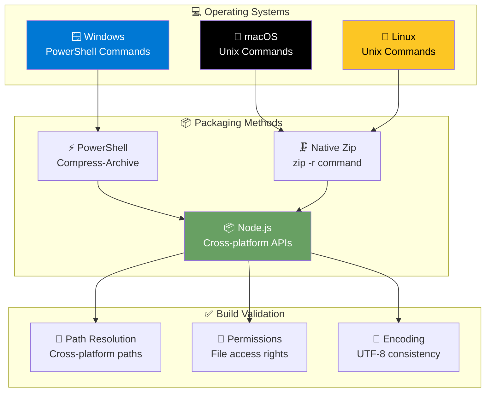

### Browser Compatibility Matrix

| Feature            | Chrome | Firefox | Edge | Safari |
| ------------------ | ------ | ------- | ---- | ------ |
| Manifest V3        | ✅      | ❌       | ✅    | ✅      |
| Manifest V2        | ✅      | ✅       | ✅    | ✅      |
| Service Workers    | ✅      | ❌       | ✅    | ✅      |
| Background Scripts | ✅      | ✅       | ✅    | ✅      |
| Content Scripts    | ✅      | ✅       | ✅    | ✅      |
| Storage API        | ✅      | ✅       | ✅    | ✅      |

---

## 📊 Performance Monitoring

### Build Analytics & Metrics

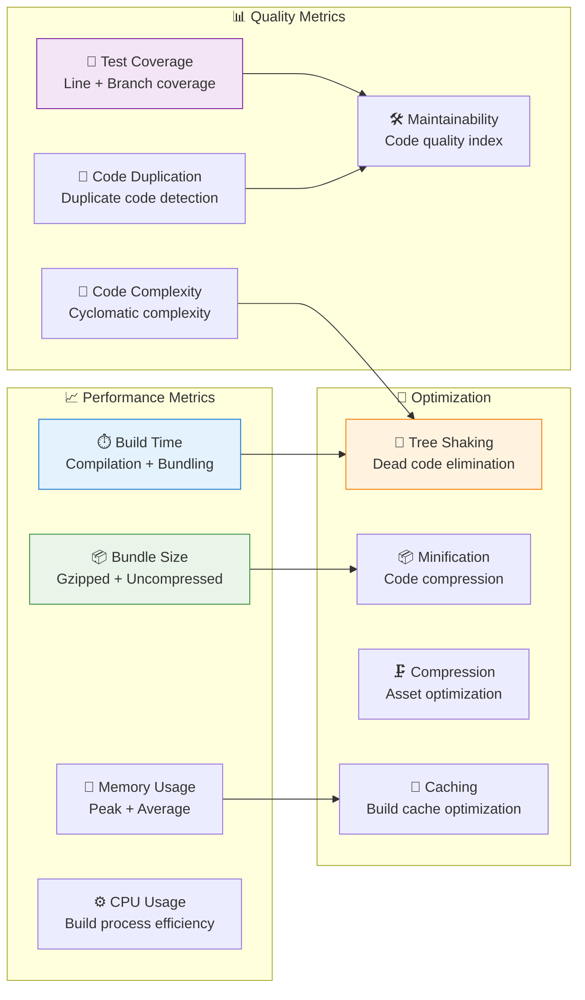

### Success/Failure Banners

**Success Banner:**
```
╔══════════════════════════════════════════════════════════════════════════════╗
║                              ✅ BUILD SUCCESSFUL                              ║
╠══════════════════════════════════════════════════════════════════════════════╣
║  🎉 Packages Created:                                                          ║
║  ├─ 🟢 Chrome Extension: novelsynth-chrome-v1.0.0.zip (2.1 MB)              ║
║  ├─ 🟠 Firefox Extension: novelsynth-firefox-v1.0.0.xpi (2.0 MB)            ║
║  └─ 📂 Source Package: novelsynth-source-v1.0.0.zip (5.2 MB)                ║
║                                                                                ║
║  📊 Build Statistics:                                                          ║
║  ├─ ⏱️  Total Time: 12.4 seconds                                              ║
║  ├─ 🧪 Tests Passed: 127/127                                                  ║
║  ├─ 📈 Coverage: 94.2%                                                        ║
║  └─ ✨ No lint errors or warnings                                             ║
╚══════════════════════════════════════════════════════════════════════════════╝
```

**Failure Banner:**
```
╔══════════════════════════════════════════════════════════════════════════════╗
║                               ❌ BUILD FAILED                                 ║
╠══════════════════════════════════════════════════════════════════════════════╣
║  🚨 Error Details:                                                             ║
║  ├─ TypeScript compilation failed                                             ║
║  ├─ 3 type errors in src/services/AIManager.ts                               ║
║  └─ 1 lint error in src/components/MainPopup.tsx                             ║
║                                                                                ║
║  🔧 Suggested Actions:                                                         ║
║  ├─ Run `npm run type-check` to see detailed errors                          ║
║  ├─ Run `npm run lint --fix` to auto-fix lint issues                         ║
║  └─ Check the build log above for more details                               ║
╚══════════════════════════════════════════════════════════════════════════════╝
```

---

## 📚 Commands Reference

### Primary Build Commands

```bash
# Core build commands
npm run build               # Production build for all targets
npm run build:dev           # Development build with source maps
npm run build:chrome        # Chrome-specific build
npm run build:firefox       # Firefox-specific build

# Development commands
npm run dev                 # Watch mode with hot reload
npm run watch               # File watcher for automatic builds
npm run serve               # Local development server

# Quality assurance
npm run test                # Run all tests
npm run test:unit           # Unit tests only
npm run test:integration    # Integration tests only
npm run test:e2e            # End-to-end tests
npm run test:coverage       # Generate coverage report

# Code quality
npm run lint                # ESLint checking
npm run lint:fix            # Auto-fix lint issues
npm run format              # Prettier formatting
npm run type-check          # TypeScript validation

# Utility commands
npm run clean               # Clean build artifacts
npm run sync-metadata       # Sync package.json ↔ manifest.json
npm run analyze             # Bundle size analysis
npm run validate            # Full validation pipeline

# Package management
npm run package             # Create all distribution packages
npm run package:chrome      # Chrome Web Store package
npm run package:firefox     # Firefox Add-ons package
npm run package:source      # Source code package

# Release management
npm run version:patch       # Bump patch version
npm run version:minor       # Bump minor version
npm run version:major       # Bump major version
npm run release             # Full release pipeline
```

### Advanced Commands

```bash
# Performance analysis
npm run perf:build          # Build performance analysis
npm run perf:bundle         # Bundle size optimization analysis
npm run perf:memory         # Memory usage profiling

# Security
npm run security:audit      # Security vulnerability scan
npm run security:license    # License compliance check
npm run security:deps       # Dependency analysis

# Documentation
npm run docs:generate       # Generate API documentation
npm run docs:serve          # Serve documentation locally
npm run docs:deploy         # Deploy documentation

# Maintenance
npm run deps:update         # Update dependencies
npm run deps:check          # Check for outdated packages
npm run cache:clear         # Clear build cache
```

---

This comprehensive build system documentation ensures reliable, professional development and deployment of NovelSynth across all supported platforms and browsers.
