# Processing Pipeline Diagram

**NovelSynth Intelligent Content Enhancement Pipeline**

This diagram illustrates NovelSynth's sophisticated processing pipeline that transforms raw content into enhanced, AI-improved text through intelligent analysis, provider selection, and quality validation.

## 🚀 Complete Processing Pipeline Architecture

```mermaid
flowchart TD
    subgraph "🔍 Content Detection & Analysis Phase"
        TRIGGER[🎯 Enhancement Trigger<br/>User Action or Auto-Detection]
        DETECT[🔍 Content Detection<br/>Website-Specific Analysis]
        QUALIFY[📊 Quality Assessment<br/>Enhancement Suitability Check]
        EXTRACT[📝 Content Extraction<br/>Clean Text with Formatting]
    end

    subgraph "🏷️ Content Classification & Preparation Phase"
        CLASSIFY[🏷️ Content Classification<br/>Type, Genre, Style Detection]
        METADATA[📋 Metadata Collection<br/>Title, Author, Context Info]
        SEGMENT[✂️ Smart Segmentation<br/>Large Content Handling]
        VALIDATE[✅ Input Validation<br/>Safety & Content Checks]
    end

    subgraph "🤖 AI Provider Selection & Management Phase"
        ANALYZE[🔍 Request Analysis<br/>Content Length & Complexity]
        SCORE[📊 Provider Scoring<br/>Multi-Factor Selection Algorithm]
        SELECT[🎯 Provider Selection<br/>Optimal AI Service Choice]
        FALLBACK[🔄 Fallback Strategy<br/>Provider Failure Handling]
    end

    subgraph "⚡ Content Enhancement Processing Phase"
        PROMPT[📝 Prompt Generation<br/>Dynamic Context-Aware Prompts]
        RATE_CHECK[⏱️ Rate Limit Check<br/>API Availability Verification]
        ENHANCE[🧠 AI Enhancement<br/>Content Improvement Processing]
        MONITOR[📊 Progress Monitoring<br/>Real-time Status Updates]
    end

    subgraph "🔧 Result Assembly & Validation Phase"
        PARSE[🔍 Response Parsing<br/>AI Output Processing]
        ASSEMBLE[🔧 Content Assembly<br/>Segment Recombination]
        QUALITY[✅ Quality Validation<br/>Enhancement Quality Check]
        FORMAT[🎨 Format Preservation<br/>Original Structure Maintenance]
    end

    subgraph "📱 User Presentation & Feedback Phase"
        DISPLAY[📱 Enhanced Display<br/>Beautiful UI Presentation]
        COMPARE[📊 Comparison View<br/>Original vs Enhanced]
        EXPORT[📤 Export Options<br/>Copy, Save, Share]
        FEEDBACK[💬 User Feedback<br/>Quality Rating & Improvement]
    end

    subgraph "🛡️ Error Handling & Recovery Systems"
        ERROR_DETECT[🚨 Error Detection<br/>Failure Point Identification]
        RETRY[🔄 Intelligent Retry<br/>Exponential Backoff Strategy]
        CIRCUIT[⚡ Circuit Breaker<br/>Provider Health Management]
        GRACEFUL[💫 Graceful Degradation<br/>Partial Success Handling]
    end

    %% Main Flow Connections
    TRIGGER --> DETECT
    DETECT --> QUALIFY
    QUALIFY --> EXTRACT
    EXTRACT --> CLASSIFY
    CLASSIFY --> METADATA
    METADATA --> SEGMENT
    SEGMENT --> VALIDATE
    VALIDATE --> ANALYZE
    ANALYZE --> SCORE
    SCORE --> SELECT
    SELECT --> PROMPT
    PROMPT --> RATE_CHECK
    RATE_CHECK --> ENHANCE
    ENHANCE --> PARSE
    PARSE --> ASSEMBLE
    ASSEMBLE --> QUALITY
    QUALITY --> FORMAT
    FORMAT --> DISPLAY
    DISPLAY --> COMPARE
    COMPARE --> EXPORT
    EXPORT --> FEEDBACK

    %% Error Handling Connections
    DETECT -.->|Detection Failed| ERROR_DETECT
    QUALIFY -.->|Quality Too Low| ERROR_DETECT
    SELECT -.->|No Provider Available| ERROR_DETECT
    RATE_CHECK -.->|Rate Limited| RETRY
    ENHANCE -.->|Processing Failed| ERROR_DETECT
    QUALITY -.->|Quality Check Failed| ERROR_DETECT

    ERROR_DETECT --> RETRY
    RETRY --> CIRCUIT
    CIRCUIT --> GRACEFUL
    GRACEFUL --> FALLBACK
    FALLBACK --> SELECT

    %% Monitoring Connections
    ENHANCE --> MONITOR
    MONITOR -.-> DISPLAY

    %% Styling
    classDef detection fill:#e3f2fd,stroke:#0277bd,stroke-width:3px
    classDef classification fill:#e8f5e8,stroke:#388e3c,stroke-width:2px
    classDef provider fill:#f3e5f5,stroke:#7b1fa2,stroke-width:2px
    classDef processing fill:#fff3e0,stroke:#f57c00,stroke-width:3px
    classDef assembly fill:#e0f2f1,stroke:#00695c,stroke-width:2px
    classDef presentation fill:#fce4ec,stroke:#c2185b,stroke-width:2px
    classDef error fill:#ffcdd2,stroke:#d32f2f,stroke-width:3px

    class TRIGGER,DETECT,QUALIFY,EXTRACT detection
    class CLASSIFY,METADATA,SEGMENT,VALIDATE classification
    class ANALYZE,SCORE,SELECT,FALLBACK provider
    class PROMPT,RATE_CHECK,ENHANCE,MONITOR processing
    class PARSE,ASSEMBLE,QUALITY,FORMAT assembly
    class DISPLAY,COMPARE,EXPORT,FEEDBACK presentation
    class ERROR_DETECT,RETRY,CIRCUIT,GRACEFUL error
```



## 🔍 Pipeline Stage Deep Dive

### 🔍 Content Detection & Analysis Phase

This phase identifies and prepares content for enhancement processing.

#### 🎯 Enhancement Trigger
**Purpose**: Initiate the enhancement process through various triggers

**Trigger Types**:
```typescript
enum TriggerType {
  USER_MANUAL = 'user_manual',      // User clicks enhancement button
  AUTO_DETECTION = 'auto_detection', // Automatic content detection
  KEYBOARD_SHORTCUT = 'keyboard',    // Ctrl+Shift+E shortcut
  CONTEXT_MENU = 'context_menu',     // Right-click context menu
  PAGE_LOAD = 'page_load'            // Automatic on page load
}

class EnhancementTrigger {
  async handleTrigger(trigger: TriggerType, context: any): Promise<void> {
    console.log(`🎯 Enhancement triggered: ${trigger}`);

    // Validate trigger context
    if (!this.validateTriggerContext(trigger, context)) {
      throw new Error('Invalid trigger context');
    }

    // Start content detection
    await this.startContentDetection(context);
  }

  private validateTriggerContext(trigger: TriggerType, context: any): boolean {
    switch (trigger) {
      case TriggerType.USER_MANUAL:
        return context.button && context.selectedText;
      case TriggerType.AUTO_DETECTION:
        return context.url && context.contentType;
      default:
        return true;
    }
  }
}
```

#### 🔍 Content Detection
**Purpose**: Intelligent identification of enhanceable content on web pages

**Detection Strategies**:
```typescript
class ContentDetector {
  private handlers: Map<string, WebsiteHandler> = new Map();

  async detectContent(url: string): Promise<ContentDetectionResult> {
    // Get appropriate handler for the website
    const handler = this.getHandlerForURL(url);

    // Attempt content detection
    const result = await handler.detectContent();

    if (result.found) {
      console.log(`✅ Content detected: ${result.type} (${result.wordCount} words)`);
      return result;
    } else {
      console.log(`❌ No enhanceable content found: ${result.reason}`);
      return result;
    }
  }

  private getHandlerForURL(url: string): WebsiteHandler {
    const domain = new URL(url).hostname;

    // Check for specific handlers
    if (this.handlers.has(domain)) {
      return this.handlers.get(domain);
    }

    // Use generic handler as fallback
    return new GenericWebsiteHandler();
  }
}

// Example website-specific handler
class FanFictionNetHandler implements WebsiteHandler {
  async detectContent(): Promise<ContentDetectionResult> {
    const storyElement = document.getElementById('storytext');

    if (!storyElement) {
      return {
        found: false,
        reason: 'No story content element found'
      };
    }

    const wordCount = this.countWords(storyElement.textContent);

    if (wordCount < 100) {
      return {
        found: false,
        reason: 'Content too short for enhancement'
      };
    }

    return {
      found: true,
      element: storyElement,
      type: 'fanfiction',
      wordCount: wordCount,
      metadata: {
        title: document.querySelector('.xcontrast_txt')?.textContent,
        author: document.querySelector('a[href*="/u/"]')?.textContent
      }
    };
  }
}
```

#### 📊 Quality Assessment
**Purpose**: Evaluate content suitability for AI enhancement

**Quality Metrics**:
```typescript
class QualityAssessment {
  assessContent(content: string): QualityScore {
    const metrics = {
      length: this.assessLength(content),
      complexity: this.assessComplexity(content),
      structure: this.assessStructure(content),
      language: this.assessLanguage(content),
      completeness: this.assessCompleteness(content)
    };

    const overall = this.calculateOverallScore(metrics);

    return {
      overall,
      metrics,
      recommendation: this.getRecommendation(overall),
      issues: this.identifyIssues(metrics)
    };
  }

  private assessLength(content: string): number {
    const wordCount = content.split(/\s+/).length;

    if (wordCount < 50) return 0.2;      // Too short
    if (wordCount < 100) return 0.5;     // Minimal
    if (wordCount < 500) return 0.8;     // Good
    if (wordCount < 2000) return 1.0;    // Ideal
    if (wordCount < 5000) return 0.9;    // Long but manageable
    return 0.7;                          // Very long, may need segmentation
  }

  private assessComplexity(content: string): number {
    const sentences = content.split(/[.!?]+/).length;
    const words = content.split(/\s+/).length;
    const avgWordsPerSentence = words / sentences;

    // Optimal complexity range
    if (avgWordsPerSentence >= 10 && avgWordsPerSentence <= 20) {
      return 1.0;
    }

    // Too simple or too complex
    return Math.max(0.3, 1.0 - Math.abs(avgWordsPerSentence - 15) / 15);
  }
}
```

### 🏷️ Content Classification & Preparation Phase

This phase analyzes and prepares content for optimal AI processing.

#### 🏷️ Content Classification
**Purpose**: Intelligent categorization of content for provider optimization

**Classification System**:
```typescript
class ContentClassifier {
  async classifyContent(content: string, metadata: any): Promise<ContentClassification> {
    const features = this.extractFeatures(content);
    const type = await this.classifyType(features, metadata);
    const genre = await this.classifyGenre(features, content);
    const style = await this.classifyStyle(features);

    return {
      type,
      genre,
      style,
      confidence: this.calculateConfidence(features),
      features
    };
  }

  private extractFeatures(content: string): ContentFeatures {
    return {
      wordCount: content.split(/\s+/).length,
      sentenceCount: content.split(/[.!?]+/).length,
      paragraphCount: content.split(/\n\s*\n/).length,
      dialogueRatio: this.calculateDialogueRatio(content),
      descriptiveRatio: this.calculateDescriptiveRatio(content),
      vocabularyComplexity: this.calculateVocabularyComplexity(content),
      tenseConsistency: this.analyzeTenseConsistency(content),
      personPerspective: this.detectPersonPerspective(content)
    };
  }

  private async classifyType(features: ContentFeatures, metadata: any): Promise<ContentType> {
    // Use heuristics and metadata to determine content type
    if (metadata.url?.includes('fanfiction')) return ContentType.FANFICTION;
    if (metadata.url?.includes('ao3') || metadata.url?.includes('archiveofourown')) {
      return ContentType.FANFICTION;
    }

    // Analyze content characteristics
    if (features.dialogueRatio > 0.4) return ContentType.DIALOGUE_HEAVY;
    if (features.descriptiveRatio > 0.6) return ContentType.DESCRIPTIVE;

    return ContentType.GENERAL_FICTION;
  }
}
```

#### ✂️ Smart Segmentation
**Purpose**: Intelligent division of large content for optimal processing

**Segmentation Strategy**:
```typescript
class SmartSegmenter {
  async segmentContent(content: string, maxTokens: number = 3000): Promise<ContentSegment[]> {
    // Calculate approximate token count
    const estimatedTokens = this.estimateTokenCount(content);

    if (estimatedTokens <= maxTokens) {
      return [{
        text: content,
        index: 0,
        context: this.extractContext(content)
      }];
    }

    // Segment by natural boundaries
    const segments = this.segmentByBoundaries(content, maxTokens);

    // Add context to each segment
    return segments.map((segment, index) => ({
      ...segment,
      index,
      context: this.generateSegmentContext(segments, index),
      overlaps: this.generateOverlaps(segments, index)
    }));
  }

  private segmentByBoundaries(content: string, maxTokens: number): RawSegment[] {
    const paragraphs = content.split(/\n\s*\n/);
    const segments: RawSegment[] = [];
    let currentSegment = '';
    let currentTokens = 0;

    for (const paragraph of paragraphs) {
      const paragraphTokens = this.estimateTokenCount(paragraph);

      if (currentTokens + paragraphTokens > maxTokens && currentSegment) {
        // Save current segment
        segments.push({
          text: currentSegment.trim(),
          tokenCount: currentTokens
        });

        // Start new segment
        currentSegment = paragraph;
        currentTokens = paragraphTokens;
      } else {
        currentSegment += '\n\n' + paragraph;
        currentTokens += paragraphTokens;
      }
    }

    // Add final segment
    if (currentSegment.trim()) {
      segments.push({
        text: currentSegment.trim(),
        tokenCount: currentTokens
      });
    }

    return segments;
  }

  private generateSegmentContext(segments: RawSegment[], index: number): SegmentContext {
    return {
      totalSegments: segments.length,
      currentSegment: index + 1,
      previousSummary: index > 0 ? this.summarizeSegment(segments[index - 1]) : null,
      nextPreview: index < segments.length - 1 ? this.previewSegment(segments[index + 1]) : null,
      overallTheme: this.extractOverallTheme(segments)
    };
  }
}
```

### 🤖 AI Provider Selection & Management Phase

This phase selects the optimal AI provider based on multiple factors.

#### 📊 Provider Scoring Algorithm
**Purpose**: Multi-factor analysis for optimal provider selection

**Scoring Implementation**:
```typescript
class ProviderSelector {
  async selectProvider(request: EnhancementRequest): Promise<SelectedProvider> {
    const availableProviders = await this.getAvailableProviders();
    const scores = await this.scoreProviders(availableProviders, request);

    // Sort by score descending
    const rankedProviders = scores.sort((a, b) => b.score - a.score);

    console.log('🏆 Provider Ranking:');
    rankedProviders.forEach((provider, index) => {
      console.log(`  ${index + 1}. ${provider.name}: ${provider.score.toFixed(2)}`);
    });

    return rankedProviders[0];
  }

  private async scoreProviders(
    providers: AIProvider[],
    request: EnhancementRequest
  ): Promise<ScoredProvider[]> {
    const scoringPromises = providers.map(async (provider) => {
      const score = await this.calculateProviderScore(provider, request);
      return { ...provider, score };
    });

    return Promise.all(scoringPromises);
  }

  private async calculateProviderScore(
    provider: AIProvider,
    request: EnhancementRequest
  ): Promise<number> {
    const factors = {
      contentTypeCompatibility: this.scoreContentTypeCompatibility(provider, request.type),
      rateLimit: await this.scoreRateLimit(provider),
      userPreference: this.scoreUserPreference(provider),
      costEfficiency: this.scoreCostEfficiency(provider, request.tokenCount),
      qualityHistory: await this.scoreQualityHistory(provider),
      responseTime: await this.scoreResponseTime(provider),
      reliability: await this.scoreReliability(provider)
    };

    // Weighted scoring
    const weights = {
      contentTypeCompatibility: 0.25,
      rateLimit: 0.20,
      userPreference: 0.15,
      costEfficiency: 0.10,
      qualityHistory: 0.15,
      responseTime: 0.10,
      reliability: 0.05
    };

    let totalScore = 0;
    for (const [factor, score] of Object.entries(factors)) {
      totalScore += score * weights[factor];
    }

    return Math.max(0, Math.min(1, totalScore));
  }

  private scoreContentTypeCompatibility(provider: AIProvider, type: ContentType): number {
    const compatibility = provider.getContentTypeCompatibility();
    return compatibility[type] || 0.5; // Default neutral score
  }
}
```

#### 🔄 Fallback Strategy
**Purpose**: Robust handling of provider failures and rate limits

**Fallback Implementation**:
```typescript
class FallbackManager {
  private providerQueue: AIProvider[] = [];
  private circuitBreakers: Map<string, CircuitBreaker> = new Map();

  async processWithFallback(request: EnhancementRequest): Promise<EnhancedContent> {
    const providers = await this.orderProvidersByPreference(request);

    for (const provider of providers) {
      const circuitBreaker = this.getCircuitBreaker(provider.name);

      if (circuitBreaker.isOpen()) {
        console.log(`⚠️ Circuit breaker open for ${provider.name}, skipping`);
        continue;
      }

      try {
        console.log(`🔄 Attempting enhancement with ${provider.name}`);
        const result = await this.processWithProvider(provider, request);

        // Success - reset circuit breaker
        circuitBreaker.onSuccess();
        return result;

      } catch (error) {
        console.log(`❌ ${provider.name} failed: ${error.message}`);

        // Record failure
        circuitBreaker.onFailure();

        // Check if this is a rate limit or temporary error
        if (this.isRetryableError(error)) {
          await this.handleRetryableError(provider, error);
        }

        // Continue to next provider
        continue;
      }
    }

    throw new Error('All providers failed or unavailable');
  }

  private async handleRetryableError(provider: AIProvider, error: Error): Promise<void> {
    if (error.message.includes('rate limit')) {
      const retryAfter = this.extractRetryAfter(error) || 60;
      console.log(`⏱️ Rate limited, waiting ${retryAfter}s for ${provider.name}`);

      // Schedule retry
      setTimeout(() => {
        this.getCircuitBreaker(provider.name).reset();
      }, retryAfter * 1000);
    }
  }
}
```

### ⚡ Content Enhancement Processing Phase

This phase performs the actual AI enhancement with monitoring and validation.

#### 📝 Dynamic Prompt Generation
**Purpose**: Context-aware prompt creation for optimal enhancement results

**Prompt Builder**:
```typescript
class PromptBuilder {
  buildEnhancementPrompt(request: EnhancementRequest): string {
    const context = this.buildContext(request);
    const instructions = this.buildInstructions(request.type, request.style);
    const examples = this.getRelevantExamples(request.type);
    const constraints = this.buildConstraints(request);

    return `${context}\n\n${instructions}\n\n${examples}\n\n${constraints}`;
  }

  private buildContext(request: EnhancementRequest): string {
    let context = `Content Type: ${request.type}\n`;
    context += `Word Count: ${request.wordCount}\n`;

    if (request.metadata.title) {
      context += `Title: "${request.metadata.title}"\n`;
    }

    if (request.metadata.author) {
      context += `Author: ${request.metadata.author}\n`;
    }

    if (request.segment) {
      context += `Segment: ${request.segment.currentSegment}/${request.segment.totalSegments}\n`;

      if (request.segment.previousSummary) {
        context += `Previous Context: ${request.segment.previousSummary}\n`;
      }
    }

    return context;
  }

  private buildInstructions(type: ContentType, style: EnhancementStyle): string {
    const baseInstructions = this.getBaseInstructions();
    const typeSpecific = this.getTypeSpecificInstructions(type);
    const styleSpecific = this.getStyleSpecificInstructions(style);

    return `${baseInstructions}\n\n${typeSpecific}\n\n${styleSpecific}`;
  }

  private getBaseInstructions(): string {
    return `You are an expert writing assistant specializing in content enhancement. Your task is to improve the provided text while maintaining its original meaning, style, and voice.

Key principles:
1. Preserve the author's unique voice and writing style
2. Enhance clarity, flow, and readability
3. Improve sentence structure and word choice
4. Add descriptive details where appropriate
5. Maintain the original tone and mood
6. Keep all character names and plot elements unchanged`;
  }

  private getTypeSpecificInstructions(type: ContentType): string {
    switch (type) {
      case ContentType.FANFICTION:
        return `Fanfiction Enhancement Guidelines:
- Maintain consistency with the source material
- Enhance character development and relationships
- Improve dialogue to feel more natural and character-appropriate
- Add sensory details to make scenes more immersive
- Ensure emotional moments have proper buildup and impact`;

      case ContentType.ORIGINAL_FICTION:
        return `Original Fiction Enhancement Guidelines:
- Strengthen world-building elements
- Develop unique character voices
- Enhance pacing and narrative flow
- Add compelling descriptive passages
- Improve dialogue tags and character actions`;

      default:
        return `General Enhancement Guidelines:
- Improve overall readability and flow
- Enhance descriptive language
- Strengthen narrative structure
- Improve word choice and variety`;
    }
  }
}
```

#### ⏱️ Rate Limit Management
**Purpose**: Intelligent handling of API rate limits and quotas

**Rate Limiter Implementation**:
```typescript
class RateLimiter {
  private providerLimits: Map<string, ProviderLimits> = new Map();
  private requestHistory: Map<string, RequestRecord[]> = new Map();

  async checkAvailability(providerId: string): Promise<RateLimitStatus> {
    const limits = this.providerLimits.get(providerId);
    if (!limits) {
      return { available: true, reason: 'No limits configured' };
    }

    const history = this.getRecentHistory(providerId);
    const status = this.analyzeRateLimit(limits, history);

    if (!status.available) {
      console.log(`⏱️ Rate limit reached for ${providerId}: ${status.reason}`);
      console.log(`   Next available: ${status.nextAvailable?.toLocaleTimeString()}`);
    }

    return status;
  }

  private analyzeRateLimit(limits: ProviderLimits, history: RequestRecord[]): RateLimitStatus {
    const now = Date.now();

    // Check requests per minute
    const lastMinute = history.filter(r => now - r.timestamp < 60000);
    if (lastMinute.length >= limits.requestsPerMinute) {
      const oldestRequest = Math.min(...lastMinute.map(r => r.timestamp));
      return {
        available: false,
        reason: 'Requests per minute limit exceeded',
        nextAvailable: new Date(oldestRequest + 60000)
      };
    }

    // Check requests per hour
    const lastHour = history.filter(r => now - r.timestamp < 3600000);
    if (lastHour.length >= limits.requestsPerHour) {
      const oldestRequest = Math.min(...lastHour.map(r => r.timestamp));
      return {
        available: false,
        reason: 'Requests per hour limit exceeded',
        nextAvailable: new Date(oldestRequest + 3600000)
      };
    }

    // Check tokens per day
    const today = history.filter(r => this.isSameDay(r.timestamp, now));
    const tokensUsedToday = today.reduce((sum, r) => sum + r.tokensUsed, 0);
    if (tokensUsedToday >= limits.tokensPerDay) {
      return {
        available: false,
        reason: 'Daily token limit exceeded',
        nextAvailable: this.getNextDay(now)
      };
    }

    return { available: true };
  }

  async waitForAvailability(providerId: string): Promise<void> {
    const status = await this.checkAvailability(providerId);

    if (!status.available && status.nextAvailable) {
      const waitTime = status.nextAvailable.getTime() - Date.now();
      console.log(`⏳ Waiting ${Math.ceil(waitTime / 1000)}s for rate limit reset`);

      await new Promise(resolve => setTimeout(resolve, waitTime));
    }
  }
}
```

### 🔧 Result Assembly & Validation Phase

This phase combines results and validates enhancement quality.

#### 🔧 Content Assembly
**Purpose**: Intelligent recombination of processed segments

**Assembly Strategy**:
```typescript
class ContentAssembler {
  async assembleSegments(segments: ProcessedSegment[]): Promise<AssembledContent> {
    console.log(`🔧 Assembling ${segments.length} processed segments`);

    // Sort segments by index
    const sortedSegments = segments.sort((a, b) => a.index - a.index);

    // Merge segments with overlap handling
    const mergedText = await this.mergeWithOverlaps(sortedSegments);

    // Preserve formatting from original
    const formatted = await this.preserveFormatting(mergedText, segments[0].originalFormatting);

    // Validate assembly quality
    const quality = await this.validateAssembly(formatted, sortedSegments);

    return {
      text: formatted,
      segmentCount: segments.length,
      assemblyQuality: quality,
      metadata: this.combineMetadata(segments)
    };
  }

  private async mergeWithOverlaps(segments: ProcessedSegment[]): Promise<string> {
    if (segments.length === 1) {
      return segments[0].enhancedText;
    }

    let merged = segments[0].enhancedText;

    for (let i = 1; i < segments.length; i++) {
      const previousSegment = segments[i - 1];
      const currentSegment = segments[i];

      // Find overlap between segments
      const overlap = this.findOverlap(
        previousSegment.enhancedText,
        currentSegment.enhancedText,
        currentSegment.overlapInfo
      );

      if (overlap.found) {
        // Remove overlapping portion from current segment
        const cleanCurrent = currentSegment.enhancedText.substring(overlap.length);
        merged += cleanCurrent;
      } else {
        // No overlap found, add transitional content if needed
        const transition = this.generateTransition(previousSegment, currentSegment);
        merged += transition + currentSegment.enhancedText;
      }
    }

    return merged;
  }

  private findOverlap(
    previousText: string,
    currentText: string,
    overlapInfo: OverlapInfo
  ): OverlapResult {
    // Try to find natural overlap points
    const previousWords = previousText.split(/\s+/);
    const currentWords = currentText.split(/\s+/);

    // Look for overlap at sentence boundaries
    const previousSentences = previousText.split(/[.!?]+/);
    const currentSentences = currentText.split(/[.!?]+/);

    // Find longest matching sequence
    for (let i = Math.min(5, previousSentences.length); i > 0; i--) {
      const previousEnd = previousSentences.slice(-i).join('.').trim();
      const currentStart = currentSentences.slice(0, i).join('.').trim();

      if (this.similarityScore(previousEnd, currentStart) > 0.8) {
        return {
          found: true,
          length: currentStart.length,
          similarity: this.similarityScore(previousEnd, currentStart)
        };
      }
    }

    return { found: false };
  }
}
```

#### ✅ Quality Validation
**Purpose**: Comprehensive validation of enhancement quality

**Quality Validator**:
```typescript
class QualityValidator {
  async validateEnhancement(
    original: string,
    enhanced: string,
    metadata: EnhancementMetadata
  ): Promise<QualityReport> {
    const validations = await Promise.all([
      this.validateContentPreservation(original, enhanced),
      this.validateLanguageQuality(enhanced),
      this.validateStructuralIntegrity(original, enhanced),
      this.validateStyleConsistency(enhanced),
      this.validateFactualAccuracy(original, enhanced)
    ]);

    const overallScore = this.calculateOverallScore(validations);
    const issues = this.identifyIssues(validations);
    const recommendations = this.generateRecommendations(validations);

    return {
      overallScore,
      validations,
      issues,
      recommendations,
      approved: overallScore >= 0.7 && issues.length === 0
    };
  }

  private async validateContentPreservation(
    original: string,
    enhanced: string
  ): Promise<ValidationResult> {
    // Check for preserved key elements
    const originalNames = this.extractNames(original);
    const enhancedNames = this.extractNames(enhanced);
    const namePreservation = this.calculatePreservationScore(originalNames, enhancedNames);

    // Check for preserved plot points
    const originalEvents = this.extractKeyEvents(original);
    const enhancedEvents = this.extractKeyEvents(enhanced);
    const eventPreservation = this.calculatePreservationScore(originalEvents, enhancedEvents);

    // Check overall meaning preservation
    const semanticSimilarity = await this.calculateSemanticSimilarity(original, enhanced);

    const score = (namePreservation + eventPreservation + semanticSimilarity) / 3;

    return {
      category: 'Content Preservation',
      score,
      details: {
        namePreservation,
        eventPreservation,
        semanticSimilarity
      },
      passed: score >= 0.8
    };
  }

  private async validateLanguageQuality(enhanced: string): Promise<ValidationResult> {
    // Grammar and spelling check
    const grammarScore = await this.checkGrammar(enhanced);

    // Readability analysis
    const readabilityScore = this.calculateReadability(enhanced);

    // Vocabulary appropriateness
    const vocabularyScore = this.assessVocabulary(enhanced);

    // Sentence variety
    const varietyScore = this.analyzeSentenceVariety(enhanced);

    const score = (grammarScore + readabilityScore + vocabularyScore + varietyScore) / 4;

    return {
      category: 'Language Quality',
      score,
      details: {
        grammar: grammarScore,
        readability: readabilityScore,
        vocabulary: vocabularyScore,
        variety: varietyScore
      },
      passed: score >= 0.75
    };
  }
}
```

## 📊 Pipeline Performance Monitoring

### 📈 Real-Time Metrics

The pipeline includes comprehensive monitoring for performance optimization:

```typescript
class PipelineMonitor {
  private metrics: Map<string, MetricCollector> = new Map();
  private activeProcesses: Map<string, ProcessMonitor> = new Map();

  async monitorProcessing(processId: string): Promise<ProcessMonitor> {
    const monitor = new ProcessMonitor(processId);
    this.activeProcesses.set(processId, monitor);

    // Start real-time monitoring
    monitor.onUpdate((update) => {
      this.broadcastUpdate(processId, update);
    });

    return monitor;
  }

  private broadcastUpdate(processId: string, update: ProcessUpdate): void {
    // Send to UI for progress display
    MessageManager.broadcast('processing.update', {
      processId,
      stage: update.stage,
      progress: update.progress,
      timeElapsed: update.timeElapsed,
      estimatedTimeRemaining: update.estimatedTimeRemaining
    });
  }

  generatePerformanceReport(): PerformanceReport {
    return {
      averageProcessingTime: this.calculateAverageTime(),
      successRate: this.calculateSuccessRate(),
      providerPerformance: this.getProviderPerformance(),
      bottlenecks: this.identifyBottlenecks(),
      recommendations: this.generateOptimizationRecommendations()
    };
  }
}
```

### ⚡ Performance Optimization

**Optimization Strategies**:
```typescript
class PipelineOptimizer {
  async optimizeProcessing(request: EnhancementRequest): Promise<OptimizedPipeline> {
    // Analyze request characteristics
    const analysis = this.analyzeRequest(request);

    // Select optimal processing strategy
    const strategy = this.selectStrategy(analysis);

    // Configure pipeline for optimal performance
    return this.configurePipeline(strategy, request);
  }

  private selectStrategy(analysis: RequestAnalysis): ProcessingStrategy {
    if (analysis.contentLength > 5000) {
      return ProcessingStrategy.PARALLEL_SEGMENTS;
    } else if (analysis.complexity === 'high') {
      return ProcessingStrategy.ENHANCED_QUALITY;
    } else {
      return ProcessingStrategy.STANDARD;
    }
  }

  private configurePipeline(
    strategy: ProcessingStrategy,
    request: EnhancementRequest
  ): OptimizedPipeline {
    const config = {
      segmentSize: this.calculateOptimalSegmentSize(strategy, request),
      parallelism: this.calculateOptimalParallelism(strategy),
      caching: this.shouldEnableCaching(request),
      providerPreference: this.optimizeProviderSelection(request)
    };

    return new OptimizedPipeline(config);
  }
}
```

## 🛡️ Error Handling & Recovery

### 🚨 Comprehensive Error Management

**Error Handling System**:
```typescript
class ErrorHandler {
  async handleProcessingError(error: ProcessingError, context: ProcessingContext): Promise<ErrorResolution> {
    // Classify error type
    const classification = this.classifyError(error);

    // Determine recovery strategy
    const strategy = this.getRecoveryStrategy(classification, context);

    // Attempt recovery
    return this.executeRecovery(strategy, error, context);
  }

  private classifyError(error: ProcessingError): ErrorClassification {
    if (error.message.includes('rate limit')) {
      return ErrorClassification.RATE_LIMIT;
    } else if (error.message.includes('timeout')) {
      return ErrorClassification.TIMEOUT;
    } else if (error.message.includes('quota')) {
      return ErrorClassification.QUOTA_EXCEEDED;
    } else if (error.code >= 500) {
      return ErrorClassification.SERVER_ERROR;
    } else {
      return ErrorClassification.CLIENT_ERROR;
    }
  }

  private async executeRecovery(
    strategy: RecoveryStrategy,
    error: ProcessingError,
    context: ProcessingContext
  ): Promise<ErrorResolution> {
    switch (strategy) {
      case RecoveryStrategy.RETRY_WITH_BACKOFF:
        return this.retryWithBackoff(context);

      case RecoveryStrategy.SWITCH_PROVIDER:
        return this.switchProvider(context);

      case RecoveryStrategy.PARTIAL_PROCESSING:
        return this.processPartially(context);

      case RecoveryStrategy.GRACEFUL_DEGRADATION:
        return this.gracefulDegradation(context);

      default:
        return this.reportFailure(error, context);
    }
  }
}
```

---

This comprehensive processing pipeline ensures NovelSynth delivers high-quality content enhancement through intelligent analysis, robust error handling, and continuous optimization, providing users with a reliable and efficient enhancement experience.