# Security Model Diagram

**NovelSynth Security & Privacy Architecture**

This diagram illustrates NovelSynth's comprehensive security model, demonstrating our zero-trust, privacy-first approach to protecting user data while enabling powerful AI-enhanced content processing.

## 🛡️ Security Architecture Overview

```mermaid
graph TB
    subgraph "👤 User Data Protection Layers"
        subgraph "🔒 Secure Data Types"
            UK[🔑 API Keys<br/>AES-256 Encrypted]
            UP[⚙️ User Preferences<br/>Local Storage Only]
            UC[📝 User Content<br/>Never Stored Permanently]
            UH[📊 Usage History<br/>Anonymous & Aggregated]
        end

        subgraph "🛡️ Privacy Controls"
            OPT[🚫 Opt-Out Options<br/>Complete Data Control]
            DEL[🗑️ Data Deletion<br/>Instant & Complete]
            EXP[📤 Data Export<br/>User-Owned Data]
            AUD[🔍 Privacy Audit<br/>Transparency Tools]
        end
    end

    subgraph "🔐 Encryption & Storage Layer"
        subgraph "🏪 Browser Storage"
            BS[🔒 Secure Storage API<br/>Native Browser Encryption]
            LS[💾 Local Storage<br/>Non-Sensitive Data Only]
            SS[🔄 Session Storage<br/>Temporary Processing Data]
            CS[🧹 Cache Storage<br/>Auto-Expiring Data]
        end

        subgraph "🔐 Encryption Services"
            AES[🔒 AES-256-GCM<br/>Government-Grade Encryption]
            SALT[🧂 Salt Generation<br/>Unique Per-Key Salting]
            KDF[🔑 Key Derivation<br/>PBKDF2 with 100k Iterations]
            RNG[🎲 Secure Random<br/>Cryptographically Secure]
        end
    end

    subgraph "🌐 Network Security Layer"
        subgraph "🔗 Communication Channels"
            HTTPS[🔒 HTTPS Only<br/>TLS 1.3 Minimum]
            CSP[🛡️ Content Security Policy<br/>XSS Prevention]
            CORS[🚧 CORS Headers<br/>Origin Validation]
            CERT[📜 Certificate Pinning<br/>MITM Protection]
        end

        subgraph "🚫 Data Flow Restrictions"
            NO_PROXY[🚫 No Proxy Servers<br/>Direct AI Communication]
            NO_LOGS[🚫 No Server Logs<br/>Zero Data Collection]
            NO_ANALYTICS[🚫 No Tracking<br/>Privacy-First Design]
            NO_THIRD_PARTY[🚫 No Third-Party Scripts<br/>Isolated Execution]
        end
    end

    subgraph "🤖 External Service Security"
        subgraph "🔌 AI Provider Integration"
            AI_DIRECT[🎯 Direct API Calls<br/>No Intermediary Servers]
            AI_ENCRYPT[🔒 Encrypted Payloads<br/>End-to-End Security]
            AI_AUTH[🔑 Secure Authentication<br/>API Key Protection]
            AI_RATE[⏱️ Rate Limiting<br/>Abuse Prevention]
        end

        subgraph "🌍 Website Interaction"
            DOM_SAFE[🛡️ Safe DOM Access<br/>Content Script Isolation]
            CSP_INJECT[🔒 CSP Compliance<br/>Secure Script Injection]
            PERM_MIN[🎯 Minimal Permissions<br/>Principle of Least Privilege]
            SANDBOX[📦 Sandboxed Execution<br/>Process Isolation]
        end
    end

    %% Data Flow Connections
    UK -->|Encrypted| BS
    UP --> LS
    UC -->|Memory Only| SS
    UH -->|Anonymous| CS

    BS --> AES
    AES --> SALT
    SALT --> KDF
    KDF --> RNG

    AI_DIRECT --> HTTPS
    AI_ENCRYPT --> CSP
    AI_AUTH --> CORS
    AI_RATE --> CERT

    DOM_SAFE --> NO_PROXY
    CSP_INJECT --> NO_LOGS
    PERM_MIN --> NO_ANALYTICS
    SANDBOX --> NO_THIRD_PARTY

    %% User Control Connections
    OPT -.-> DEL
    DEL -.-> EXP
    EXP -.-> AUD

    %% Styling
    classDef userdata fill:#e3f2fd,stroke:#0277bd,stroke-width:3px
    classDef encryption fill:#c8e6c9,stroke:#388e3c,stroke-width:3px
    classDef network fill:#fff3e0,stroke:#f57c00,stroke-width:2px
    classDef external fill:#f3e5f5,stroke:#7b1fa2,stroke-width:2px
    classDef privacy fill:#ffebee,stroke:#c62828,stroke-width:3px
    classDef restriction fill:#ffcdd2,stroke:#d32f2f,stroke-width:2px

    class UK,UP,UC,UH userdata
    class BS,LS,SS,CS,AES,SALT,KDF,RNG encryption
    class HTTPS,CSP,CORS,CERT network
    class AI_DIRECT,AI_ENCRYPT,AI_AUTH,AI_RATE,DOM_SAFE,CSP_INJECT,PERM_MIN,SANDBOX external
    class OPT,DEL,EXP,AUD privacy
    class NO_PROXY,NO_LOGS,NO_ANALYTICS,NO_THIRD_PARTY restriction
```



## 🔍 Security Layer Analysis

### 👤 User Data Protection

#### 🔑 API Key Security
**Encryption Implementation**:
```typescript
class SecureKeyManager {
  async storeAPIKey(provider: string, key: string): Promise<void> {
    // Generate unique salt for this key
    const salt = crypto.getRandomValues(new Uint8Array(16));

    // Derive encryption key from user's browser fingerprint
    const derivedKey = await this.deriveKey(salt);

    // Encrypt the API key using AES-256-GCM
    const encrypted = await this.encryptData(key, derivedKey);

    // Store encrypted data with salt
    await browser.storage.local.set({
      [`api_${provider}`]: {
        data: encrypted,
        salt: Array.from(salt),
        timestamp: Date.now()
      }
    });
  }

  private async deriveKey(salt: Uint8Array): Promise<CryptoKey> {
    // Use PBKDF2 with 100,000 iterations for key derivation
    const baseKey = await crypto.subtle.importKey(
      'raw',
      new TextEncoder().encode(await this.getBrowserFingerprint()),
      'PBKDF2',
      false,
      ['deriveKey']
    );

    return crypto.subtle.deriveKey(
      {
        name: 'PBKDF2',
        salt: salt,
        iterations: 100000,
        hash: 'SHA-256'
      },
      baseKey,
      { name: 'AES-GCM', length: 256 },
      false,
      ['encrypt', 'decrypt']
    );
  }
}
```

**Key Security Features**:
- **AES-256-GCM Encryption**: Military-grade encryption for API keys
- **Unique Salt Per Key**: Prevents rainbow table attacks
- **Key Derivation**: PBKDF2 with 100,000 iterations for brute-force resistance
- **Browser Fingerprint**: Ties encryption to specific browser/device
- **Automatic Expiration**: Keys expire and require re-entry periodically

#### 📝 Content Handling Security
**Zero-Storage Policy**:
```typescript
class ContentProcessor {
  async processContent(content: string): Promise<string> {
    // Content is processed in memory only
    const processedContent = await this.enhanceWithAI(content);

    // No content is ever stored permanently
    // Processing data cleared immediately after use
    return processedContent;
  }

  private async enhanceWithAI(content: string): Promise<string> {
    try {
      // Direct API call to AI provider
      const response = await this.aiProvider.enhance(content);
      return response.enhanced;
    } finally {
      // Immediate cleanup of temporary data
      this.clearTemporaryData();
    }
  }
}
```

**Content Security Principles**:
- **Memory-Only Processing**: Content never written to disk
- **Immediate Cleanup**: Temporary data cleared after processing
- **No Logging**: Content never appears in logs or debug output
- **Direct AI Communication**: No intermediate storage or proxy servers

### 🔐 Encryption & Storage Security

#### 🏪 Browser Storage Security
**Secure Storage Implementation**:
```typescript
class SecureStorageManager {
  async secureStore(key: string, value: any): Promise<void> {
    const isSecret = this.isSecretData(key);

    if (isSecret) {
      // Use browser's secure storage with encryption
      const encrypted = await this.encrypt(JSON.stringify(value));
      await browser.storage.local.set({ [key]: encrypted });
    } else {
      // Use regular storage for non-sensitive data
      await browser.storage.sync.set({ [key]: value });
    }
  }

  private isSecretData(key: string): boolean {
    const secretPrefixes = ['api_', 'auth_', 'key_', 'token_'];
    return secretPrefixes.some(prefix => key.startsWith(prefix));
  }
}
```

**Storage Security Layers**:
- **Browser Secure Storage**: Leverages browser's built-in encryption
- **Application-Level Encryption**: Additional encryption layer for sensitive data
- **Data Classification**: Automatic classification of sensitive vs. non-sensitive data
- **Access Control**: Strict access controls for encrypted storage

#### 🔐 Encryption Service Architecture
**Multi-Layer Encryption**:
```typescript
class EncryptionService {
  async encryptSensitiveData(data: string): Promise<EncryptedData> {
    // Layer 1: Application-level encryption
    const appEncrypted = await this.appEncrypt(data);

    // Layer 2: Browser storage encryption (automatic)
    // This happens when storing in browser.storage.local

    return {
      data: appEncrypted,
      algorithm: 'AES-256-GCM',
      keyDerivation: 'PBKDF2-SHA256-100k',
      timestamp: Date.now()
    };
  }

  private async appEncrypt(data: string): Promise<string> {
    const key = await this.getDerivedKey();
    const iv = crypto.getRandomValues(new Uint8Array(12));

    const encrypted = await crypto.subtle.encrypt(
      { name: 'AES-GCM', iv: iv },
      key,
      new TextEncoder().encode(data)
    );

    return this.combineIvAndData(iv, encrypted);
  }
}
```

### 🌐 Network Security Layer

#### 🔒 Transport Security
**HTTPS Enforcement**:
```typescript
class NetworkSecurity {
  async makeSecureRequest(url: string, options: RequestOptions): Promise<Response> {
    // Enforce HTTPS for all external requests
    if (!url.startsWith('https://')) {
      throw new SecurityError('Only HTTPS requests are allowed');
    }

    // Verify TLS version and cipher strength
    await this.verifyTLSSecurity(url);

    // Add security headers
    options.headers = {
      ...options.headers,
      'Strict-Transport-Security': 'max-age=31536000',
      'X-Content-Type-Options': 'nosniff',
      'X-Frame-Options': 'DENY'
    };

    return fetch(url, options);
  }
}
```

**Content Security Policy**:
```javascript
// Strict CSP for extension pages
const CSP_POLICY = `
  default-src 'self';
  script-src 'self' 'unsafe-eval';
  style-src 'self' 'unsafe-inline';
  img-src 'self' data: https:;
  connect-src https://api.openai.com https://generativelanguage.googleapis.com;
  object-src 'none';
  base-uri 'self';
  form-action 'none';
`;
```

#### 🚫 Data Flow Restrictions
**Zero-Server Architecture**:
```typescript
class PrivacyGuard {
  validateDataFlow(destination: string, dataType: DataType): boolean {
    // Block any attempts to send data to NovelSynth servers
    if (this.isNovelSynthServer(destination)) {
      if (dataType === DataType.USER_CONTENT || dataType === DataType.API_KEYS) {
        throw new PrivacyViolationError('User data cannot be sent to NovelSynth servers');
      }
    }

    // Only allow direct AI provider communication
    return this.isApprovedAIProvider(destination);
  }

  private isNovelSynthServer(url: string): boolean {
    const novelSynthDomains = [
      'novelsynth.com',
      'life-experimentalist.github.io',
      'api.novelsynth.com'
    ];
    return novelSynthDomains.some(domain => url.includes(domain));
  }
}
```

### 🤖 External Service Security

#### 🔌 AI Provider Security
**Secure API Integration**:
```typescript
class SecureAIProvider {
  async makeAPIRequest(content: string, apiKey: string): Promise<AIResponse> {
    // Validate API endpoint security
    await this.validateEndpointSecurity();

    // Encrypt payload before transmission
    const encryptedPayload = await this.encryptPayload({
      content: content,
      timestamp: Date.now(),
      nonce: crypto.getRandomValues(new Uint8Array(16))
    });

    // Make request with secure headers
    const response = await fetch(this.endpoint, {
      method: 'POST',
      headers: {
        'Authorization': `Bearer ${apiKey}`,
        'Content-Type': 'application/json',
        'X-Request-ID': crypto.randomUUID(),
        'User-Agent': 'NovelSynth/1.0.0'
      },
      body: JSON.stringify(encryptedPayload)
    });

    // Validate response integrity
    return this.validateAndDecryptResponse(response);
  }
}
```

**Provider Security Validation**:
- **Certificate Pinning**: Verify AI provider SSL certificates
- **Endpoint Validation**: Ensure requests go to official API endpoints
- **Response Integrity**: Validate response format and content
- **Error Handling**: Secure error handling without data leakage

#### 🌍 Website Interaction Security
**Safe Content Script Injection**:
```typescript
class SecureContentScript {
  injectSecurely(tabId: number): void {
    // Validate tab permissions
    if (!this.hasTabPermission(tabId)) {
      throw new PermissionError('No permission to access this tab');
    }

    // Use secure injection with CSP compliance
    chrome.scripting.executeScript({
      target: { tabId: tabId },
      func: this.secureContentFunction,
      world: 'ISOLATED'  // Run in isolated world for security
    });
  }

  private secureContentFunction(): void {
    // Content script runs in isolated environment
    // No access to page's JavaScript context
    // Cannot be interfered with by page scripts

    const enhancementUI = document.createElement('div');
    enhancementUI.id = 'novelsynth-enhancement-ui';

    // Apply secure styling to prevent CSS injection
    this.applySecureStyles(enhancementUI);

    document.body.appendChild(enhancementUI);
  }
}
```

## 🔒 Privacy Controls & User Rights

### 🚫 User Privacy Controls

#### Complete Data Control Interface
```typescript
class PrivacyControls {
  async deleteAllUserData(): Promise<void> {
    // Remove all stored API keys
    await this.clearAPIKeys();

    // Clear user preferences
    await this.clearPreferences();

    // Clear any cached data
    await this.clearCache();

    // Clear browser storage
    await browser.storage.local.clear();
    await browser.storage.sync.clear();

    // Notify user of successful deletion
    this.notifyDataDeleted();
  }

  async exportUserData(): Promise<UserDataExport> {
    return {
      preferences: await this.getPreferences(),
      customPrompts: await this.getCustomPrompts(),
      // Note: API keys are never exported for security
      exportDate: new Date().toISOString(),
      version: '1.0.0'
    };
  }

  async optOutOfAnalytics(): Promise<void> {
    await this.setPreference('analytics_enabled', false);
    await this.clearAnalyticsData();
    this.notifyOptOutComplete();
  }
}
```

### 🔍 Privacy Transparency

#### Privacy Audit Interface
```typescript
class PrivacyAudit {
  generatePrivacyReport(): PrivacyReport {
    return {
      dataCollection: {
        userContent: 'Never collected or stored',
        apiKeys: 'Encrypted locally, never transmitted to NovelSynth',
        preferences: 'Stored locally only',
        analytics: 'Anonymous usage patterns only (if enabled)'
      },
      dataSharing: {
        aiProviders: 'Content sent directly for processing only',
        thirdParties: 'No data sharing with third parties',
        novelSynth: 'No user data sent to NovelSynth servers'
      },
      dataRetention: {
        processing: 'Immediate deletion after processing',
        settings: 'Retained until user deletion',
        analytics: 'Anonymous aggregated data only'
      },
      userRights: {
        access: 'Full data export available',
        deletion: 'Instant complete data deletion',
        portability: 'Settings and preferences exportable',
        optOut: 'Complete opt-out from all data collection'
      }
    };
  }
}
```

## 🛡️ Security Threat Mitigation

### 🚨 Common Attack Vectors & Defenses

#### Cross-Site Scripting (XSS) Protection
```typescript
class XSSProtection {
  sanitizeUserInput(input: string): string {
    // Remove potentially dangerous HTML/JavaScript
    const sanitized = input
      .replace(/<script\b[^<]*(?:(?!<\/script>)<[^<]*)*<\/script>/gi, '')
      .replace(/javascript:/gi, '')
      .replace(/on\w+\s*=/gi, '');

    return this.escapeHTML(sanitized);
  }

  private escapeHTML(unsafe: string): string {
    return unsafe
      .replace(/&/g, '&amp;')
      .replace(/</g, '&lt;')
      .replace(/>/g, '&gt;')
      .replace(/"/g, '&quot;')
      .replace(/'/g, '&#039;');
  }
}
```

#### Man-in-the-Middle (MITM) Protection
```typescript
class MITMProtection {
  async validateCertificate(url: string): Promise<boolean> {
    const response = await fetch(url, { method: 'HEAD' });
    const cert = response.headers.get('X-Certificate-Fingerprint');

    // Verify against known good certificate fingerprints
    return this.knownGoodFingerprints.includes(cert);
  }

  enforceHSTS(): void {
    // Enforce HTTP Strict Transport Security
    if (location.protocol !== 'https:') {
      location.replace(`https:${location.href.substring(location.protocol.length)}`);
    }
  }
}
```

#### API Key Compromise Protection
```typescript
class KeyProtection {
  async rotateAPIKey(provider: string): Promise<void> {
    // Prompt user for new API key
    const newKey = await this.promptForNewKey(provider);

    // Validate new key
    await this.validateAPIKey(provider, newKey);

    // Replace old key securely
    await this.secureKeyReplacement(provider, newKey);

    // Clear any cached responses using old key
    await this.clearProviderCache(provider);
  }

  detectSuspiciousActivity(provider: string): boolean {
    const usage = this.getProviderUsage(provider);

    // Check for unusual patterns that might indicate compromise
    return usage.errorRate > 0.5 ||
           usage.requestsPerHour > usage.normalThreshold * 3 ||
           usage.responseTime > usage.normalResponseTime * 5;
  }
}
```

## 📊 Security Monitoring & Compliance

### 🔍 Security Metrics Dashboard
```typescript
class SecurityMonitoring {
  generateSecurityMetrics(): SecurityMetrics {
    return {
      encryptionStatus: this.validateAllEncryption(),
      certificateStatus: this.validateAllCertificates(),
      permissionStatus: this.auditPermissions(),
      dataFlowCompliance: this.validateDataFlows(),
      threatDetection: this.scanForThreats(),
      privacyCompliance: this.validatePrivacyCompliance()
    };
  }

  async performSecurityAudit(): Promise<SecurityAuditReport> {
    const tests = [
      this.testEncryptionIntegrity(),
      this.testAPIKeySecurity(),
      this.testNetworkSecurity(),
      this.testContentSecurityPolicy(),
      this.testPermissionBoundaries(),
      this.testPrivacyControls()
    ];

    const results = await Promise.all(tests);
    return this.compileAuditReport(results);
  }
}
```

### 🏆 Security Compliance Standards

**GDPR Compliance**:
- ✅ Explicit user consent for data processing
- ✅ Right to data portability and deletion
- ✅ Data minimization and purpose limitation
- ✅ Privacy by design and by default

**CCPA Compliance**:
- ✅ Transparent privacy practices
- ✅ User right to know and delete
- ✅ Opt-out of data sales (N/A - no data sales)
- ✅ Non-discrimination for privacy choices

**SOC 2 Type II Alignment**:
- ✅ Security controls and monitoring
- ✅ Availability and processing integrity
- ✅ Confidentiality controls
- ✅ Privacy protection measures

---

This comprehensive security model ensures that NovelSynth provides powerful AI enhancement capabilities while maintaining the highest standards of user privacy and data protection. Every design decision prioritizes user security and transparency, building trust through verifiable privacy practices.