# System Architecture

This page provides a visual overview of the NovelSynth extension architecture using interactive diagrams.

## 🏗️ High-Level System Overview

NovelSynth follows a modular architecture designed for extensibility and maintainability across multiple browsers.

```mermaid
graph TB
    subgraph "🌐 Browser Environment"
        subgraph "🔧 Extension Core"
            BG[🎯 Background Script<br/>Service Worker]
            CS[📄 Content Scripts<br/>Website Integration]
            PP[⚙️ Popup Interface<br/>React-based UI]
        end

        subgraph "🔌 Browser APIs"
            SA[💾 Storage API<br/>Settings & Keys]
            TA[📑 Tabs API<br/>Page Management]
            MA[📡 Messaging API<br/>Communication]
        end

        subgraph "🖥️ Website Layer"
            WP[🌍 Web Page DOM<br/>Content Area]
            WC[📝 Website Content<br/>Text & Images]
        end
    end

    subgraph "🤖 AI Services"
        AI1[🟦 Google Gemini<br/>Text Generation]
        AI2[🟢 OpenAI GPT<br/>Language Models]
        AI3[🟤 Anthropic Claude<br/>Constitutional AI]
        AI4[🟡 HuggingFace<br/>Open Source Models]
        AI5[🟣 OpenRouter<br/>Multi-Provider Access]
    end

    PP -.->|Settings & Config| BG
    CS -.->|Content Processing| BG
    BG -->|Data Persistence| SA
    BG -->|Page Control| TA
    BG -->|Cross-Component| MA
    CS -->|DOM Manipulation| WP
    CS -->|Text Extraction| WC
    BG -->|API Requests| AI1
    BG -->|API Requests| AI2
    BG -->|API Requests| AI3
    BG -->|API Requests| AI4
    BG -->|API Requests| AI5

    style BG fill:#e1f5fe,stroke:#01579b
    style CS fill:#f3e5f5,stroke:#4a148c
    style PP fill:#e8f5e8,stroke:#1b5e20
    style AI1 fill:#4285f4,color:#fff
    style AI2 fill:#00a67e,color:#fff
    style AI3 fill:#ff6b35,color:#fff
    style AI4 fill:#ff9800,color:#fff
    style AI5 fill:#9c27b0,color:#fff
```

## 🔄 Content Processing Flow

This diagram shows how content flows through the system from detection to enhancement:

## 🧩 Component Architecture

The extension is built with modular components that can be extended independently:

```mermaid
graph TD
    subgraph "🎯 Background Services"
        ASM[🤖 AI Service Manager<br/>Provider Coordination]
        SHM[🌐 Site Handler Manager<br/>Website Detection]
        SM[💾 Storage Manager<br/>Settings Persistence]
        RL[⏱️ Rate Limiter<br/>API Throttling]
        PM[📝 Prompt Manager<br/>Template System]
    end

    subgraph "🤖 AI Provider Layer"
        GS[Google Gemini<br/>Service Implementation]
        OS[OpenAI<br/>Service Implementation]
        AS[Anthropic<br/>Service Implementation]
        HS[HuggingFace<br/>Service Implementation]
        RS[OpenRouter<br/>Service Implementation]
        BASE[🔧 Base AI Service<br/>Common Interface]
    end

    subgraph "📄 Content Processing"
        CD[🔍 Content Detector<br/>Type Recognition]
        CS[✂️ Content Segmenter<br/>Large Text Handling]
        PB[🏗️ Prompt Builder<br/>Dynamic Templates]
        WC[📊 Word Counter<br/>Statistics Tracking]
        PBN[⏳ Processing Banner<br/>User Feedback]
    end

    subgraph "🌐 Website Handlers"
        FFH[📚 FanFiction.Net<br/>Story Parser]
        AOH[📖 Archive of Our Own<br/>Work Parser]
        RRH[👑 Royal Road<br/>Chapter Parser]
        WNH[📱 WebNovel<br/>Chapter Parser]
        GGH[💻 GeeksforGeeks<br/>Article Parser]
        MH[📰 Medium<br/>Article Parser]
        GNH[📃 Generic News<br/>Article Parser]
    end

    ASM --> GS
    ASM --> OS
    ASM --> AS
    ASM --> HS
    ASM --> RS
    GS --> BASE
    OS --> BASE
    AS --> BASE
    HS --> BASE
    RS --> BASE

    SHM --> FFH
    SHM --> AOH
    SHM --> RRH
    SHM --> WNH
    SHM --> GGH
    SHM --> MH
    SHM --> GNH

    ASM --> RL
    ASM --> PM
    PM --> PB

    style ASM fill:#e3f2fd,stroke:#0277bd
    style BASE fill:#f1f8e9,stroke:#388e3c
    style SHM fill:#fce4ec,stroke:#c2185b
    style CD fill:#fff3e0,stroke:#f57c00
    style FFH fill:#e8f5e8,stroke:#2e7d32
    style GGH fill:#f3e5f5,stroke:#7b1fa2
```

## 🚀 Enhancement Processing Pipeline

This flowchart shows the detailed steps in content enhancement:

```mermaid
flowchart TD
    START([👤 User Clicks Enhance]) --> CD{🔍 Content Detected?}
    CD -->|❌ No| FAIL[⚠️ Show Detection Error]
    CD -->|✅ Yes| ET[📝 Extract Text Content]
    ET --> CT[🏷️ Determine Content Type]
    CT --> SC{📏 Large Content?}
    SC -->|❌ No| PP[🏗️ Prepare Prompt]
    SC -->|✅ Yes| SEG[✂️ Segment Content]
    SEG --> PP
    PP --> API{🔧 API Key Available?}
    API -->|❌ No| CONFIG[⚙️ Show Config Prompt]
    API -->|✅ Yes| RL{⏱️ Rate Limited?}
    RL -->|✅ Yes| WAIT[⏳ Wait & Retry]
    WAIT --> RL
    RL -->|❌ No| AI[🤖 Call AI Service]
    AI --> SUCCESS{✅ Success?}
    SUCCESS -->|❌ No| RETRY{🔄 Retries Left?}
    RETRY -->|✅ Yes| WAIT
    RETRY -->|❌ No| ERROR[❌ Show Error Message]
    SUCCESS -->|✅ Yes| ASSEMBLE[🔧 Assemble Results]
    ASSEMBLE --> DISPLAY[🎉 Display Enhanced Content]
    DISPLAY --> STATS[📊 Show Statistics]
    STATS --> COMPLETE([✅ Enhancement Complete])

    CONFIG --> COMPLETE
    FAIL --> COMPLETE
    ERROR --> COMPLETE

    style START fill:#c8e6c9,stroke:#388e3c
    style COMPLETE fill:#c8e6c9,stroke:#388e3c
    style FAIL fill:#ffcdd2,stroke:#d32f2f
    style ERROR fill:#ffcdd2,stroke:#d32f2f
    style AI fill:#e1f5fe,stroke:#0277bd
    style DISPLAY fill:#f3e5f5,stroke:#7b1fa2
    style CONFIG fill:#fff3e0,stroke:#f57c00
```

## 🔐 Security & Privacy Architecture

NovelSynth implements a privacy-first approach with secure data handling:

```mermaid
graph TB
    subgraph "👤 User Data"
        UK[🔑 API Keys<br/>Encrypted Storage]
        UP[⚙️ User Preferences<br/>Local Storage]
        UC[📝 User Content<br/>Never Stored]
    end

    subgraph "🛡️ Security Layer"
        BS[🔒 Browser Secure Storage<br/>Native Encryption]
        LS[💾 Local Settings<br/>Non-sensitive Data]
        TS[⚡ Temporary Processing<br/>Memory Only]
    end

    subgraph "🌐 External Communication"
        AI[🤖 AI Providers<br/>Direct API Calls]
        WS[🌍 Websites<br/>Content Extraction]
        NS[🚫 NovelSynth Servers<br/>No Communication]
    end

    UK -->|🔐 Encrypted| BS
    UP --> LS
    UC -->|⚡ Never Stored| TS
    TS -->|🔗 Direct Only| AI
    UC -->|🚫 No Transmission| NS
    UK -->|🔑 Direct Auth| AI

    classDef secure fill:#c8e6c9,stroke:#4caf50,stroke-width:3px
    classDef private fill:#e1f5fe,stroke:#2196f3,stroke-width:2px
    classDef external fill:#fff3e0,stroke:#ff9800,stroke-width:2px
    classDef nosend fill:#ffcdd2,stroke:#f44336,stroke-width:3px

    class UK,BS secure
    class UP,LS,TS private
    class AI,WS external
    class NS nosend
```

## 📱 Cross-Browser Compatibility

NovelSynth supports multiple browsers with adaptive manifests:

```mermaid
graph LR
    subgraph "🌐 Browser Support"
        subgraph "Chrome/Chromium"
            CM[📄 Manifest V3<br/>Service Worker]
            CA[🔧 Chrome Action API<br/>Extension Button]
            CH[🔌 Host Permissions<br/>Website Access]
        end

        subgraph "Firefox"
            FM[📄 Manifest V2<br/>Background Scripts]
            FA[🔧 Browser Action<br/>Extension Button]
            FP[🔌 Permissions<br/>Website Access]
        end
    end

    subgraph "🔧 Shared Components"
        SC[📝 Source Code<br/>TypeScript/React]
        BP[🏗️ Build Process<br/>Webpack]
        API[🤖 AI Integration<br/>Universal]
    end

    SC --> BP
    BP --> CM
    BP --> FM
    API --> CM
    API --> FM

    CM --> CA
    CM --> CH
    FM --> FA
    FM --> FP

    style CM fill:#4285f4,color:#fff
    style FM fill:#ff6611,color:#fff
    style SC fill:#e8f5e8,stroke:#2e7d32
    style BP fill:#f3e5f5,stroke:#7b1fa2
```

## 🎯 Feature Interaction Map

This diagram shows how different features interact within the extension:

```mermaid
mindmap
  root((🚀 NovelSynth<br/>Features))
    🔍 Content Detection
      📚 Fiction Sites
        FanFiction.Net
        Archive of Our Own
        Royal Road
        WebNovel
      💻 Technical Sites
        GeeksforGeeks
        Medium
        Substack
      📰 News Sites
        Generic Detection
        Article Parsing
    🤖 AI Processing
      ✨ Enhancement
        Grammar Fixes
        Style Improvement
        Readability
      📄 Summarization
        Key Points
        Chapter Summaries
        Article Abstracts
      🔍 Analysis
        Writing Style
        Content Structure
        Reading Level
      💡 Suggestions
        Improvement Tips
        Alternative Phrases
        Content Recommendations
    ⚙️ Configuration
      🔑 API Keys
        Multiple Providers
        Secure Storage
        Key Validation
      🎛️ Settings
        Feature Toggles
        Model Selection
        Rate Limits
      📝 Custom Prompts
        User Templates
        Site-specific
        Feature-specific
    📊 Monitoring
      ⏱️ Performance
        Processing Time
        Memory Usage
        API Response Time
      📈 Quality
        Success Rates
        Error Tracking
        User Feedback
      📋 Usage
        Feature Usage
        Site Coverage
        Enhancement Stats
```

---

These diagrams provide a comprehensive visual guide to understanding NovelSynth's architecture. Each diagram focuses on different aspects of the system, from high-level overview to detailed component interactions.