# System Overview Diagram

**NovelSynth High-Level System Architecture**

This diagram provides a comprehensive view of the NovelSynth extension's architecture, showing how all major components interact within the browser environment and with external AI services.

## 🎯 Architecture Overview

```mermaid
graph TB
    subgraph "🌐 Browser Environment"
        subgraph "🔧 Extension Core"
            BG[🎯 Background Script<br/>Service Worker]
            CS[📄 Content Scripts<br/>Website Integration]
            PP[⚙️ Popup Interface<br/>React-based UI]
        end

        subgraph "🔌 Browser APIs"
            SA[💾 Storage API<br/>Settings & Keys]
            TA[📑 Tabs API<br/>Page Management]
            MA[📡 Messaging API<br/>Communication]
        end

        subgraph "🖥️ Website Layer"
            WP[🌍 Web Page DOM<br/>Content Area]
            WC[📝 Website Content<br/>Text & Images]
        end
    end

    subgraph "🤖 AI Services"
        AI1[🟦 Google Gemini<br/>Text Generation]
        AI2[🟢 OpenAI GPT<br/>Language Models]
        AI3[🟤 Anthropic Claude<br/>Constitutional AI]
        AI4[🟡 HuggingFace<br/>Open Source Models]
        AI5[🟣 OpenRouter<br/>Multi-Provider Access]
    end

    PP -.->|Settings & Config| BG
    CS -.->|Content Processing| BG
    BG -->|Data Persistence| SA
    BG -->|Page Control| TA
    BG -->|Cross-Component| MA
    CS -->|DOM Manipulation| WP
    CS -->|Text Extraction| WC
    BG -->|API Requests| AI1
    BG -->|API Requests| AI2
    BG -->|API Requests| AI3
    BG -->|API Requests| AI4
    BG -->|API Requests| AI5

    style BG fill:#e1f5fe,stroke:#01579b
    style CS fill:#f3e5f5,stroke:#4a148c
    style PP fill:#e8f5e8,stroke:#1b5e20
    style AI1 fill:#4285f4,color:#fff
    style AI2 fill:#00a67e,color:#fff
    style AI3 fill:#ff6b35,color:#fff
    style AI4 fill:#ff9800,color:#fff
    style AI5 fill:#9c27b0,color:#fff
```

## 🔍 Component Analysis

### 🔧 Extension Core Components

#### 🎯 Background Script (Service Worker)
- **Purpose**: Central orchestration hub for all extension operations
- **Responsibilities**:
  - AI service management and provider coordination
  - Rate limiting and retry logic implementation
  - Cross-component message routing
  - Secure storage of API keys and user preferences
  - Content processing pipeline coordination
- **Technology**: Service Worker (Chrome) / Background Script (Firefox)
- **Key Features**:
  - Persistent state management
  - Multi-provider AI integration
  - Intelligent failover mechanisms
  - Performance monitoring and optimization

#### 📄 Content Scripts (Website Integration)
- **Purpose**: Direct interface between extension and web pages
- **Responsibilities**:
  - Site-specific content detection and extraction
  - DOM manipulation for enhancement display
  - User interface injection and interaction handling
  - Real-time processing feedback display
- **Technology**: Injected JavaScript per website
- **Key Features**:
  - Modular site handlers for different website types
  - Intelligent content area detection
  - Formatting preservation during processing
  - Non-intrusive UI integration

#### ⚙️ Popup Interface (React-based UI)
- **Purpose**: User configuration and control center
- **Responsibilities**:
  - API key management and provider configuration
  - Feature toggle and preference settings
  - Real-time extension status display
  - Processing history and statistics
- **Technology**: React 19.1.0 with TypeScript
- **Key Features**:
  - Intuitive configuration workflow
  - Secure credential input handling
  - Real-time validation and testing
  - Responsive design for different browser sizes

### 🔌 Browser API Integration

#### 💾 Storage API
- **Purpose**: Persistent data storage with encryption
- **Data Types**:
  - Encrypted API keys using browser's secure storage
  - User preferences and feature configurations
  - Processing history and statistics
  - Custom prompt templates
- **Security**: Native browser encryption with AES-256

#### 📑 Tabs API
- **Purpose**: Cross-tab coordination and management
- **Capabilities**:
  - Content script injection and management
  - Active tab detection and monitoring
  - Cross-tab message coordination
  - Permission-based access control

#### 📡 Messaging API
- **Purpose**: Secure inter-component communication
- **Message Types**:
  - Enhancement requests and responses
  - Configuration updates and synchronization
  - Status updates and error notifications
  - Statistics and performance metrics

### 🤖 AI Service Integration

#### 🟦 Google Gemini
- **Models**: Gemini Pro, Gemini Pro Vision
- **Strengths**: Excellent reasoning, large context windows
- **Rate Limits**: 60 requests/minute (Pro), 15 requests/minute (Free)
- **Special Features**: Vision capabilities for image analysis

#### 🟢 OpenAI GPT
- **Models**: GPT-4, GPT-4 Turbo, GPT-3.5 Turbo
- **Strengths**: Superior creative writing, consistent formatting
- **Rate Limits**: Tier-based (500-10,000 requests/minute)
- **Special Features**: Function calling, JSON mode

#### 🟤 Anthropic Claude
- **Models**: Claude 3.5 Sonnet, Claude 3 Haiku, Claude 3 Opus
- **Strengths**: Constitutional AI, safety-focused responses
- **Rate Limits**: 50 requests/minute (API), 5 requests/minute (Free)
- **Special Features**: Large context windows (200K tokens)

#### 🟡 HuggingFace
- **Models**: Open-source models via Inference API
- **Strengths**: Free access, diverse model selection
- **Rate Limits**: 1,000 requests/hour (Free), unlimited (Pro)
- **Special Features**: Community models, specialized fine-tunes

#### 🟣 OpenRouter
- **Models**: Multiple providers through single API
- **Strengths**: Provider diversity, unified billing
- **Rate Limits**: Provider-dependent
- **Special Features**: Automatic failover, cost optimization

## 🔄 Information Flow Patterns

### Configuration Flow
1. User opens popup interface
2. Popup retrieves current settings from Storage API
3. User modifies configuration (API keys, preferences)
4. Popup validates settings and tests connectivity
5. Validated settings saved to encrypted storage
6. Background script receives configuration update
7. Content scripts updated with new processing preferences

### Enhancement Flow
1. User navigates to supported website
2. Content script detects page load and content type
3. Content script injects enhancement UI elements
4. User clicks enhancement button
5. Content script extracts and validates content
6. Background script receives enhancement request
7. Background script processes content with AI service
8. Enhanced content returned to content script
9. Content script displays results with formatting preservation

### Error Handling Flow
1. Component encounters error during processing
2. Error details logged with context information
3. Background script applies retry logic if applicable
4. User receives friendly error notification
5. Fallback providers attempted if available
6. Statistics updated with error metrics

## 🛡️ Security Architecture

### Data Flow Security
- **API Keys**: Encrypted storage, never transmitted to NovelSynth servers
- **User Content**: Direct browser-to-AI provider communication
- **Processing Data**: Temporary memory storage only, automatic cleanup
- **Configuration**: Local storage with validation and sanitization

### Permission Model
- **activeTab**: Access to current page content only
- **storage**: Secure settings and key storage
- **scripting**: Content script injection for enhancement
- **host_permissions**: Specific website access for content detection

## 📊 Performance Characteristics

### Resource Usage
- **Memory**: ~10-50MB depending on content size
- **CPU**: Minimal background processing, burst during enhancement
- **Network**: Direct AI API calls only, no proxy overhead
- **Storage**: <1MB for settings and cache

### Processing Metrics
- **Content Detection**: <100ms for supported sites
- **Text Extraction**: <500ms for typical articles
- **AI Processing**: 2-30s depending on content size and provider
- **Result Display**: <200ms for formatting and injection

## 🔧 Extension Points

### Adding New AI Providers
1. Implement `BaseAIService` interface
2. Add provider configuration to popup interface
3. Register provider in `AIServiceManager`
4. Configure rate limits and capabilities

### Adding New Website Handlers
1. Extend `BaseWebsiteHandler` class
2. Define content detection selectors
3. Implement extraction and injection logic
4. Register handler in `SiteHandlerManager`

### Adding New Features
1. Define message protocol extensions
2. Implement background processing logic
3. Add content script UI components
4. Update popup configuration options

---

This system overview demonstrates NovelSynth's modular, extensible architecture designed for privacy, performance, and cross-browser compatibility. Each component operates independently while contributing to a cohesive user experience for AI-powered content enhancement.