# NovelSynth Testing Guide

**Comprehensive Development & Testing Documentation**

This guide covers all aspects of testing NovelSynth, from initial setup to comprehensive browser testing across multiple platforms.

## 📋 Table of Contents

1. [Quick Start](#-quick-start)
   - [Prerequisites](#prerequisites)
   - [Setup Steps](#setup-steps)
2. [Prerequisites](#prerequisites)
   - [Environment Configuration](#environment-configuration)
   - [Development Commands](#development-commands)
3. [Development Setup](#️-development-setup)
   - [Environment Configuration](#environment-configuration)
   - [Development Commands](#development-commands)
4. [Browser Testing](#-browser-testing)
5. [Automated Testing](#-automated-testing)
6. [Manual Testing Procedures](#-manual-testing-procedures)
7. [Cross-Browser Testing](#-cross-browser-testing)
8. [Performance Testing](#-performance-testing)
9. [Troubleshooting](#-troubleshooting)

---

## 🚀 Quick Start

### Prerequisites
- **Node.js 16+** and npm
- **Git** for version control
- **Code Editor** (VS Code recommended)
- **Modern Browser** (Chrome, Firefox, or Edge)

### Setup Steps

1. **Clone and Install**
   ```bash
   git clone https://github.com/LifeExperimentalist/novelsynth.git
   cd novelsynth
   npm install
   ```

2. **Sync Metadata and Build**
   ```bash
   npm run sync-metadata
   npm run build:dev
   ```

3. **Load in Browser**
   - **Chrome**: Go to `chrome://extensions/`, enable Developer mode, load unpacked from `dist/`
   - **Firefox**: Go to `about:debugging`, load temporary add-on, select `dist/manifest.json`

---

## 🛠️ Development Setup

### Environment Configuration

1. **Install Dependencies**
   ```bash
   npm install
   npm install -g typescript  # If not already installed
   ```

2. **Configure IDE**
   - Install TypeScript and React extensions
   - Enable auto-formatting with Prettier
   - Configure ESLint for code quality

3. **Verify Setup**
   ```bash
   npm run type-check    # Verify TypeScript compilation
   npm run lint          # Check code quality
   npm run test          # Run test suite
   ```

### Development Commands

```bash
# Development with hot reload
npm run dev

# Build for development (with source maps)
npm run build:dev

# Build for production
npm run build

# Run tests in watch mode
npm run test:watch

# Type checking
npm run type-check
```

---

## 🌐 Browser Testing

### Chrome Testing

#### Method 1: Development Mode
1. **Open Chrome Extensions**
   - Navigate to `chrome://extensions/`
   - Enable "Developer mode" (top-right toggle)

2. **Load Extension**
   - Click "Load unpacked"
   - Select your `dist/` folder
   - Extension should appear with green status

3. **Verify Installation**
   - Check browser toolbar for NovelSynth icon
   - Test on supported websites (fanfiction.net, archive of our own, etc.)
   - Open popup and verify settings interface

#### Method 2: Package Testing
1. **Create Chrome Package**
   ```bash
   npm run build
   npm run package:chrome
   ```
2. **Install CRX** (if available) or load as unpacked

### Firefox Testing

#### Method 1: Temporary Installation (Development)
1. **Open Firefox Developer Tools**
   - Navigate to `about:debugging#/runtime/this-firefox`
   - Or press `Ctrl+Shift+Alt+I` and go to "This Firefox"

2. **Load Extension**
   - Click "Load Temporary Add-on..."
   - Navigate to your `dist/` folder
   - Select `manifest.json`
   - Click "Open"

3. **Verify Installation**
   - Extension should appear with green dot
   - Check browser toolbar for NovelSynth icon
   - Test functionality on supported websites

#### Method 2: XPI Package Testing
1. **Create XPI Package**
   ```bash
   npm run build
   npm run package:firefox
   ```

2. **Install XPI**
   - Open Firefox
   - Drag XPI file to browser window
   - Click "Add" when prompted
   - Confirm installation

### Edge Testing

1. **Enable Developer Mode**
   - Go to `edge://extensions/`
   - Enable "Developer mode"

2. **Load Extension**
   - Click "Load unpacked"
   - Select `dist/` folder
   - Verify installation and functionality

---

## 🧪 Automated Testing

### Test Suite Architecture

```mermaid
graph TD
    subgraph "🧪 Test Categories"
        UNIT[🔬 Unit Tests<br/>Component Testing]
        INT[🔗 Integration Tests<br/>Service Integration]
        E2E[🌐 End-to-End Tests<br/>Full Workflow]
        PERF[⚡ Performance Tests<br/>Bundle Analysis]
    end

    subgraph "🔍 Testing Tools"
        JEST[🃏 Jest<br/>Test Runner]
        RTL[⚛️ React Testing Library<br/>UI Component Testing]
        MSW[🌐 MSW<br/>API Mocking]
        PUPPTEER[🎭 Puppeteer<br/>Browser Automation]
    end

    UNIT --> JEST
    INT --> RTL
    E2E --> PUPPTEER
    PERF --> JEST

    style UNIT fill:#e8f5e8,stroke:#4caf50
    style INT fill:#e3f2fd,stroke:#2196f3
    style E2E fill:#f3e5f5,stroke:#9c27b0
    style PERF fill:#fff3e0,stroke:#ff9800
```



### Running Tests

```bash
# Run all tests
npm test

# Run tests in watch mode
npm run test:watch

# Run specific test suite
npm run test:unit
npm run test:integration
npm run test:e2e

# Generate coverage report
npm run test:coverage

# Performance testing
npm run test:performance
```

### Test Configuration

**Jest Configuration** (`jest.config.js`):
```javascript
module.exports = {
  preset: 'ts-jest',
  testEnvironment: 'jsdom',
  setupFilesAfterEnv: ['<rootDir>/tests/setup.ts'],
  collectCoverageFrom: [
    'src/**/*.{ts,tsx}',
    '!src/**/*.d.ts',
    '!src/**/*.test.{ts,tsx}'
  ],
  coverageThreshold: {
    global: {
      branches: 80,
      functions: 80,
      lines: 80,
      statements: 80
    }
  }
};
```

---

## 🔍 Manual Testing Procedures

### Core Functionality Testing

#### 1. Content Detection
- **Fiction Sites**: Test on FanFiction.Net, Archive of Our Own, Royal Road
- **News Sites**: Test on various news articles and blog posts
- **Technical Sites**: Test on documentation and tutorial pages

#### 2. Enhancement Features
- **Text Enhancement**: Verify grammar and style improvements
- **Summarization**: Test chapter and article summarization
- **Analysis**: Check content analysis features

#### 3. Settings & Configuration
- **API Keys**: Test API key validation and storage
- **Preferences**: Verify user preference persistence
- **Feature Toggles**: Test individual feature enable/disable

### Testing Checklist

```markdown
## 📋 Manual Testing Checklist

### Installation & Setup
- [ ] Extension loads without errors
- [ ] Icon appears in browser toolbar
- [ ] Popup opens and displays correctly
- [ ] Settings can be accessed and modified

### Content Detection
- [ ] Fiction sites detected correctly
- [ ] News articles detected properly
- [ ] Technical content recognized
- [ ] Generic content handled gracefully

### Core Features
- [ ] Text enhancement works accurately
- [ ] Summarization produces quality results
- [ ] Content analysis provides useful insights
- [ ] Original/enhanced toggle functions

### Error Handling
- [ ] Invalid API keys show appropriate errors
- [ ] Network errors handled gracefully
- [ ] Rate limiting displays proper messages
- [ ] Unsupported content shows helpful notices

### Performance
- [ ] Processing completes in reasonable time
- [ ] Large content handled without crashes
- [ ] Memory usage remains stable
- [ ] UI remains responsive during processing

### Cross-Browser Compatibility
- [ ] Chrome functionality verified
- [ ] Firefox features working
- [ ] Edge compatibility confirmed
- [ ] Consistent behavior across browsers
```

---

## 🌐 Cross-Browser Testing

### Browser-Specific Considerations

#### Chrome (Manifest V3)
- **Service Worker**: Verify background script lifecycle
- **Storage API**: Test chrome.storage functionality
- **Permissions**: Confirm host permissions work correctly

#### Firefox (Manifest V2)
- **Background Scripts**: Test persistent background page
- **WebExtensions API**: Verify browser.* API compatibility
- **Permissions**: Test activeTab and host permissions

#### Testing Matrix

| Feature           | Chrome | Firefox | Edge | Notes                    |
| ----------------- | ------ | ------- | ---- | ------------------------ |
| Content Detection | ✅      | ✅       | ✅    | Universal                |
| Text Enhancement  | ✅      | ✅       | ✅    | API-dependent            |
| Storage           | ✅      | ✅       | ✅    | Browser-specific APIs    |
| Popup Interface   | ✅      | ✅       | ✅    | React-based              |
| Content Scripts   | ✅      | ✅       | ✅    | Cross-browser compatible |

---

## ⚡ Performance Testing

### Bundle Analysis

```bash
# Analyze bundle size
npm run analyze

# Performance profiling
npm run build:profile

# Memory leak detection
npm run test:memory
```

### Performance Metrics

- **Bundle Size**: < 2MB total
- **Load Time**: < 3 seconds for popup
- **Processing Time**: < 30 seconds for large content
- **Memory Usage**: < 100MB peak usage

### Optimization Testing

1. **Code Splitting**: Verify lazy loading works
2. **Tree Shaking**: Confirm unused code removal
3. **Compression**: Test gzip compression effectiveness
4. **Caching**: Verify result caching functionality

---

## 🔧 Troubleshooting

### Common Issues

#### Extension Won't Load
```bash
# Check for syntax errors
npm run type-check

# Rebuild and try again
npm run clean
npm run build:dev
```

#### API Calls Failing
1. Verify API keys are correctly configured
2. Check network connectivity
3. Confirm API service status
4. Review browser console for errors

#### Content Not Detected
1. Check website URL patterns
2. Verify content selectors
3. Test DOM structure changes
4. Review console logs

#### Performance Issues
1. Profile memory usage
2. Check for memory leaks
3. Optimize large content handling
4. Review background script efficiency

### Debug Tools

#### Chrome DevTools
```javascript
// Content script debugging
console.log('NovelSynth: Content detected', content);

// Background script debugging
console.log('NovelSynth: Processing request', request);

// Storage debugging
chrome.storage.local.get(null, (data) => {
  console.log('NovelSynth: Storage contents', data);
});
```

#### Firefox Developer Tools
```javascript
// Similar debugging for Firefox
browser.storage.local.get(null).then((data) => {
  console.log('NovelSynth: Storage contents', data);
});
```

### Logging System

The extension includes comprehensive logging:

```typescript
// Enable debug logging
localStorage.setItem('novelsynth-debug', 'true');

// Log levels: ERROR, WARN, INFO, DEBUG
console.log('[NovelSynth][INFO] Processing started');
```

---

## 📊 Test Reporting

### Coverage Reports

```bash
# Generate HTML coverage report
npm run test:coverage

# View coverage report
open coverage/lcov-report/index.html
```

### Performance Reports

```bash
# Bundle analyzer report
npm run analyze

# Performance profiling
npm run build:profile
```

### Automated CI/CD Testing

The project includes GitHub Actions for:
- **Unit Test Execution**
- **Cross-Browser Testing**
- **Performance Monitoring**
- **Security Scanning**
- **Bundle Analysis**

---

This comprehensive testing guide ensures NovelSynth maintains high quality and reliability across all supported browsers and use cases.
